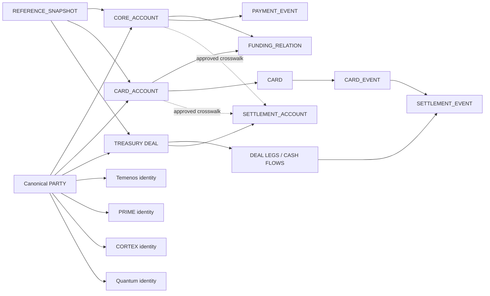
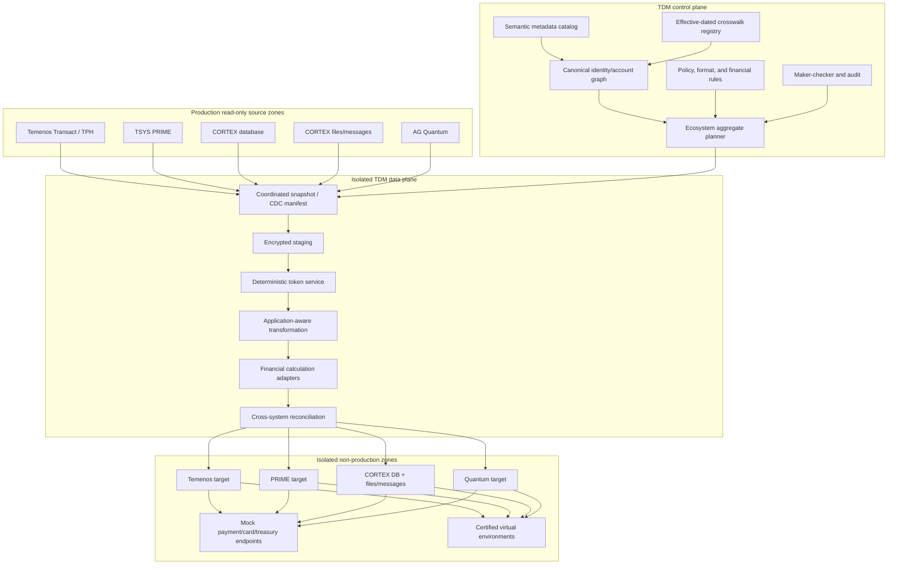

# Cross-System Referential TDM Integration Blueprint

Document owner: Enterprise Data Engineering  
Document type: Enterprise Test Data Management implementation blueprint  
Participating systems: Temenos Transact/TPH, TSYS PRIME, FIS CORTEX, FIS AvantGard Quantum  
Primary objective: Deterministic, referentially complete, financially valid multi-application test data  
Status: Implementation design

## 1. Executive intent

This blueprint defines how an enterprise TDM implementation will create one coherent, privacy-safe test data ecosystem across:

- Temenos Transact Core Banking and Temenos Payments Hub;
- TSYS PRIME card issuing and lifecycle processing;
- FIS CORTEX debit, prepaid, and acquiring processing;
- FIS AvantGard Quantum treasury management.

The implementation must do more than apply the same masking function to similarly named columns. It must understand which identifiers represent the same business object, which identifiers are only related, and which values must never be copied into non-production.

The target outcome is a synchronized non-production data set in which:

1. one customer remains the same fictional customer across all participating systems;
2. accounts, card portfolios, settlement accounts, cards, deals, and transactions remain correctly related;
3. each application receives values valid for its own field length, alphabet, checksum, and structure;
4. balances, limits, authorizations, settlements, and deal cash flows remain mathematically valid;
5. relational rows, Temenos multi-value structures, and CORTEX files/messages agree;
6. prohibited payment-authentication data is not copied;
7. the complete multi-system subset can be refreshed, replayed, validated, and audited as one release.

The central design object is a **Customer Financial Ecosystem Aggregate** backed by a governed **Canonical Identity and Account Graph**.

## 2. Source referential matrix

| System engine | Primary data structure | Supplied high-risk targets | Supplied cross-system keys |
|---|---|---|---|
| Temenos Transact Core Banking | TAFJ relational persistence with multi-value/sub-value structures | names, national ID, balances, free-text narratives | `CUSTOMER.NUMBER`, `ACCOUNT.NUMBER` |
| TSYS PRIME Cards | relational database | cardholder name, limits, PVV/CVV-related values | Customer ID, Base Account No |
| FIS CORTEX | relational database plus flat files/messages | PAN, Track 2 | CIF Number, Account Number |
| FIS AvantGard Quantum | relational database plus treasury interfaces | counterparty names, SSI, deal cash flows, Nostro/Vostro accounts | Client CIF Ref, Settlement Account No |

This source matrix is the starting point, not the final semantic mapping. Column-name similarity is insufficient evidence that two fields represent the same business identifier.

## 3. Mandatory interpretation corrections

### 3.1 Balances and limits

Balances, credit limits, available amounts, and deal cash flows are not ordinary word-masking targets.

They require one of these governed treatments:

- preserve the financial values while masking identity;
- scale a complete financial aggregate and recalculate dependent values;
- replace the aggregate with a fully synthetic, reconciled scenario;
- recalculate target balances for a subset of retained movements;
- add an explicit governed balancing entry where the test scenario permits it.

Independent random changes are prohibited when they would break accounting or product equations.

### 3.2 PVV, CVV, PIN, and cryptographic material

Production PVV, CVV/CVC/CID, PIN blocks, keys, certificates, and related verification material are not transformed as normal data.

The implementation must:

- omit or neutralize production verification material;
- generate test-domain values only through an approved test HSM/service and non-production keys;
- replace production key references with test key references;
- prove that production cryptographic material is absent.

### 3.3 Track 2

Production Track 2 is not copied to ordinary non-production environments.

When a test scenario requires Track 2-shaped data, generate a safe test representation using:

- a transformed or synthetic test PAN;
- scenario-valid test expiry;
- approved test service code;
- synthetic discretionary data;
- non-production verification values when explicitly required and approved.

### 3.4 Settlement accounts

A Quantum settlement account is not automatically the same semantic object as:

- a Temenos customer deposit account;
- a PRIME base account;
- a CORTEX debit/prepaid account.

They may be linked by an explicit, effective-dated account crosswalk. Without that evidence, they remain different canonical account-role objects.

## 4. Scope

### 4.1 In scope

- Cross-system discovery and relationship cataloging.
- Canonical party, account, card, deal, transaction, and settlement identities.
- Deterministic token generation and application-specific rendering.
- Exact and approved crosswalk-based identity resolution.
- Effective-dated and role-aware account relationships.
- Customer Financial Ecosystem Aggregate planning.
- Coordinated full-seed extraction and CDC replay.
- Temenos dynamic-array parsing and reconstruction.
- PRIME relational card-portfolio closure.
- CORTEX database/file/message synchronization.
- Quantum deal, SSI, cash-flow, and market-snapshot closure.
- Cross-system financial, structural, privacy, and routing validation.
- Coordinated target load, certification, virtual clone, refresh, and deletion.
- Key rotation, token lineage, maker-checker approval, and audit.

### 4.2 Out of scope

- Enterprise master-data-management replacement.
- Fuzzy matching as an automatic production-to-test identity decision.
- Guessing account equivalence from equal strings or column names.
- Copying production authentication or cryptographic data.
- Reconstructing proprietary product calculations without approved adapters.
- Creating live payment, card, treasury, or customer-contact routes.
- Changing production schemas or production identifiers.

## 5. Design principles

1. **Semantic identity before tokenization.** Resolve what the value means before transforming it.
2. **Relationship evidence before equality.** Equal source text does not prove the same object.
3. **Canonical identity plus local rendering.** One business object can have different valid field representations.
4. **One aggregate, many applications.** Select and release the customer ecosystem as a coordinated unit.
5. **Financial closure before volume.** Apply limits to complete roots, not arbitrary child rows.
6. **Temporal relationships matter.** Account ownership, SSI, card, and deal relationships are effective-dated.
7. **Determinism is policy-scoped.** Reuse output only where linkage is intentional.
8. **Restricted data is regenerated, not disguised.** Authentication values use test domains.
9. **Reference snapshots stay coherent.** Market, product, calendar, and code sets are versioned.
10. **Unknowns fail closed.** Ambiguous relationships block the affected aggregate.
11. **Evidence is a release artifact.** No cross-system data set is certified without proof.
12. **No production egress.** All payment, card, treasury, and communication routes are blocked or simulated.

## 6. Canonical business graph

### 6.1 Entity types

| Canonical entity | Meaning | Examples of source identifiers |
|---|---|---|
| `PARTY` | individual or organization | Temenos Customer Number, PRIME Customer ID, CORTEX CIF, Quantum Client CIF Ref |
| `CORE_ACCOUNT` | deposit/current/savings/loan account governed by core banking | Temenos Account Number |
| `CARD_ACCOUNT` | card issuing or prepaid account/portfolio | PRIME Base Account No, CORTEX card/prepaid account |
| `FUNDING_RELATION` | relationship between a card account and funding/core account | approved account crosswalk |
| `SETTLEMENT_ACCOUNT` | account used by treasury/card settlement | Quantum Settlement Account, Nostro/Vostro reference |
| `CARD` | physical/virtual/tokenized payment card | internal card ID, test PAN mapping |
| `MERCHANT` | acquiring merchant identity | CORTEX merchant ID |
| `TERMINAL` | merchant terminal/routing identity | CORTEX terminal ID |
| `DEAL` | treasury contract or transaction | Quantum deal/contract ID |
| `PAYMENT_EVENT` | payment or transfer lifecycle | Temenos/TPH payment reference |
| `CARD_EVENT` | authorization, clearing, reversal, refund, dispute | PRIME/CORTEX transaction references |
| `SETTLEMENT_EVENT` | card or treasury settlement group | batch/settlement/payment reference |
| `REFERENCE_SNAPSHOT` | coherent products, calendars, rates, and curves | versioned reference/market snapshot |

### 6.2 Relationship graph



Dashed relationships require an approved crosswalk. They are not inferred merely because account strings match.

### 6.3 Customer Financial Ecosystem Aggregate

For a selected party, the aggregate can include:

- Temenos customer, KYC-safe profile, arrangements, accounts, balances, and payments;
- PRIME cardholder, base account, card, limits, billing, authorization, clearing, and payment state;
- CORTEX CIF, debit/prepaid account, card, authorization, merchant/acquiring, settlement, and file/message records;
- Quantum counterparty/client, deals, legs, cash flows, SSI, settlement accounts, confirmations, accounting, and risk context;
- approved shared reference snapshots;
- all crosswalks and correlation references needed to prove the ecosystem.

Scenario policy determines which domains are mandatory. A card-only request need not include unrelated treasury deals, but every included domain must be closed and valid.

## 7. Semantic crosswalk model

### 7.1 Party mapping

The default party mapping is:

| System | Physical/logical key | Canonical type | Default semantic scope |
|---|---|---|---|
| Temenos | `CUSTOMER.NUMBER` | `PARTY` | `PARTY.GLOBAL_ID` |
| TSYS PRIME | Customer ID | `PARTY` | `PARTY.GLOBAL_ID` |
| FIS CORTEX | CIF Number | `PARTY` | `PARTY.GLOBAL_ID` |
| FIS AG Quantum | Client CIF Ref | `PARTY` | `PARTY.GLOBAL_ID` |

These values produce one shared canonical party token only after the crosswalk proves that they identify the same party.

### 7.2 Account mapping

| System | Physical/logical key | Canonical type | Default semantic scope |
|---|---|---|---|
| Temenos | `ACCOUNT.NUMBER` | `CORE_ACCOUNT` | `ACCOUNT.CORE_ID` |
| TSYS PRIME | Base Account No | `CARD_ACCOUNT` | `ACCOUNT.CARD_ID` |
| FIS CORTEX | Account Number | configured `CARD_ACCOUNT` or `CORE_ACCOUNT` role | role-specific |
| FIS AG Quantum | Settlement Account No | `SETTLEMENT_ACCOUNT` | `ACCOUNT.SETTLEMENT_ID` |

Account values share a token only when the semantic mapping says they are the same canonical account. Related but different accounts receive different tokens and retain an explicit relationship.

### 7.3 Identifier relationship types

| Relationship type | Meaning | Example |
|---|---|---|
| `SAME_AS` | two source identifiers represent one canonical object | Temenos Customer Number and CORTEX CIF |
| `OWNS` | party owns or controls an account | party to core account |
| `FUNDS` | core account funds a card/prepaid account | Temenos account to PRIME/CORTEX account |
| `SETTLES_THROUGH` | account/deal settles through another account | card account to settlement account |
| `REPRESENTS` | field is a local rendering of a canonical token | local customer-number output |
| `CORRELATES_WITH` | events are related but not identical | TPH payment to card settlement |
| `SUPERSEDES` | effective-dated identifier replaces another | migrated/reissued account |
| `ALIAS_OF` | alternate identifier for the same object | legacy customer alias |

### 7.4 Effective dates

Every crosswalk stores:

- valid-from and valid-to;
- source-system effective date;
- relationship status;
- evidence source;
- confidence;
- reviewer;
- version;
- supersession reference.

The run resolves relationships as of the requested business timestamp.

## 8. Identity resolution

### 8.1 Evidence precedence

Identity resolution uses:

1. approved authoritative cross-reference table;
2. application-maintained integration key;
3. exact governed source-to-source mapping;
4. approved deterministic derivation;
5. reviewed manual mapping.

Fuzzy matching may suggest candidates during discovery but cannot release a mapping without review.

### 8.2 Party-resolution contract

```text
source identifiers
  -> normalize by identifier type
  -> resolve authoritative crosswalk
  -> assign canonical party identity
  -> detect one-to-many or many-to-one conflicts
  -> approve exception or block aggregate
```

### 8.3 Account-resolution contract

Account resolution also requires:

- account role;
- product type;
- currency;
- owning party;
- application domain;
- effective dates;
- funding/settlement semantics.

Two equal account strings in different systems are not merged when role or ownership conflicts.

### 8.4 Conflict rules

Block automatic release when:

- one active source party maps to multiple canonical parties;
- unrelated parties map to one canonical party without approved household/organization logic;
- account ownership disagrees across systems;
- account roles are incompatible;
- effective dates do not overlap the requested point in time;
- a mapping relies only on name/address similarity;
- a source key changes without a reviewed supersession path.

## 9. Deterministic tokenization contract

### 9.1 Two-layer token model

The implementation separates:

1. **Canonical token:** stable identity inside the TDM control plane.
2. **Application rendering:** deterministic output satisfying a target field's format.

Example:

```text
canonicalPartyToken = HMAC(keyVersion, "PARTY.GLOBAL_ID" + canonicalPartyId)

temenosCustomerNumber = Render(canonicalPartyToken, TEMENOS_CUSTOMER_PROFILE)
primeCustomerId       = Render(canonicalPartyToken, PRIME_CUSTOMER_PROFILE)
cortexCif             = Render(canonicalPartyToken, CORTEX_CIF_PROFILE)
quantumClientRef      = Render(canonicalPartyToken, QUANTUM_CLIENT_PROFILE)
```

The four rendered values may differ in length or alphabet, but the encrypted crosswalk proves that they represent the same canonical party.

Where all systems permit one identical representation, policy may use one shared rendering. This is an explicit decision, not a default assumption.

### 9.2 Token primitive

```text
digest = HMAC-SHA-256(
    keyVersionSecret,
    semanticScope + "|" + normalizedCanonicalIdentity
)

output = FormatPreservingRender(digest, formatProfile, collisionCounter)
```

HMAC-SHA-256 is a standard cryptographic construction. The TDM implementation uses an approved cryptographic library and an externally managed secret; it does not invent a custom hash algorithm.

### 9.3 Normalization profiles

Normalization is versioned by identifier type:

| Type | Example normalization |
|---|---|
| customer/CIF | trim approved padding, normalize case, preserve significant leading zeros |
| account | remove display separators only when contract says they are non-semantic |
| PAN | digits only, preserve configured IIN/BIN profile separately |
| BIC | uppercase and validate 8/11-character structure |
| IBAN | uppercase, remove display spaces, validate country length and checksum |
| deal reference | normalize only documented prefixes/separators |
| file transaction reference | preserve fixed-width padding rules |

Normalization must never collapse two distinct valid source identifiers.

### 9.4 Format profiles

A format profile defines:

- output alphabet;
- minimum and maximum length;
- fixed prefix/suffix;
- significant leading zeros;
- checksum algorithm;
- fixed-width padding;
- case;
- reserved values;
- uniqueness scope;
- collision handling;
- null and blank behavior.

### 9.5 Collision handling

Before release:

1. reserve the token in the configured semantic scope;
2. detect duplicate output assigned to different canonical identities;
3. increment a deterministic collision counter;
4. rerender;
5. store the counter in encrypted lineage;
6. prove uniqueness for each target constraint.

### 9.6 Nulls, blanks, and sentinels

- `NULL` remains `NULL` unless the application requires a governed default.
- Blank and null are not treated as the same without explicit policy.
- Reserved sentinel values are preserved or remapped according to metadata.
- Invalid source values are quarantined rather than silently normalized into valid values.

### 9.7 Key rotation

Every run freezes:

- secret/key version;
- semantic-scope version;
- normalization version;
- format-profile version;
- collision-map version.

Rotation supports:

- reproducible refresh with the retained approved version;
- explicit retokenization into a new target release;
- no silent mixing of key versions within one certified ecosystem.

## 10. Transformation policy by data class

### 10.1 Party profile

Names, addresses, phone numbers, email, national identifiers, and related free text are generated as one coherent fictional party profile.

The same fictional party identity is rendered across systems while respecting:

- field lengths;
- structured versus multi-value representation;
- local name/address components;
- locale;
- mandatory fields;
- application-specific code values.

### 10.2 Temenos

- Parse multi-value and sub-value structures into logical leaves.
- Transform shared party/account identities using the canonical graph.
- Transform names, national identifiers, addresses, and narratives contextually.
- Reassemble arrays without changing unapproved delimiter/cardinality structure.
- Reconcile arrangement, account, balance, and payment state.

### 10.3 TSYS PRIME

- Transform Customer ID and cardholder profile consistently with `PARTY`.
- Keep Base Account No in `ACCOUNT.CARD_ID` unless an approved `SAME_AS` mapping exists.
- Transform/generate PAN through an approved payment-card profile.
- Reconcile limits, available credit, balances, billing, and transaction state.
- Remove or regenerate PVV/CVV/PIN-related values in the test cryptographic domain.

### 10.4 FIS CORTEX

- Transform CIF through `PARTY.GLOBAL_ID`.
- Resolve Account Number through its configured core/card/funding role.
- Generate or transform test PAN with approved IIN/BIN and Luhn rules.
- Generate safe test Track 2 only when the scenario requires it.
- Apply identical mapped values to database, flat-file, and message occurrences.
- Reconcile debit/prepaid balances, authorization chains, acquiring batches, and settlement.

### 10.5 FIS AG Quantum

- Transform Client CIF Ref through `PARTY.GLOBAL_ID`.
- Treat Settlement Account No through `ACCOUNT.SETTLEMENT_ID`.
- Substitute fictional counterparties and coherent SSI.
- Transform BIC/IBAN/Nostro/Vostro identifiers with valid test formats.
- Recalculate FX, Money Market, and derivative values through approved calculation adapters.
- Preserve a coherent market/reference snapshot.
- Reconcile deal cash flows, settlement, accounting, and risk.

## 11. Cross-system TDM architecture



### 11.1 Control-plane services

| Service | Responsibility |
|---|---|
| Semantic catalog | physical-to-canonical mappings, classifications, relationships, formats |
| Crosswalk registry | authoritative and reviewed identifier relationships |
| Identity graph | canonical parties, account roles, cards, deals, and events |
| Policy registry | token, privacy, payment-security, financial, and egress rules |
| Aggregate planner | selects complete cross-system scenario closure |
| Approval service | maker-checker, risk classification, exception approval |
| Evidence service | immutable plan, token version, counts, validation, and lineage |

### 11.2 Data-plane services

| Service | Responsibility |
|---|---|
| Source adapters | Oracle/JDBC, Temenos-aware structures, files/messages, approved CDC |
| Staging | per-run AES-256-GCM encrypted partitions |
| Token service | canonical token and target rendering |
| Transform workers | application-aware identity, structure, and payload treatment |
| Calculation adapters | card, balance, settlement, FX, MM, swap, and accounting rules |
| Reconciliation | cross-system identity, structural, financial, privacy, and egress gates |
| Target loaders | dependency-aware native or streaming loads |

## 12. Metadata contracts

### 12.1 Physical field contract

Every participating key or sensitive field records:

- system and application;
- schema/file/message/layout;
- table/record and column/path;
- data type, length, scale, alphabet, and encoding;
- nullability and default;
- primary/unique/foreign/tool-defined key role;
- canonical entity type;
- semantic scope;
- normalization profile;
- output format profile;
- effective-date columns;
- relationship source and confidence;
- transformation policy;
- financial dependency group;
- evidence owner and approval state.

### 12.2 Crosswalk record

```text
Crosswalk {
  canonicalEntityType
  canonicalEntityId
  sourceSystem
  sourceIdentifierType
  sourceIdentifierEncrypted
  relationshipType
  validFrom
  validTo
  evidenceSource
  confidence
  status
  version
  approvedBy
}
```

Production source identifiers are encrypted in the registry and excluded from ordinary operator views.

### 12.3 Token lineage record

```text
TokenLineage {
  runId
  canonicalEntityType
  canonicalTokenHash
  semanticScope
  keyVersion
  normalizationVersion
  targetSystem
  targetField
  formatProfileVersion
  collisionCounter
  outputHash
  result
}
```

The clear token may exist in the target, but evidence can use a keyed hash to avoid exposing it unnecessarily.

## 13. Coordinated subset planning

### 13.1 Root selectors

Supported cross-system roots include:

- canonical party;
- Temenos Customer Number;
- PRIME Customer ID;
- CORTEX CIF;
- Quantum Client CIF Ref;
- core account;
- card account or portfolio;
- card test scenario;
- treasury deal or counterparty;
- date/event range;
- deterministic sample;
- approved business scenario pack.

### 13.2 Expansion sequence

For every requested root:

1. resolve the canonical party and effective-dated crosswalks;
2. include selected core accounts and their required arrangements/payments;
3. include related card accounts, cards, and required lifecycle/financial records;
4. include CORTEX relational and file/message representations;
5. include selected Quantum deals, SSI, settlements, accounting, and market snapshot;
6. include shared product/reference data;
7. apply scenario-specific exclusions;
8. validate aggregate closure;
9. estimate row, file, and storage volume;
10. freeze the approved multi-system run plan.

### 13.3 Relationship traversal

Each edge has:

- source and target canonical entity;
- physical implementation in each system;
- direction;
- cardinality;
- effective-date rule;
- include/exclude/optional state;
- Q1 parent-pull behavior;
- Q2 child-cascade behavior;
- precedence source;
- selected relationship when alternatives exist.

An `INDEPENDENT` table or record disables inherited Q1/Q2 behavior for that node. A per-edge `NONE` setting prevents traversal through that relationship.

### 13.4 Aggregate-level limits

Limits apply to complete roots:

- 10,000 parties means 10,000 closed party ecosystems;
- 100,000 card events means complete selected event chains, not 100,000 arbitrary rows;
- 5,000 treasury deals means 5,000 complete deal aggregates.

Shared reference rows are added outside root limits and counted separately.

## 14. Coordinated source boundary

### 14.1 Business timestamp

One release uses a declared business timestamp `T` and records each system's read boundary:

| Source | Boundary evidence |
|---|---|
| Temenos/Oracle | consistent snapshot/SCN or approved standby position |
| PRIME database | database snapshot/log position |
| CORTEX database | database snapshot/log position |
| CORTEX files | file family, business date, sequence, checksum, trailer totals |
| Quantum database | database snapshot/log position |
| Market/reference data | named snapshot and valuation timestamp |

### 14.2 Cross-system skew

The systems cannot always be frozen in one distributed transaction. The manifest therefore defines:

- requested business time;
- actual source boundary per system;
- tolerated skew per data domain;
- in-flight-event reconciliation rule;
- late-arriving file/message policy;
- unresolved-event quarantine.

No release claims point-in-time consistency without recording the measured skew.

### 14.3 Initial full seed

The full seed:

1. freezes the approved catalog, crosswalk, policies, and key versions;
2. obtains each source boundary;
3. extracts selected aggregates;
4. stages encrypted partitions;
5. reconciles source identities and event totals;
6. records restart checkpoints;
7. proceeds to transformation only after source closure passes.

### 14.4 CDC and incremental refresh

Incremental refresh:

- reads each source from its retained CDC/log/watermark position;
- captures relevant file/message sequences;
- maps changes to canonical aggregates;
- rehydrates complete affected aggregates;
- applies the frozen or explicitly promoted policy version;
- revalidates cross-system closure;
- publishes a new certified target bookmark.

Raw row-level CDC is not blindly applied to transformed targets when it could break a multi-system aggregate.

### 14.5 In-flight events

An authorization, payment, settlement, or treasury lifecycle event crossing the snapshot boundary is handled by one of:

- include all committed representations;
- exclude the full in-flight chain;
- replay changes through a later approved cutoff;
- quarantine the affected aggregate.

The choice is scenario- and system-specific and retained in evidence.

## 15. End-to-end transformation workflow

```text
Discover physical fields and relationships
  -> approve semantic mappings and crosswalks
  -> select business scenario
  -> plan Customer Financial Ecosystem Aggregates
  -> capture coordinated source boundaries
  -> extract and encrypt
  -> resolve canonical identities
  -> create canonical tokens
  -> render target-specific identifiers
  -> transform application structures and payloads
  -> recalculate financial dependencies
  -> reconcile cross-system relationships and totals
  -> load all targets in dependency order
  -> block production endpoints
  -> execute application smoke tests
  -> certify one ecosystem release
```

### 15.1 Rule order

1. Parse physical structure.
2. Resolve field semantic type.
3. Resolve canonical identity/account graph.
4. Apply effective-dated crosswalk.
5. Generate canonical token.
6. Render application-specific value.
7. Transform coherent party profile.
8. Generate safe card/authentication test data.
9. Recalculate financial values.
10. Rebuild multi-value/file/message payloads.
11. Apply target endpoint overrides.
12. Validate and rescan.

### 15.2 Shared values inside free text

Narratives and payloads use the same canonical token service for recognized:

- customer/CIF references;
- account and settlement account references;
- PAN and card references;
- BIC/IBAN;
- deal and transaction references;
- names, addresses, phones, and emails.

Longest-match and overlap rules prevent partial replacement. Structured payloads are parsed by schema before residual text scanning.

## 16. Cross-system load orchestration

### 16.1 Dependency order

A representative order is:

1. safe shared reference snapshots;
2. fictional party/institution catalogs;
3. Temenos customer and account masters;
4. card customer/base-account structures;
5. CORTEX CIF/account and merchant/acquiring masters;
6. Quantum client/counterparty and SSI masters;
7. cards, tokens, deals, arrangements, and account products;
8. payments, authorizations, clearing, cash flows, and settlements;
9. billing, accounting, risk, and operational history;
10. files, messages, confirmations, and interface records;
11. target-only endpoints, credentials, schedules, and simulators.

The deployed order is generated from the approved dependency graph, not hard-coded globally.

### 16.2 Release unit

One release unit contains:

- four target data packages or approved subset thereof;
- crosswalk and token version;
- source-boundary manifest;
- reference/market snapshot;
- reconciliation package;
- endpoint-isolation package;
- target bookmark identities;
- approval and retention metadata.

No application package is marked certified while a mandatory peer package has failed.

### 16.3 Partial-system scenarios

When a test intentionally provisions fewer than four systems:

- absent systems are declared in the scenario pack;
- required external responses are simulated;
- cross-system validations are adjusted only through approved rules;
- the release cannot be mislabeled as a complete four-system ecosystem.

### 16.4 Restart and idempotency

Restart must not:

- issue different tokens for the same frozen run;
- duplicate customer/account mappings;
- duplicate card or treasury events;
- double-post balances, settlements, or accounting;
- mix source boundaries;
- mix token key or policy versions;
- produce a database/file mismatch.

## 17. Referential validation

### 17.1 Party identity matrix

For each canonical party, evidence shows:

| Canonical party | Temenos | PRIME | CORTEX | Quantum | Result |
|---|---|---|---|---|---|
| keyed evidence ID | rendered customer | rendered customer | rendered CIF | rendered client ref | pass/fail |

Clear source identifiers are not included in ordinary evidence.

### 17.2 Account-role matrix

The account report distinguishes:

- `SAME_AS`;
- `FUNDS`;
- `SETTLES_THROUGH`;
- `OWNS`;
- unrelated.

This proves referential alignment without falsely forcing related accounts into one identifier.

### 17.3 Orphan checks

Validate:

- every cardholder maps to an approved party;
- every card/base account maps to its owning party;
- every CORTEX database/file event resolves to approved account/card/event identities;
- every Quantum SSI and cash flow resolves to the intended party/deal/settlement account;
- every cross-system event correlation has both expected endpoints;
- no unexpected active mapping points to an absent root.

### 17.4 Token consistency

For every shared semantic scope:

- the same canonical entity produces the expected rendering in every occurrence;
- different canonical entities do not collide;
- fixed-width and multi-value representations match the same token lineage;
- key and format versions are uniform inside the release.

## 18. Financial and operational reconciliation

### 18.1 Core-to-card

Where a core account funds a card account:

- ownership and currency agree;
- funding links exist and are effective;
- payment/transfer events reconcile where selected;
- card balance/limit equations remain valid;
- no source core balance is copied to a partial target without reconciliation.

### 18.2 PRIME-to-CORTEX

When events overlap or integrate:

- shared party/account crosswalks agree;
- card/PAN profiles are compatible;
- transaction references follow the approved relationship;
- authorization, reversal, clearing, refund, and settlement chains reconcile;
- CORTEX database and file totals match.

### 18.3 Core/card-to-Quantum

Where Quantum settlement uses a related account:

- the relationship is `SAME_AS` or `SETTLES_THROUGH`, never assumed;
- currency and legal entity are compatible;
- SSI uses transformed test routing;
- cash flows and account movements reconcile for the selected scenario;
- accounting remains balanced;
- market data remains one coherent snapshot.

### 18.4 Cross-system control totals

Control totals can include:

- parties by participating system;
- accounts by role and currency;
- cards and active statuses;
- authorization/clearing/settlement counts and amounts;
- payment counts and amounts;
- treasury deals, legs, and cash-flow totals;
- file/message header/trailer counts and amounts;
- balanced accounting groups;
- excluded/quarantined aggregates.

Tolerance must be explicit. Unexplained differences fail release.

## 19. Privacy and payment-security controls

### 19.1 Restricted-data deny list

The target must not contain:

- production PIN/PIN block;
- production PVV or CVV/CVC/CID material;
- production Track 2;
- production HSM keys or key references;
- production certificates, secrets, API keys, or signing material;
- unapproved clear national identifiers;
- unapproved clear PAN or bank account values;
- production contact routes.

### 19.2 Token vault and keys

- Keys are held by an approved Vault/KMS/HSM.
- Workers receive only the least privilege needed for the run.
- Key access is audited.
- Clear source-to-token crosswalks are encrypted and access-restricted.
- Reports use keyed evidence hashes where possible.
- Key revocation invalidates future use without deleting retained audit metadata.

### 19.3 Post-transform rescan

Rescan:

- relational columns;
- Temenos logical leaves;
- CORTEX files/messages;
- Quantum confirmations/payment payloads;
- JSON/XML/CLOB/free text;
- logs and reject data in target scope.

Unapproved high-confidence findings block certification.

## 20. Egress isolation

Every target route is assigned `BLOCK`, `MOCK`, `CAPTURE_ONLY`, `TEST_ENDPOINT`, or approved `READ_ONLY_REFERENCE`.

The launch gate proves that non-production cannot reach:

- production SWIFT or bank endpoints;
- card networks, processors, HSMs, card production, or token services;
- production merchant/acquirer routes;
- production treasury matching, trading, confirmation, or payment routes;
- production email, SMS, customer statements, or notifications;
- production ERP/GL posting endpoints.

Unknown routes default to `BLOCK`.

## 21. Evidence and observability

### 21.1 Live status

Operators see:

- current system, table/file, and aggregate;
- source boundary and CDC position;
- rows/bytes read, transformed, loaded, rejected, and quarantined;
- token/crosswalk resolution counts;
- financial reconciliation status;
- privacy scan status;
- target application and egress-test status;
- estimated completion and current bottleneck.

### 21.2 Immutable release evidence

Retain:

- approved run plan;
- source snapshot/CDC/file manifest;
- catalog and crosswalk versions;
- token/policy/format/calculation versions;
- aggregate membership counts;
- identity and account-role matrices;
- structural and financial reconciliation;
- privacy and restricted-data scan;
- endpoint isolation evidence;
- loader/retry/quarantine decisions;
- target bookmarks and deletion evidence.

## 22. Acceptance criteria

| ID | Acceptance criterion | Required evidence |
|---|---|---|
| XRI-001 | Every supplied cross-system key maps to a reviewed canonical entity and semantic scope | Semantic mapping catalog |
| XRI-002 | Party mappings use authoritative or reviewed crosswalk evidence | Crosswalk provenance report |
| XRI-003 | Temenos Customer Number, PRIME Customer ID, CORTEX CIF, and Quantum Client CIF Ref align to the intended canonical party | Party identity matrix |
| XRI-004 | Account numbers are classified by core, card, funding, or settlement role before tokenization | Account-role report |
| XRI-005 | Related but non-identical accounts retain explicit `FUNDS` or `SETTLES_THROUGH` relationships | Account relationship graph |
| XRI-006 | No account equality is inferred from column name or equal text alone | Mapping-decision audit |
| XRI-007 | Crosswalks are effective-dated and resolve correctly at the requested business time | Temporal crosswalk test |
| XRI-008 | One canonical identity produces valid deterministic application renderings | Token lineage report |
| XRI-009 | Different canonical identities do not collide within any target uniqueness scope | Collision report |
| XRI-010 | All fields in one certified release use approved uniform key, normalization, and format versions | Version manifest |
| XRI-011 | Temenos multi-value/sub-value structures round-trip without unapproved shape change | Temenos structure report |
| XRI-012 | PRIME card portfolios remain referentially and financially complete | PRIME aggregate report |
| XRI-013 | CORTEX relational, flat-file, and message identifiers/totals agree | CORTEX cross-format report |
| XRI-014 | Quantum client, deal, SSI, settlement, accounting, and risk relationships remain complete | Quantum aggregate report |
| XRI-015 | No unexpected cross-system party, account, card, deal, or event orphan remains | Referential report |
| XRI-016 | Core-to-card funding relationships and selected movements reconcile | Funding reconciliation |
| XRI-017 | Card authorization, clearing, reversal, refund, and settlement chains reconcile where selected | Card event report |
| XRI-018 | Quantum settlement-account relationships and selected movements reconcile | Treasury settlement report |
| XRI-019 | Financial limits, balances, and deal cash flows satisfy approved equations and tolerances | Financial validation pack |
| XRI-020 | Production PIN/PVV/CVV/Track 2/cryptographic material is absent | Restricted-data report |
| XRI-021 | Test PAN and any approved test Track 2 values satisfy format, uniqueness, and checksum rules | Card-security test report |
| XRI-022 | Residual privacy scans find no unapproved sensitive values | Privacy rescan |
| XRI-023 | Cross-system source boundaries and measured skew are explicit | Coordinated snapshot manifest |
| XRI-024 | CDC refresh rehydrates complete affected aggregates | CDC aggregate evidence |
| XRI-025 | Interrupted runs resume without token drift, duplicates, or double financial effects | Recovery exercise |
| XRI-026 | Mandatory peer-system packages are certified or explicitly excluded by scenario | Release-unit manifest |
| XRI-027 | Every target application can read representative transformed aggregates | Four-system smoke test |
| XRI-028 | Production payment, card, treasury, and communication endpoints are unreachable | Egress test |
| XRI-029 | Clone, bookmark, rewind, coordinated refresh, reservation, and expiry work | Environment-lifecycle evidence |
| XRI-030 | Every output is traceable to source boundary, canonical entity, policy, key, calculation, and target result | End-to-end lineage |
| XRI-031 | Representative scope completes inside the agreed 4-6 hour window | Timed performance report |
| XRI-032 | The agreed benchmark demonstrates the 500 GB/hour objective where applicable | Performance benchmark |

## 23. Failure handling

| Failure | Required behavior |
|---|---|
| missing party crosswalk | quarantine affected ecosystem; do not guess |
| ambiguous account role | block affected account graph pending review |
| crosswalk effective-date gap | block requested point-in-time release |
| source identifier collision | stop affected semantic scope and resolve evidence |
| target token collision | deterministic rerender with retained counter |
| key/policy version mismatch | block release unit |
| source snapshot expires | reacquire boundary and replan affected extraction |
| cross-system skew exceeds tolerance | replay to a later cutoff or quarantine in-flight aggregates |
| CORTEX file/database mismatch | quarantine file family and related events |
| Temenos structure cannot round-trip | quarantine logical record |
| calculation adapter fails | quarantine complete financial aggregate |
| financial reconciliation fails | block affected ecosystem or release, per severity policy |
| residual restricted data | quarantine and rescan after correction |
| production endpoint detected | block target startup and revoke certification |
| target load interruption | roll back recovery unit and resume idempotently |
| CDC gap | rebuild from a certified base snapshot |

### 23.1 Quarantine unit

The default quarantine unit is the smallest complete business aggregate that can be removed without breaking retained referential or financial integrity.

Examples:

- one party ecosystem;
- one card portfolio;
- one CORTEX transaction/file correlation group;
- one Quantum deal aggregate;
- one settlement/accounting group.

Skipping an individual child row is prohibited when it would leave a broken parent, event chain, balance, or accounting group.

### 23.2 Exception approval

An exception records:

- failed gate;
- affected systems and aggregates;
- business impact;
- compensating validation;
- owner;
- reviewer;
- expiry;
- release/package version.

An exception cannot authorize production secrets or prohibited authentication data in non-production.

## 24. Governance and roles

| Role | Responsibility |
|---|---|
| Cross-system data owner | owns canonical entity definitions and release intent |
| Application owner | approves system-specific mapping and smoke criteria |
| Data steward | approves classifications, crosswalks, relationships, and exceptions |
| Card/payment security | approves PAN, Track 2, HSM, PVV/CVV/PIN, and egress controls |
| Treasury product SME | approves deal math, SSI, market snapshot, and tolerances |
| Accounting/risk SME | approves balance, journal, valuation, and risk reconciliation |
| TDM platform administrator | operates platform, keys, policies, and capacity |
| Environment operator | executes approved provisioning and clone lifecycle |
| Tester | requests scenarios, uses/reserves data, and reports defects |
| Auditor | reviews immutable evidence without source-data access |

### 24.1 Maker-checker gates

Separate request and approval are required for:

- new or changed cross-system `SAME_AS` mappings;
- semantic-scope or normalization changes;
- token-key rotation or format-profile promotion;
- financial-rule promotion;
- payment-authentication test strategy;
- external-route changes;
- high-risk export;
- release package promotion.

Administrative bypass, if permitted, must be explicit, time-bound, justified, and independently reviewed.

### 24.2 Ownership boundaries

- Application teams own local field meaning and application validity.
- The cross-system data owner owns canonical semantics.
- Security owns restricted-data and cryptographic controls.
- Treasury/card/accounting SMEs own financial invariants.
- TDM operations own execution, not semantic overrides.

## 25. Implementation phases

### Phase 0: Evidence and access readiness

- confirm application releases, database engines, schemas, files, and interfaces;
- establish read-only production access;
- inventory authoritative cross-reference sources;
- inventory payment/card/treasury endpoints;
- identify test HSM and calculation adapters;
- agree business timestamp and skew policy.

### Phase 1: Semantic catalog

- discover all supplied matrix keys and sensitive fields;
- bind physical fields to canonical entity types;
- classify account roles;
- model multi-value, relational, file, message, and treasury structures;
- identify ambiguity and missing relationships;
- approve exclusions.

### Phase 2: Identity graph and token service

- load authoritative crosswalks;
- create effective-dated party and account graph;
- define normalization and format profiles;
- implement canonical tokens and application renderings;
- prove collision, null, sentinel, and key-rotation behavior.

### Phase 3: Application transformations

- implement Temenos parse/transform/repack;
- implement PRIME portfolio/card/security treatment;
- implement CORTEX DB/file/message synchronization;
- implement Quantum deal/SSI/settlement transformations;
- certify financial and structural rules.

### Phase 4: Coordinated extraction and delivery

- implement source boundaries and CDC manifests;
- implement encrypted staging and restart;
- build Customer Financial Ecosystem Aggregate planner;
- orchestrate dependency-aware target loads;
- enforce target endpoint isolation.

### Phase 5: Certification and scale

- execute cross-system smoke and recovery tests;
- certify virtual clone/refresh/rewind lifecycle;
- measure the 4-6 hour completion target;
- run the agreed large-volume benchmark;
- publish operating runbooks, dashboards, and evidence retention.

## 26. Proof-of-concept plan

### Pre-PoC preparation

- select a small set of parties that participate in at least three systems;
- identify at least one complete four-system party if available;
- select one core account, one card account, one CORTEX file/event chain, and one Quantum deal;
- prepare test endpoints, test HSM strategy, and market snapshot;
- approve source boundaries and evidence handling.

### Day 1: Discover and crosswalk

- catalog the supplied join keys in all systems;
- resolve party and account roles;
- build the canonical graph;
- produce the first party/account crosswalk report;
- document unresolved mappings.

### Day 2: Deterministic identity

- generate one canonical party token;
- render valid customer/CIF/client identifiers for all systems;
- prove deterministic replay and collision handling;
- build one coherent fictional party profile;
- transform identifier occurrences inside structured payloads and narratives.

### Day 3: Application closure

- round-trip one Temenos multi-value customer/account record;
- provision one PRIME card portfolio;
- synchronize one CORTEX relational plus file/message chain;
- transform one Quantum deal plus SSI and settlement account;
- prove restricted authentication data is absent.

### Day 4: Reconcile and provision

- load all participating targets;
- run party, account-role, orphan, and token consistency reports;
- reconcile balances, card events, settlement, and treasury cash flow;
- run application reads and test-endpoint checks;
- create one certified ecosystem bookmark.

### Day 5: Refresh and recover

- apply a controlled change in each source test fixture;
- replay coordinated CDC/file changes;
- interrupt and resume the refresh;
- prove token stability and no duplicate financial effect;
- rewind the ecosystem and publish final evidence.

## 27. Worked four-system example

### 27.1 Source semantics

Assume authoritative integration records prove:

```text
Temenos CUSTOMER.NUMBER C000554321
PRIME Customer ID       554321
CORTEX CIF Number       CIF-554321
Quantum Client CIF Ref  Q-554321
```

All four identify one canonical party.

Account evidence shows:

```text
Temenos ACCOUNT.NUMBER      010000998877
PRIME Base Account No       BA-773300
CORTEX Account Number       DA-773300
Quantum Settlement Account  QA-440021
```

The relationships are:

```text
PARTY owns CORE_ACCOUNT 010000998877
PARTY owns CARD_ACCOUNT BA-773300
CARD_ACCOUNT DA-773300 SAME_AS BA-773300
CORE_ACCOUNT 010000998877 FUNDS CARD_ACCOUNT BA-773300
Quantum QA-440021 SETTLES_THROUGH an approved test settlement relationship
```

The Quantum account is not marked `SAME_AS` merely because it participates in the same customer's ecosystem.

### 27.2 Canonical and rendered identity

```text
Canonical PARTY evidence ID: P-82A4...

Temenos rendering: TC00418327
PRIME rendering:   0418327
CORTEX rendering:  CIF-0418327
Quantum rendering: Q-0418327
```

Each output satisfies its field profile. Token lineage proves all four derive from the same canonical party and key version.

### 27.3 Coherent fictional profile

The transformed profile uses one fictional identity:

```text
Name:        Jordan Mercer
National ID: governed test identifier
Email:       jordan.mercer@example.test
Phone:       governed test number
Address:     coherent fictional address
```

Each system receives its required components and lengths, while narratives and payloads use the same mapped values.

### 27.4 Account renderings

- The core account receives an `ACCOUNT.CORE_ID` token.
- PRIME and CORTEX card accounts receive one shared `ACCOUNT.CARD_ID` rendering where formats permit, or compatible local renderings with one canonical card-account lineage.
- Quantum receives an `ACCOUNT.SETTLEMENT_ID` rendering linked by `SETTLES_THROUGH`.
- Funding and settlement relationships remain explicit.

### 27.5 Financial closure

The scenario:

- retains or recalculates the Temenos target account balance for selected movements;
- reconciles PRIME card balance, limit, and available credit;
- reconciles CORTEX authorization/clearing/file totals;
- recalculates the selected Quantum deal cash flows and settlement through the approved adapter;
- balances accounting groups;
- proves any cross-system payment/settlement correlations selected by the scenario.

### 27.6 Security outcome

- Test PAN passes configured prefix, uniqueness, and Luhn rules.
- No production Track 2 reaches the target.
- No production PIN/PVV/CVV/key material reaches the target.
- SSI/BIC/IBAN values are test-safe and format-valid.
- All external routes terminate in approved simulators.

## 28. Mandatory onboarding decisions

Before implementation, the organization must confirm:

1. authoritative customer/CIF cross-reference source;
2. authoritative account and funding cross-reference source;
3. meaning of CORTEX Account Number in each product/file family;
4. meaning of PRIME Base Account No for credit and prepaid products;
5. Quantum settlement-account role and relationship to core/Nostro accounts;
6. effective-date and supersession rules;
7. household, joint-party, corporate-party, and beneficial-owner treatment;
8. customer/account normalization profiles;
9. permitted shared rendering versus local rendering;
10. uniqueness scopes and reserved values;
11. token key custody and rotation policy;
12. Temenos dictionary/release and multi-value layout;
13. PRIME product/card lifecycle scope;
14. CORTEX file/message layouts and sequence controls;
15. Quantum product/calculation adapters and market snapshot;
16. balance, limit, settlement, accounting, and risk tolerances;
17. test HSM and payment-authentication strategy;
18. cross-system source timestamp and skew tolerance;
19. CDC/log/file retention windows;
20. target endpoint/simulator inventory;
21. scenario packs and mandatory participating systems;
22. target volumes and performance objectives;
23. maker-checker and exception policy;
24. evidence and crosswalk retention periods.

## 29. Required implementation artifacts

- Physical-to-canonical semantic field catalog.
- Effective-dated party crosswalk.
- Effective-dated account-role and relationship crosswalk.
- Canonical Identity and Account Graph.
- Customer Financial Ecosystem Aggregate specification.
- Normalization-profile registry.
- Format-profile registry.
- Semantic-scope registry.
- Token key/rotation runbook.
- Collision registry and evidence design.
- Restricted-data deny list.
- Test HSM/authentication strategy.
- Temenos parser and relationship profile.
- PRIME portfolio and financial-rule profile.
- CORTEX database/file/message mapping.
- Quantum deal/SSI/settlement/calculation profile.
- Coordinated snapshot and CDC manifest schema.
- Cross-system load and rollback plan.
- Egress deny/allow matrix.
- Referential and financial validation pack.
- Virtual environment lifecycle plan.
- Performance/capacity model.
- Governance and evidence-retention policy.

## 30. Definition of done

The cross-system TDM implementation is complete only when:

- all supplied join keys have approved semantic mappings;
- party identity is proven across participating systems;
- account roles and relationships are explicit and effective-dated;
- no account equality is inferred from naming alone;
- canonical tokens and local renderings are deterministic and collision-free;
- key, policy, normalization, and format versions are frozen per release;
- complete business aggregates are selected and delivered;
- Temenos structures, PRIME portfolios, CORTEX database/files, and Quantum deals remain valid;
- balances, limits, card events, settlements, cash flows, and accounting reconcile;
- prohibited authentication and cryptographic material is absent;
- residual privacy scans pass;
- cross-system source boundaries and skew are recorded;
- CDC refresh is aggregate-aware and restartable;
- target applications pass representative reads;
- production egress is blocked;
- coordinated clone, bookmark, rewind, refresh, and expiry work;
- performance objectives are demonstrated;
- evidence is immutable, sanitized, and reviewable.

## 31. RFP matrix traceability

| Matrix requirement | Blueprint treatment | Acceptance gates |
|---|---|---|
| Temenos `CUSTOMER.NUMBER` | canonical `PARTY.GLOBAL_ID` with Temenos rendering | XRI-001 through XRI-003, XRI-008 |
| Temenos `ACCOUNT.NUMBER` | `ACCOUNT.CORE_ID` and explicit funding/settlement relationships | XRI-004 through XRI-007, XRI-016 |
| Temenos names/national ID/narratives | coherent party profile, logical-leaf parsing, residual rescan | XRI-011, XRI-022 |
| Temenos balances | aggregate reconciliation, not word masking | XRI-019 |
| PRIME Customer ID | canonical `PARTY.GLOBAL_ID` with PRIME rendering | XRI-003, XRI-008 |
| PRIME Base Account No | role-specific `ACCOUNT.CARD_ID` | XRI-004 through XRI-006 |
| PRIME cardholder/limits | coherent party profile plus financial equations | XRI-012, XRI-019 |
| PRIME PVV/CVV-related values | omit or regenerate through test cryptographic domain | XRI-020 |
| CORTEX CIF | canonical `PARTY.GLOBAL_ID` with CORTEX rendering | XRI-003, XRI-008 |
| CORTEX Account Number | configured account role and approved relationship | XRI-004 through XRI-006 |
| CORTEX PAN/Track 2 | test PAN plus safe synthetic Track 2; no production authentication data | XRI-020, XRI-021 |
| CORTEX relational DB/files | synchronized token occurrence and control-total reconciliation | XRI-013 |
| Quantum Client CIF Ref | canonical `PARTY.GLOBAL_ID` with Quantum rendering | XRI-003, XRI-008 |
| Quantum Settlement Account No | `ACCOUNT.SETTLEMENT_ID` plus explicit account relationship | XRI-004 through XRI-006, XRI-018 |
| Quantum counterparty/SSI/Nostro | fictional institution and format-valid test routing | XRI-014, XRI-018, XRI-028 |
| Quantum deal cash flows | coordinated product calculation and reconciliation | XRI-019 |
| Absolute deterministic alignment | canonical graph, token lineage, version freeze, collision checks | XRI-008 through XRI-010, XRI-030 |

## 32. Relationship to application blueprints

This integration blueprint governs shared semantics and synchronized release behavior. It must be implemented together with:

- `TEMENOS_CORE_TDM_SOLUTION_BLUEPRINT.md`;
- `TSYS_PRIME_TDM_SOLUTION_BLUEPRINT.md`;
- `FIS_CORTEX_TDM_SOLUTION_BLUEPRINT.md`;
- `FIS_AG_QUANTUM_TDM_SOLUTION_BLUEPRINT.md`.

When a local application rule conflicts with a cross-system rule:

1. security and prohibited-data rules always win;
2. semantic identity is resolved by the approved cross-system graph;
3. local field rendering follows the application blueprint;
4. financial calculation follows the approved product adapter;
5. unresolved conflict blocks release and requires joint approval.

