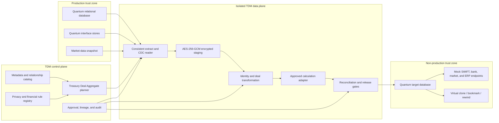

# FIS AvantGard Quantum Treasury TDM Solution Blueprint

Document owner: Enterprise Data Engineering  
Document type: Test Data Management implementation blueprint  
Target platform: Enterprise-grade TDM platform  
Primary source pattern: FIS AvantGard Quantum relational database with treasury interfaces  
Status: Implementation design

## 1. Executive intent

This blueprint defines how an enterprise TDM implementation will discover, subset, de-identify, reconcile, provision, refresh, and govern non-production data for FIS AvantGard Quantum.

The implementation must support treasury testing without reducing Quantum to a collection of unrelated database tables. A usable test data set must preserve the complete economic and operational meaning of a deal:

- legal entity and counterparty;
- portfolio, book, trader, and product classification;
- principal or notional;
- currencies, rates, spreads, and price;
- trade, value, reset, payment, maturity, and settlement dates;
- legs, schedules, fixings, and cash flows;
- settlement instructions and Nostro/Vostro references;
- confirmations, payments, and accounting postings;
- market-data context used for valuation and risk;
- lifecycle events, amendments, cancellations, and rollovers.

The central design object is a **Treasury Deal Aggregate**. A subset, transformation, refresh, rewind, or deletion operates on this aggregate and its governed reference snapshot, not on isolated rows.

The expected outcome is a non-production Quantum environment that:

1. contains no disallowed production identity or payment-routing data;
2. remains mathematically and relationally valid;
3. supports realistic FX, Money Market, and derivative test scenarios;
4. preserves valuation and risk behavior within agreed tolerances;
5. cannot send instructions to production banks, SWIFT, matching venues, or payment networks;
6. is reproducible, refreshable, auditable, and disposable.

## 2. TDM implementation scope

### 2.1 In scope

- Quantum relational tables and approved views.
- FX spot, forward, swap, option-related, and configured currency products.
- Money Market placements, deposits, borrowings, investments, and rollovers.
- Interest-rate swaps and other approved derivative structures.
- Counterparties, legal entities, branches, books, portfolios, and users.
- Settlement instructions, Nostro/Vostro accounts, bank identifiers, BICs, and IBANs.
- Deal legs, schedules, reset/fixing data, cash flows, fees, and taxes.
- Confirmations, payment instructions, settlement statuses, and matching references.
- Accounting events, journals, ledger mappings, and hedge-accounting links where enabled.
- Collateral, limits, exposure, valuation, and risk records required by selected scenarios.
- Market-data snapshots, yield curves, calendars, currencies, rates, and reference data.
- Related inbound and outbound interface records needed for application-valid tests.
- Full-seed extraction, incremental refresh, CDC positions, and point-in-time replay.
- Encrypted staging, transformation, target loading, virtual copies, bookmarks, and rewind.
- Technical, privacy, financial, operational, and governance validation.

### 2.2 Out of scope

- Executing real treasury trades or payments.
- Reconstructing proprietary Quantum pricing algorithms from documentation.
- Changing the production Quantum schema or production calculations.
- Sending confirmations or settlement messages to production counterparties.
- Copying production signing keys, certificates, credentials, or HSM material.
- Treating independent random value changes as valid deal masking.
- Partially masking a live market-data set in a way that corrupts curves or risk results.
- Using the TDM platform as the authoritative general ledger or risk engine.

## 3. Design principles

1. **Deal closure before row count.** Select complete deals and required context before applying volume limits.
2. **Transform economic variables as a contract.** Related values are recalculated together.
3. **Use source-equivalent calculations.** Product- and release-specific calculations invoke approved Quantum services, libraries, or certified rule modules.
4. **Separate identity from economics.** Counterparty and account identity is tokenized; balances and deal economics are reconciled.
5. **Keep market data coherent.** Preserve one complete approved snapshot or replace it with another complete snapshot.
6. **Determinism is scoped.** The same business identifier maps consistently wherever linkage is required.
7. **No live egress.** Every external treasury route is blocked or replaced by a governed simulator.
8. **Non-production keys only.** Test certificates, encryption keys, and credentials must be separate from production.
9. **Evidence is part of the output.** A provisioned data set is incomplete without lineage and reconciliation evidence.
10. **Fail closed.** Unresolved financial, privacy, or routing violations block release.

## 4. Quantum estate interpretation

### 4.1 Functional domains

| Domain | Typical records | TDM concern |
|---|---|---|
| Organization | legal entities, branches, books, portfolios, users | identity, authorization, reporting hierarchy |
| Counterparty | legal name, aliases, contacts, limits, ratings | privacy, sanctions-like test realism, cross-system identity |
| FX | spot, forwards, swaps, options, allocations | currencies, notional, rate, dates, cash-flow consistency |
| Money Market | deposits, loans, placements, investments | principal, rate/profit, day count, accrual, maturity |
| Derivatives | swaps, legs, resets, fixings, schedules | coupled calculations and lifecycle integrity |
| Settlement | SSI, Nostro/Vostro, bank accounts, BIC, IBAN | payment privacy, format validity, safe routing |
| Confirmation | messages, matching references, acknowledgements | status chains, duplicate prevention, endpoint isolation |
| Accounting | events, journals, ledger accounts, hedge links | balanced postings and period integrity |
| Risk | valuation, exposure, limits, collateral, sensitivities | coherent market snapshot and tolerance validation |
| Market reference | curves, rates, calendars, currencies, indices | must remain a complete, internally consistent snapshot |
| Interfaces | SWIFT, bank files/APIs, market feeds, ERP, trading venues | data-format fidelity and zero production egress |

Physical table names vary by Quantum release, enabled modules, and client configuration. The implementation must discover and bind the actual schema to this logical model through metadata rather than hard-coded table assumptions.

### 4.2 Data classes

Quantum data is divided into four control classes:

| Class | Examples | Default treatment |
|---|---|---|
| Identity | counterparty name, contact, trader, beneficiary | deterministic substitution |
| Payment routing | SSI, account number, BIC, IBAN, bank routing | format-valid test token plus non-production endpoint |
| Deal economics | principal, notional, rate, spread, dates, cash flows | coordinated mathematical transformation |
| Market/reference | curves, fixings, calendars, currency definitions | coherent approved snapshot; no partial random masking |

This separation prevents the common mistake of applying an identity-tokenization rule to a financial amount or applying independent randomization to mutually dependent deal values.

## 5. Treasury Deal Aggregate

### 5.1 Aggregate root

The aggregate root is the stable logical deal identifier, resolved from the configured Quantum deal, contract, transaction, or instrument key.

Each selected root must carry all rows needed to represent the same deal through its current lifecycle state.

### 5.2 Aggregate membership

```text
Treasury Deal
  +-- organization / legal entity / branch
  +-- counterparty and client crosswalk
  +-- portfolio / book / trader
  +-- product and instrument definition
  +-- deal header and version history
  +-- one or more economic legs
  |    +-- currency and notional
  |    +-- fixed or floating rate terms
  |    +-- schedules, resets, and fixings
  |    +-- projected and realized cash flows
  +-- fees, taxes, commissions, and allocations
  +-- settlement instruction and bank account
  +-- confirmation and matching state
  +-- payment and settlement state
  +-- accounting events and journal entries
  +-- collateral, exposure, and limit references
  +-- valuation and risk results
  +-- coherent market/reference snapshot
  +-- interface payloads and acknowledgements
```

### 5.3 Aggregate closure rules

For every selected deal:

1. include all active economic legs;
2. include all schedule rows required to calculate those legs;
3. include lifecycle events needed to explain the selected current state;
4. include settlement instructions used by the selected cash flows;
5. include confirmation and payment records needed by the test scenario;
6. include balanced accounting groups, never one side of an entry;
7. include the market-data snapshot identifier used by retained valuation records;
8. include reference rows required for application reads;
9. include related counterparties and organization rows through deterministic crosswalks;
10. exclude unrelated historical data unless explicitly requested.

### 5.4 Scenario packs

The aggregate supports reusable scenario packs:

- FX spot booking and same-day settlement;
- FX forward through maturity;
- FX swap with near and far legs;
- Money Market placement with accrual and maturity;
- Money Market rollover;
- fixed/floating interest-rate swap with resets and payments;
- amendment, cancellation, or early termination;
- failed confirmation and repair;
- failed settlement and retry;
- limit breach;
- collateral call;
- accounting period close;
- valuation or VaR regression under a named market snapshot.

Each pack defines required members, allowed states, expected calculations, and release gates.

## 6. Reference architecture



No data plane component writes to production. Production access is read-only and separated from target credentials.

## 7. Metadata and control plane

### 7.1 Required source metadata

The implementation catalog records:

- database engine and release;
- Quantum application release and enabled modules;
- schemas, tables, views, columns, types, lengths, scales, and nullability;
- primary, unique, foreign, and tool-defined keys;
- check constraints, default expressions, sequences, triggers, and partitions;
- relationship confidence and source: database, application metadata, or approved manual rule;
- deal-family classification;
- sensitive-data classification;
- market/reference classification;
- transaction volume and date distribution;
- lifecycle/state columns;
- accounting-group and control-total columns;
- interface message layouts and endpoint classifications;
- owner, retention, criticality, and approval status.

### 7.2 Relationship precedence

When multiple relationships describe the same child-to-parent association:

1. a reviewed explicit TDM relationship may override a database relationship;
2. otherwise, a valid database foreign key is preferred;
3. an application-derived relationship is used when the database does not enforce it;
4. unresolved ambiguity blocks the affected aggregate;
5. an approved `NONE` selection disables traversal for that edge and is retained as evidence.

### 7.3 Versioned rules

Every run freezes:

- catalog version;
- relationship version;
- privacy-policy version;
- financial-rule version;
- calculation-adapter version;
- scenario-pack version;
- market-snapshot identifier;
- tokenization-key version;
- target-routing policy;
- approval record.

Changing any frozen item creates a new run plan and new evidence identity.

## 8. Cross-system identity and deterministic mapping

### 8.1 Canonical identifiers

The identity registry supports:

- Client CIF reference;
- counterparty identifier;
- legal-entity identifier;
- deal or contract identifier;
- settlement account number;
- Nostro/Vostro account reference;
- confirmation reference;
- payment reference;
- portfolio/book reference.

### 8.2 Mapping contract

For a value that must remain joinable:

```text
token = Format(
    HMAC-SHA-256(
        keyVersion,
        scope + canonicalValue
    )
)
```

The scope determines intentional reuse:

- `CLIENT_CIF` maps a client consistently across approved systems;
- `DEAL_ID` maps all representations of one deal;
- `SETTLEMENT_ACCOUNT` maps an account consistently across SSI, payment, and accounting records;
- separate scopes prevent accidental equality between unrelated identifier types.

Collision detection is mandatory. A token is committed only after uniqueness is proven within its configured business scope.

### 8.3 Crosswalk evidence

The released data set retains encrypted lineage showing:

- source system and identifier type;
- canonicalization rule;
- token scope and key version;
- target system and target identifier;
- collision-resolution counter, if any.

Clear production identifiers are not included in ordinary operator reports.

## 9. Counterparty and organization treatment

### 9.1 Fictional institutions

Counterparty and bank identities are replaced from an approved fictional institution catalog containing:

- legal and short names;
- country and region;
- entity type;
- test BIC and branch codes;
- supported currencies;
- risk category;
- test-only contact details.

The catalog must not create a misleading match to a real sanctioned or restricted entity.

### 9.2 Consistency

The same transformed institution must appear consistently in:

- counterparty master;
- deal header;
- settlement instructions;
- confirmations;
- payment records;
- exposure and limit records;
- accounting descriptions;
- interface payloads.

### 9.3 Free text

Narratives, comments, confirmation text, remittance information, and imported payloads receive:

1. structured-field transformation where layouts are known;
2. sensitive-data detection on residual free text;
3. deterministic replacement for recognized entity references;
4. redaction or synthetic replacement for unresolved sensitive fragments;
5. post-transform privacy rescan.

## 10. Financial transformation contracts

### 10.1 General rule

The engine never changes principal, notional, rate, spread, price, or dates independently when another retained value depends on it.

For each product family, transformation is:

```text
source aggregate
  -> choose governed scenario transformation
  -> transform independent variables
  -> invoke approved product calculation
  -> regenerate dependent schedules and amounts
  -> reconcile against product invariants
  -> release or quarantine
```

Product equations in this document are representative validation concepts. The deployed rule must use the release-specific Quantum calculation path or a certified equivalent.

### 10.2 Transformation modes

| Mode | Purpose | Treatment |
|---|---|---|
| Preserve economics | privacy-only testing | identity changes; economic values unchanged |
| Scale economics | volume/risk scenarios | notionals/principals scaled and dependent values recalculated |
| Shift dates | lifecycle testing | dates shifted through a valid business-calendar rule and schedules rebuilt |
| Reprice | valuation testing | approved rate/curve scenario applied and dependent outputs regenerated |
| State transition | operational testing | lifecycle moved through an allowed state-machine transition |
| Synthetic deal | new-scenario testing | complete deal built from product template and approved reference snapshot |

### 10.3 Date handling

Date shifting must respect:

- trade date before or equal to value date;
- start date before maturity date;
- reset/fixing dates before affected payment dates;
- business-day conventions;
- holiday calendars;
- tenor and frequency;
- month-end handling;
- settlement lag;
- accounting period rules;
- lifecycle ordering.

An invalid date combination is quarantined before target load.

## 11. FX treatment

### 11.1 FX aggregate

An FX aggregate includes:

- trade and deal identifiers;
- buy and sell currencies;
- base and quote amounts;
- agreed rate and rate convention;
- trade, value, fixing, and maturity dates;
- near/far legs for swaps;
- premiums, fees, and commissions;
- settlement instructions for each currency leg;
- confirmations, payments, accounting, and valuation references.

### 11.2 FX invariants

Subject to configured quotation convention and rounding:

```text
quoteAmount = baseAmount * agreedRate
```

or its configured inverse convention.

The TDM rule must preserve:

- currency-pair compatibility;
- quote convention;
- near/far leg direction;
- value-date chronology;
- amount/rate relationship;
- rounding and decimal precision;
- settlement account currency;
- accounting balance;
- lifecycle state.

### 11.3 FX forward and swap

For a forward:

- if notional, rate, or maturity changes, regenerate the dependent quote amount and downstream cash flow;
- retain or recalculate forward points using the approved calculation adapter;
- use the selected market snapshot consistently.

For a swap:

- near and far legs remain linked;
- buy/sell direction reverses as required by the product;
- both leg amounts and dates reconcile;
- settlement instructions match each leg currency.

### 11.4 FX release evidence

Evidence includes:

- before/after invariant values without exposing production identity;
- calculation-adapter version;
- rounding convention;
- market-snapshot identifier;
- per-deal pass/fail result;
- aggregate currency totals.

## 12. Money Market treatment

### 12.1 Money Market aggregate

The aggregate includes:

- principal;
- currency;
- start and maturity dates;
- interest or profit rate;
- day-count basis;
- payment frequency;
- accrued and maturity amounts;
- rollover links;
- settlement instructions;
- accounting and valuation records.

### 12.2 Invariants

The implementation validates:

- principal is positive unless the product explicitly permits otherwise;
- start date precedes maturity;
- tenor matches configured dates;
- interest/profit amount agrees with principal, rate, day count, and period;
- maturity amount equals principal plus or minus configured dependent amounts;
- rollover references form an allowed chain;
- payment-account currency is compatible;
- accounting postings balance.

### 12.3 Accrual calculation

A representative simple-interest check is:

```text
interest = principal * annualRate * dayCountFraction
```

The production implementation must use Quantum's configured conventions, including compounding, calendars, rounding, and product-specific profit rules.

## 13. Derivative and swap treatment

### 13.1 Interest-rate swap aggregate

The aggregate includes:

- swap header;
- fixed and floating legs;
- currency and notional for each leg;
- effective and maturity dates;
- payment and reset frequencies;
- fixed rate, floating index, and spread;
- amortization;
- business-day and day-count conventions;
- reset/fixing observations;
- projected and realized cash flows;
- termination or amendment events;
- confirmation, collateral, valuation, accounting, and settlement rows.

### 13.2 Coupled transformation

The two legs are transformed as one contract:

1. transform allowed independent variables;
2. rebuild schedules;
3. resolve reset and fixing dates;
4. calculate projected cash flows;
5. preserve paid cash flows unless the scenario explicitly rewinds them;
6. regenerate valuation inputs and linked results as configured;
7. reconcile accounting and lifecycle state.

### 13.3 Swap invariants

- leg count and pay/receive direction are valid;
- schedules cover the contract period without unapproved gaps or overlaps;
- reset dates align to floating periods;
- fixed and floating cash flows use the correct conventions;
- amortizing notional schedules are monotonic where required;
- termination and amendment chronology is valid;
- net settlement agrees with component cash flows;
- valuation and sensitivity differences remain within approved tolerances.

## 14. Settlement instructions and bank identifiers

### 14.1 SSI treatment

Standing Settlement Instructions are transformed as structured records, not as free text. The rule coordinates:

- counterparty;
- currency;
- account owner;
- bank and branch;
- Nostro/Vostro role;
- account number or IBAN;
- BIC;
- intermediary/correspondent chain;
- effective dates;
- priority and status.

### 14.2 BIC

A transformed BIC must:

- satisfy the required 8- or 11-character structure;
- use a test institution entry approved for the environment;
- map consistently across SSI, payment, and confirmation data;
- never route to a production endpoint.

Format validity does not imply the identifier is safe for routing. Endpoint isolation is a separate mandatory gate.

### 14.3 IBAN

A transformed IBAN must:

- preserve the configured country format;
- preserve the required length;
- pass the IBAN checksum;
- use a test bank/account component;
- map consistently across all occurrences;
- remain unique within the configured target scope.

### 14.4 Nostro/Vostro accounts

Account identifiers are tokenized, but amounts are not treated as opaque tokens.

The implementation must reconcile:

- account currency;
- opening balance;
- retained movements;
- closing balance;
- available balance where modeled;
- deal and payment references;
- accounting postings.

If movements are subsetted, the target balance is recalculated or a governed balancing entry is added according to the scenario contract. The original production balance must not be copied merely to make a partial subset appear reconciled.

### 14.5 SWIFT and ISO 20022 message treatment

SWIFT MT, SWIFT MX/ISO 20022, bank files, and configured payment payloads are parsed with versioned schemas or approved copybooks/layout definitions. They are not transformed with broad text replacement.

The message rule:

1. parses the payload into typed fields;
2. links deal, party, account, SSI, amount, currency, and date fields to the Treasury Deal Aggregate;
3. applies the same deterministic identity and routing transformations used in the database;
4. recalculates message-level dependent values and identifiers;
5. serializes using the original approved message family and version;
6. validates schema, cardinality, data type, field length, enumeration, and checksum rules;
7. reconciles message amounts and references to database records;
8. routes output only to an approved simulator, capture-only endpoint, or test endpoint.

Where a message contains a signature, MAC, encrypted block, or production authentication material, the production value is discarded. A test-domain value may be generated only with approved non-production keys.

## 15. Market-data and reference-data isolation

### 15.1 Market-data rule

Yield curves, FX rates, fixings, volatility surfaces, indices, calendars, and other valuation references form a coherent snapshot. The implementation chooses one of two approved modes:

1. **Preserved approved snapshot:** copy a complete historical or frozen snapshot with no sensitive identity data.
2. **Synthetic coherent snapshot:** replace the complete snapshot with a governed synthetic set and revalue affected deals.

Partial random masking is prohibited because it can produce internally inconsistent curves and meaningless valuation or VaR results.

### 15.2 Snapshot boundary

Every run records:

- market date and valuation timestamp;
- source snapshot or batch identifier;
- curve and surface versions;
- fixing cutoff;
- holiday-calendar version;
- currency and index catalog version;
- completeness checks;
- target snapshot identifier.

Deals and valuation outputs are released only when their required reference set is present.

### 15.3 Reference-data treatment

| Reference data | Default action |
|---|---|
| currencies and decimal rules | preserve |
| holiday calendars | preserve as a versioned set |
| business-day conventions | preserve |
| product definitions | preserve or clone as approved |
| yield curves and FX rates | preserve complete snapshot or replace complete snapshot |
| counterparties and banks | replace with fictional governed catalog |
| live endpoint and routing configuration | replace with non-production configuration |
| production credentials and certificates | never copy |

## 16. Discovery and privacy policy

### 16.1 Discovery coverage

Discovery scans:

- metadata names and comments;
- structured column values;
- JSON, XML, CLOB, and message payloads;
- confirmation and payment narratives;
- imported bank data;
- interface staging and reject tables;
- logs and audit payloads within the approved scope;
- table and column lineage.

Treasury-specific types include:

- counterparty and beneficiary identity;
- Client CIF;
- SSI;
- bank account;
- IBAN;
- BIC;
- Nostro/Vostro;
- payment reference;
- deal reference;
- trader and user identity;
- phone, email, address, tax identifier, and national identifier.

### 16.2 Policy order

Transformation order is:

1. resolve aggregate and relationship closure;
2. select market/reference snapshot;
3. canonicalize cross-system identifiers;
4. transform organization and personal identity;
5. transform routing identifiers and SSI;
6. transform allowed independent economic variables;
7. recalculate dependent deal values;
8. rebuild schedules and cash flows;
9. reconcile balances and accounting;
10. transform structured interface payloads;
11. scan residual free text;
12. apply endpoint overrides;
13. run release gates.

### 16.3 Residual privacy gate

After transformation:

- rescan the target and generated files/messages;
- compare findings against the approved allowlist;
- quarantine records with unresolved high-confidence findings;
- block release when restricted data exceeds the threshold;
- retain a sanitized finding report.

## 17. Subsetting and scenario selection

### 17.1 Root selectors

Supported selectors include:

- Client CIF;
- counterparty;
- legal entity;
- deal identifier;
- product family;
- portfolio or book;
- currency pair;
- trade/value/maturity range;
- lifecycle state;
- settlement state;
- exception state;
- scenario pack;
- deterministic sample.

### 17.2 Closure algorithm

The planner:

1. resolves selected roots;
2. expands deal versions and product-specific members;
3. includes required organization and counterparty records;
4. includes each settlement and accounting group atomically;
5. attaches the coherent market/reference snapshot;
6. applies relationship overrides;
7. checks scenario completeness;
8. estimates row and storage volume;
9. obtains approval for sensitive or high-value scenarios;
10. freezes the run plan.

### 17.3 Volume controls

Volume limits apply to root aggregates, not arbitrary child rows. A limit of 1,000 FX deals means 1,000 complete deal aggregates plus required shared reference data.

Deterministic sampling uses the run seed and stable root key, so the same plan can reproduce the same aggregate selection.

## 18. Consistent extraction and CDC

### 18.1 Full seed

The initial seed uses a database-consistent read boundary or an approved source snapshot. It records:

- source database identity;
- snapshot or transaction position;
- extraction start and completion;
- table/partition row counts;
- aggregate counts;
- market-snapshot identifier;
- checksum and restart checkpoint.

Long-running extraction must avoid prolonged blocking of the production workload.

### 18.2 Incremental refresh

Incremental capture may use:

- database log-based CDC;
- approved change tables;
- application audit/version metadata;
- timestamp/watermark capture where transactional CDC is unavailable.

CDC is grouped by Treasury Deal Aggregate. If one leg or schedule row changes, the refresh planner reevaluates the complete affected aggregate before applying the change to a target clone.

### 18.3 Point-in-time provisioning

To provision as of time `T`:

1. restore the latest certified base snapshot at or before `T`;
2. replay ordered committed changes through `T`;
3. resolve aggregate changes atomically;
4. attach the market/reference snapshot valid for the selected policy;
5. transform using the frozen policy and key versions;
6. reconcile and release a new target bookmark.

The run manifest records source positions, replay boundaries, skipped transactions, and target bookmark.

### 18.4 Restart behavior

Each extract and load unit is idempotent. Restart must not:

- duplicate deals;
- duplicate cash flows;
- double-post accounting entries;
- apply a settlement twice;
- advance a lifecycle event out of order;
- mix market snapshots.

## 19. Encrypted staging and zero-trust controls

Staged data is encrypted with AES-256-GCM using envelope encryption:

- per-run data-encryption key;
- key-encryption key held by an approved KMS or Vault;
- authenticated metadata including run, partition, and schema version;
- no clear production credentials in staging;
- per-run access policy;
- immutable access audit;
- explicit expiration and cryptographic deletion.

Operators can see progress, counts, sanitized samples, and validation results without direct access to unmasked payloads.

Network policy allows only:

- approved source read paths during extraction;
- control-plane communication;
- approved target write paths;
- mock/test endpoints after provisioning.

Production SWIFT, bank, payment, confirmation, trading, market-data publishing, email, and notification routes are denied.

## 20. Transformation and reconciliation pipeline

```text
Catalog
  -> Plan Treasury Deal Aggregates
  -> Consistent extract / CDC replay
  -> Encrypted staging
  -> Identity and payment-routing transformation
  -> Product calculation
  -> Schedule and cash-flow regeneration
  -> Accounting and balance reconciliation
  -> Interface transformation
  -> Privacy rescan
  -> Target load
  -> Application, risk, and egress validation
  -> Certified bookmark
```

### 20.1 Quarantine

A record or aggregate is quarantined when:

- a required relationship is unresolved;
- product calculation fails;
- dates violate lifecycle ordering;
- schedules contain gaps or overlaps;
- cash flows do not reconcile;
- accounting is unbalanced;
- settlement currency and account disagree;
- the market snapshot is incomplete;
- residual restricted data is detected;
- a production endpoint remains reachable.

The default action is to quarantine the entire affected deal aggregate, not to silently discard one child row.

### 20.2 Reject policy

Skip-bad-row behavior is not permitted for financially coupled rows. An approved tolerance may allow unrelated aggregates to continue, but the failed aggregate remains excluded and reported.

## 21. Target provisioning

### 21.1 Load order

A representative dependency-aware order is:

1. static reference configuration;
2. market/reference snapshot;
3. organization and legal entities;
4. fictional counterparties and bank masters;
5. portfolios, books, products, and limits;
6. transformed SSI and account references;
7. deal headers and versions;
8. legs, schedules, resets, and fixings;
9. cash flows, fees, and allocations;
10. confirmations and payment records;
11. accounting, valuation, risk, and collateral records;
12. interface and audit records;
13. non-production endpoint overrides.

Actual order is generated from the discovered dependency graph and approved application rules.

### 21.2 Loading strategy

The platform selects:

- certified native loader where available;
- JDBC/driver streaming for transactional or smaller loads;
- staging-table merge for restartable updates;
- partition exchange where supported and approved;
- copy-on-write virtual clone for rapid environment creation.

Batch size and parallelism are calculated from:

- database parameter limits;
- row width and LOB usage;
- index and trigger behavior;
- target resource limits;
- product dependency groups;
- recovery-unit size.

### 21.3 Post-load actions

- rebuild or validate indexes and constraints;
- restore target-only triggers and jobs;
- compile invalid objects where required;
- replace endpoints and credentials;
- disable production schedules and outbound queues;
- reconcile aggregate counts and financial totals;
- run Quantum application smoke checks;
- create a certified bookmark only after all mandatory gates pass.

## 22. External integration isolation

### 22.1 Integration inventory

The implementation inventories and classifies:

- SWIFT gateways and queues;
- bank APIs and file channels;
- payment hubs;
- matching and confirmation platforms;
- trading venues;
- market-data providers and publishers;
- ERP/general-ledger interfaces;
- risk and reporting platforms;
- email, SMS, and workflow notification;
- schedulers and batch agents.

### 22.2 Isolation policy

Every route is assigned:

- `BLOCK`;
- `MOCK`;
- `CAPTURE_ONLY`;
- `TEST_ENDPOINT`;
- approved `READ_ONLY_REFERENCE`.

Unknown routes default to `BLOCK`.

### 22.3 Launch gate

Before application startup, an automated egress probe proves:

- DNS and host overrides resolve only to test destinations;
- production IP ranges are denied;
- production certificates and credentials are absent;
- queues/topics use test namespaces;
- outbound files land only in quarantined test locations;
- schedulers that can initiate settlement are disabled or redirected.

## 23. OpenShift and HCI deployment

The data plane is deployed as restartable workers with:

- namespace-level isolation;
- separate service accounts for source read, staging, target load, and validation;
- Kubernetes secrets backed by Vault/KMS;
- encrypted persistent volumes;
- resource requests and limits;
- horizontal scaling driven by queue depth and throughput;
- pod disruption budgets;
- resumable checkpoints;
- centralized logs, metrics, and traces;
- network policies enforcing the integration allowlist.

The design supports HCI-backed storage while avoiding a requirement that unmasked source data be permanently materialized.

## 24. Virtual environment lifecycle

After a target is certified:

- create named virtual clones for teams;
- reserve a clone with owner and expiry;
- bookmark known test states;
- rewind after a test;
- refresh from a newer certified base plus CDC;
- capture change evidence;
- revoke and delete expired clones;
- prove storage and encryption-key cleanup.

Refreshing a clone reruns aggregate and validation rules for changed data. It does not blindly copy CDC rows into an already transformed environment.

## 25. Validation model

### 25.1 Structural validation

- expected objects exist;
- constraints and indexes are valid;
- configured object counts match;
- no unexpected orphan relationships exist;
- deal versions and lifecycle chains are complete.

### 25.2 Mathematical validation

- FX amount/rate relationships pass configured conventions;
- Money Market accrual and maturity values reconcile;
- swap legs, schedules, resets, and cash flows are complete;
- balances reconcile to retained movements;
- fees, taxes, and net amounts reconcile;
- accounting entries balance;
- valuation/risk differences remain inside approved tolerances.

### 25.3 Privacy validation

- no unapproved production counterparty identity remains;
- payment and settlement identifiers are transformed;
- free text and payloads pass residual discovery;
- reports contain only sanitized evidence;
- staging retention and deletion are proven.

### 25.4 Operational validation

- Quantum starts and reads selected deals;
- approved deal lifecycle tests execute;
- confirmation and settlement tests reach only simulators;
- restart and replay are idempotent;
- clone/bookmark/rewind/refresh behave as designed.

## 26. Acceptance criteria

| ID | Acceptance criterion | Required evidence |
|---|---|---|
| QTM-001 | Every in-scope Quantum object maps to a logical domain or approved exclusion | Catalog and exclusion report |
| QTM-002 | Selected roots produce complete Treasury Deal Aggregates | Aggregate-closure report |
| QTM-003 | Client CIF, deal, and settlement identifiers remain consistent across approved systems | Cross-system identity matrix |
| QTM-004 | Counterparties and institutions are fictional, governed, and internally consistent | Substitution report |
| QTM-005 | SSI relationships remain complete and effective-date valid | SSI validation report |
| QTM-006 | Transformed BICs and IBANs satisfy configured format and checksum rules | Identifier-format report |
| QTM-007 | Nostro/Vostro account references are consistent across deals, SSI, payments, and accounting | Settlement-account matrix |
| QTM-008 | Account balances reconcile to retained movements or approved balancing treatment | Balance report |
| QTM-009 | FX spot/forward amount and rate relationships pass configured conventions | FX calculation report |
| QTM-010 | FX swap near/far legs, dates, directions, and settlements reconcile | FX swap report |
| QTM-011 | Money Market principal, rate/profit, day count, accrual, and maturity reconcile | Money Market report |
| QTM-012 | Interest-rate swap legs, schedules, resets, fixings, and cash flows reconcile | Swap calculation report |
| QTM-013 | Amendments, cancellations, rollovers, and terminations satisfy lifecycle ordering | Lifecycle report |
| QTM-014 | Confirmation, payment, and settlement status chains are scenario valid | Operations report |
| QTM-015 | Every retained accounting group balances | Accounting reconciliation |
| QTM-016 | Market curves, rates, fixings, calendars, and indices form one complete approved snapshot | Market-snapshot manifest |
| QTM-017 | Revalued deals and risk measures remain within approved product tolerances | Valuation/risk comparison |
| QTM-018 | No production SWIFT, bank, payment, matching, trading, market-publishing, or notification route is reachable | Egress test |
| QTM-019 | No production credentials, certificates, or signing material exists in the target | Secret and certificate scan |
| QTM-020 | Post-transform discovery finds no unapproved restricted data | Privacy rescan |
| QTM-021 | Full-seed and CDC positions are complete and replayable | Snapshot/CDC manifest |
| QTM-022 | Interrupted extraction, transformation, and load resume without duplicate financial effects | Recovery exercise |
| QTM-023 | Staging is encrypted, access-controlled, and deleted on schedule | Security and retention evidence |
| QTM-024 | Quantum reads and processes representative transformed deals | Application smoke test |
| QTM-025 | The representative scope completes inside the agreed 4-6 hour window | Timed performance report |
| QTM-026 | OpenShift/HCI deployment, scaling, PVC recovery, and restart pass | Platform evidence |
| QTM-027 | Clone, bookmark, rewind, refresh, reservation, and expiry work | Environment-lifecycle evidence |
| QTM-028 | Every aggregate is traceable to source position, policies, calculation version, market snapshot, and target result | Lineage manifest |
| QTM-029 | The agreed large-volume benchmark demonstrates the target throughput, including the 500 GB/hour RFP objective where applicable | Performance benchmark |
| QTM-030 | SWIFT and ISO 20022 messages pass versioned schema round-trip validation and reconcile to transformed database records | Message validation and cross-format reconciliation |

## 27. Failure handling

| Failure | Handling |
|---|---|
| source snapshot expires | stop, retain checkpoint, obtain a new consistent boundary |
| CDC gap | block point-in-time release and rebuild from a certified base |
| unknown product or rule | quarantine affected aggregate and require rule approval |
| calculation adapter unavailable | pause financial transformation; do not use an approximation silently |
| reconciliation failure | quarantine complete accounting/deal group |
| market snapshot incomplete | block valuation/risk scenarios |
| token collision | resolve deterministically and retain collision evidence |
| target batch failure | roll back recovery unit and resume from checkpoint |
| residual privacy finding | quarantine affected aggregate and rescan after correction |
| production route detected | block application launch and revoke target certification |

## 28. Governance and operating model

### 28.1 Roles

| Role | Responsibility |
|---|---|
| TDM platform administrator | platform configuration and availability |
| Quantum application owner | scope, application behavior, and release approval |
| Treasury product SME | product invariants and scenario packs |
| Data steward | classifications, relationships, and exceptions |
| Security/PCI/privacy reviewer | identity, payment, secret, and retention controls |
| Risk/valuation SME | market snapshot and valuation tolerances |
| Accounting SME | journal and balance validation |
| Environment operator | approved provisioning and clone lifecycle |
| Tester | request, reserve, use, rewind, and release test data |
| Auditor | read-only evidence review |

### 28.2 Maker-checker

High-risk actions require separate requester and approver:

- releasing a new privacy policy;
- releasing a new financial calculation rule;
- approving a new market snapshot;
- provisioning high-value deal scenarios;
- changing egress routing;
- exporting data;
- promoting a package between environments.

Emergency administrative bypass, if allowed, must be explicit, time-bound, justified, and independently reviewed.

### 28.3 Evidence retention

Retain:

- immutable run manifest;
- approvals;
- policy and rule versions;
- sanitized reconciliation results;
- privacy-scan results;
- source and CDC positions;
- target bookmark and lifecycle events;
- loader, retry, and failure decisions;
- deletion evidence.

Retention periods are policy-driven and must not preserve clear production values beyond approved need.

## 29. Implementation phases

### Phase 0: Readiness

- confirm Quantum release, modules, database engine, and connectivity;
- inventory external interfaces and test substitutes;
- identify approved calculation paths;
- agree product tolerances and evidence ownership.

### Phase 1: Catalog and aggregate model

- discover schemas, constraints, lifecycle tables, and volumes;
- classify identity, economics, routing, and market data;
- build Treasury Deal Aggregate relationships;
- review manual relationships and exclusions.

### Phase 2: Security and identity

- configure counterparty and identifier transformations;
- build fictional institution and test-bank catalogs;
- implement BIC/IBAN/SSI treatment;
- validate deterministic cross-system mappings.

### Phase 3: Product rules

- implement FX, Money Market, and derivative adapters;
- build schedule, cash-flow, settlement, accounting, and balance reconciliation;
- certify scenario packs;
- establish market snapshot handling.

### Phase 4: Provisioning and isolation

- implement full seed, CDC, encrypted staging, and restart;
- load dependency-ordered target data;
- replace credentials and endpoints;
- execute application and egress tests.

### Phase 5: Scale and service

- tune loaders and partitioning;
- prove OpenShift/HCI scaling and recovery;
- certify clones, bookmarks, refresh, and expiry;
- complete performance benchmark and operating runbooks.

## 30. Proof-of-concept plan

### Day 1: Discover and model

- connect read-only to the approved Quantum source;
- catalog representative FX, Money Market, swap, SSI, accounting, and market tables;
- select example deals;
- produce aggregate-closure and privacy findings.

### Day 2: Identity and settlement

- substitute fictional counterparties;
- transform Client CIF, account, BIC, IBAN, SSI, and Nostro/Vostro identifiers;
- prove cross-table and cross-system determinism;
- prove no production routing remains.

### Day 3: Mathematical scrambling

- transform a multi-currency FX forward or swap;
- transform a Money Market placement;
- transform an interest-rate swap;
- regenerate dependent amounts, schedules, and cash flows through the approved calculation path.

### Day 4: Provision and validate

- load the non-production target;
- reconcile deal math, balances, accounting, and market snapshot;
- execute Quantum reads and selected lifecycle tests;
- run residual privacy and egress scans.

### Day 5: Recover and evidence

- interrupt and resume a run;
- create, bookmark, rewind, and refresh a clone;
- measure throughput;
- package acceptance evidence and unresolved exceptions.

## 31. Worked TDM examples

### 31.1 FX forward

Input aggregate:

- source identity exists only in encrypted staging;
- fictional counterparty replaces the production counterparty;
- principal is transformed by an approved scale rule;
- currency pair and quote convention are preserved;
- maturity is shifted through the business calendar;
- quote amount, forward points, cash flow, settlement, accounting, and valuation are recalculated.

Release requires QTM-003, QTM-004, QTM-006, QTM-009, QTM-014 through QTM-020, and QTM-024 to pass.

### 31.2 Money Market placement

The scenario transforms principal, rate/profit, and maturity within configured ranges. The calculation adapter regenerates accrual and maturity amount using the actual product conventions. Settlement account and counterparty are safely substituted; accounting remains balanced.

### 31.3 Interest-rate swap

The scenario changes notional and shifts effective/maturity dates. The engine regenerates fixed and floating schedules, resets, fixings, projected cash flows, settlement events, accounting, and valuation. Independent editing of one leg is prohibited.

### 31.4 Partial account subset

A target includes only selected Nostro movements. The engine does not copy the production closing balance. It calculates the target opening/closing treatment from the approved scenario and emits an explicit balancing record only when the scenario contract permits it.

## 32. Mandatory onboarding decisions

Before implementation, the client must confirm:

1. Quantum release and enabled modules;
2. source database engine, topology, and supported snapshot method;
3. product families and lifecycle states in scope;
4. authoritative deal and Client CIF keys;
5. tool-defined relationships not present in the database;
6. calculation services/libraries that TDM may invoke;
7. valuation and risk tolerances;
8. market-snapshot selection policy;
9. accounting reconciliation ownership;
10. counterparty and fictional institution policy;
11. BIC, IBAN, SSI, and account-format requirements;
12. permitted balancing treatment for partial subsets;
13. external interfaces and approved test endpoints;
14. CDC source and retention window;
15. required data volume and completion window;
16. OpenShift/HCI capacity and storage classes;
17. clone, retention, reservation, and deletion policies;
18. maker-checker and emergency-bypass rules;
19. evidence retention period;
20. definition of production-like application smoke success.

## 33. Required implementation artifacts

- Quantum source and interface inventory.
- Logical-to-physical domain map.
- Treasury Deal Aggregate graph.
- Sensitive-data and payment-routing catalog.
- Counterparty and fictional institution catalog.
- Cross-system identity registry.
- Product calculation-rule registry.
- Market-snapshot manifest.
- Scenario-pack library.
- SSI/BIC/IBAN transformation specification.
- Subset and CDC plan.
- Encrypted staging design.
- Target load and rollback plan.
- Integration deny/allow matrix.
- Financial reconciliation pack.
- Application smoke-test pack.
- Performance and capacity model.
- OpenShift/HCI deployment manifests.
- Operations and recovery runbooks.
- Immutable audit and evidence schema.

## 34. Definition of done

The Quantum TDM implementation is complete only when:

- representative FX, Money Market, and derivative aggregates are modeled;
- product-specific calculations use an approved implementation;
- transformed deals pass mathematical and lifecycle validation;
- SSI, BIC, IBAN, Nostro/Vostro, and Client CIF mappings are consistent and safe;
- accounting and target balances reconcile;
- one coherent market/reference snapshot supports valuation and risk;
- residual privacy scans pass;
- no production endpoint or secret remains;
- full seed and incremental refresh are restartable;
- Quantum application smoke tests pass;
- clones and bookmarks are governed through expiry and deletion;
- the agreed performance window is demonstrated;
- approvals, lineage, and evidence are immutable and reviewable.

## 35. RFP traceability

| RFP requirement theme | Blueprint coverage |
|---|---|
| FX, Money Market, and derivative scrambling | Sections 10-13, 25, 26, 30, 31 |
| Counterparty and SSI de-identification | Sections 9 and 14 |
| Nostro/Vostro, BIC, and IBAN | Sections 8 and 14 |
| Deterministic customer/deal linkage | Section 8 |
| Preserve SWIFT and ISO 20022 layout and format | Sections 14, 16, 22 |
| Maintain deal mathematics | Sections 10-13 and 25 |
| Protect market curves and historical rates | Section 15 |
| Preserve VaR/valuation behavior | Sections 13, 15, 25, 26 |
| Non-locking extraction and CDC | Section 18 |
| Encrypted zero-trust staging | Section 19 |
| Block live payment and matching routes | Section 22 |
| OpenShift/HCI and recovery | Section 23 |
| Virtual clone, bookmark, rewind, refresh | Section 24 |
| Immutable lineage and evidence | Sections 7, 26, 28 |
| Four-to-six-hour window and throughput | Sections 26, 29, 34 |

## 36. Reference material

- FIS Treasury and Risk Manager - Quantum Edition overview: https://www.fisglobal.com/products/fis-treasury-and-risk-manager-quantum-edition/data/overview
- FIS Quantum product sheet: https://www.fisglobal.com/-/media/fisglobal/files/pdf/product-sheet/quantum-product-sheet.pdf
- FIS Treasury and Risk Manager - Quantum Edition: https://www.fisglobal.com/products/fis-treasury-and-risk-manager-quantum-edition
- FIS Treasury, Risk and Payment Suite: https://www.fisglobal.com/products/treasury-risk-and-payment-suite
- FIS liquidity, FX, and risk strategy brochure: https://www.fisglobal.com/-/media/fisglobal/files/pdf/brochure/are-you-satisfied-that-you-built-a-solid-liquidity-fx-and-risk-strategy-brochure.pdf
