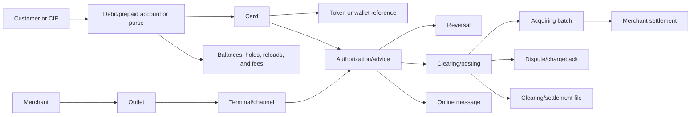
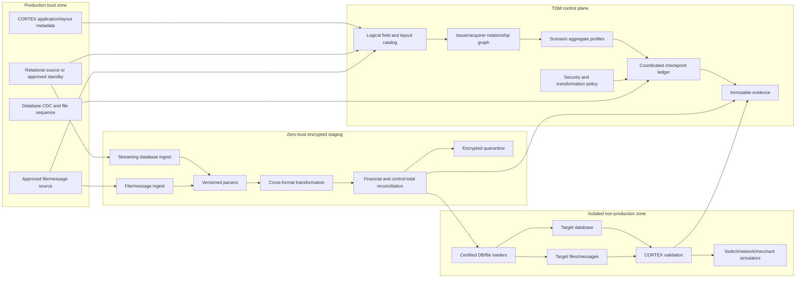

# FIS CORTEX Card Processing TDM Solution Blueprint

Document owner: Enterprise Data Engineering  
Status: Implementation-ready solution blueprint  
Scope: FIS CORTEX debit/prepaid issuing, merchant acquiring, relational data, and flat-file/message processing  
Product assumption: A vendor-neutral, enterprise-grade test data management platform  

## 1. Executive intent

This blueprint defines how an enterprise TDM platform will discover, extract, subset, transform, validate, and provision CORTEX test data while preserving issuing, prepaid, acquiring, transaction, clearing, and settlement integrity across both relational records and flat-file/message layouts.

The governed test-data unit is a **Card Transaction Ecosystem Aggregate**. It can contain:

- cardholder and customer identity;
- debit/prepaid account or purse;
- card and token;
- authorization, reversal, and clearing records;
- merchant, outlet, terminal, and acquiring hierarchy;
- transaction batch and settlement;
- database rows and corresponding file/message records;
- product, currency, routing, fee, and risk reference data.

The target outcome is a repeatable TDM process with evidence proving that:

- customer, account, card, merchant, terminal, transaction, and settlement relationships remain valid;
- debit and prepaid balances reconcile;
- authorization, reversal, clearing, dispute, and settlement chains remain traceable;
- database and flat-file representations agree;
- PAN transformation preserves the approved IIN/BIN behavior, format, uniqueness, and Luhn validity;
- production Track 2, PIN, verification values, and cryptographic material are not copied into standard non-production;
- synthetic test messages preserve required field positions, encodings, headers, trailers, counts, and checksums;
- customer and account keys remain deterministic across connected systems;
- no test traffic reaches production payment, acquiring, merchant, HSM, or customer-contact endpoints;
- every delivered environment passes privacy, structural, financial, lifecycle, and application validation.

## 2. TDM implementation scope

### 2.1 In scope

- CORTEX relational metadata and application metadata.
- Issuer, institution, portfolio, program, product, and merchant boundaries.
- Debit and prepaid card lifecycle.
- Cardholder, CIF, account, purse, card, supplementary card, and token relationships.
- Merchant, outlet, terminal, acquirer, and settlement relationships.
- Authorization, advice, reversal, clearing, refund, dispute, and chargeback.
- Reload, unload, transfer, purchase, withdrawal, fee, and prepaid balance.
- Relational, fixed-width, delimited, and approved binary/message layouts.
- Headers, trailers, record types, field positions, encodings, control totals, and checksums.
- PAN and cardholder-data transformation.
- Safe synthetic message and Track 2 generation when a test requires them.
- Deterministic CIF and account mapping across connected applications.
- Initial full extraction followed by incremental database and file capture.
- Isolated encrypted staging and OpenShift/HCI execution.
- Target loading, file delivery, application validation, and simulator validation.
- Masked-master clone, bookmark, rewind, refresh, and deletion.

### 2.2 Out of scope

- Sending test authorizations, clearing files, settlement instructions, or merchant messages to production networks.
- Copying production PIN blocks, full track data, card verification values, chip-equivalent authentication data, or HSM keys into standard non-production.
- Reusing a production payment key domain for test messages.
- Randomizing balances, limits, transaction amounts, fees, or settlement totals independently.
- Editing a file as undifferentiated text without an approved layout definition.
- Assuming every CORTEX installation uses the same database, file format, switch, or product modules.
- Treating a successful database or file write as proof of application usability.

## 3. Design principles

1. **One transaction, every representation.** Database rows, messages, and files for the same event are transformed consistently.
2. **Business closure before row limit.** Subsetting begins with a cardholder, card, merchant, transaction, or settlement scenario.
3. **Layout-aware before text-aware.** Files are parsed by versioned record definitions, not by generic delimiters or regex.
4. **Issuing and acquiring are separate domains.** Shared transactions link them, but their roots and reconciliation rules differ.
5. **Security class determines treatment.** PAN, Track 2, PIN data, customer PII, financial state, and reference data do not share one masking rule.
6. **Financial state is reconciled.** Balances, holds, reloads, fees, transactions, and settlements move as controlled sets.
7. **External egress is denied.** Only approved simulators and test security services are reachable.
8. **Production is read-only.** Extraction uses approved snapshot, standby, CDC, and file-ingestion mechanisms.
9. **Every stage is restartable.** Database and file checkpoints form one atomic run ledger.
10. **Evidence is mandatory.** The dataset is released only after cross-format and application validation.

## 4. CORTEX estate interpretation

### 4.1 Issuing

The issuing domain can include:

- customer and CIF;
- debit or prepaid account;
- purse or wallet;
- card product and program;
- physical or virtual card;
- status, activation, expiry, renewal, replacement, and closure;
- limits and controls;
- authorization and balance effects;
- reloads, refunds, reversals, and fees.

### 4.2 Acquiring

The acquiring domain can include:

- merchant and legal entity;
- outlet/location;
- terminal and channel;
- acquirer and settlement configuration;
- merchant category, pricing, fees, and commissions;
- transaction capture and batching;
- clearing, settlement, and reconciliation;
- dispute and chargeback.

### 4.3 Integration formats

The installation may exchange:

- relational records;
- fixed-width files;
- delimited files;
- structured text;
- XML or JSON;
- network or switch messages;
- binary or packed fields.

The exact formats are onboarding inputs. ISO 8583, scheme-specific clearing, and custom file assumptions are not applied unless the client layout catalog confirms them.

## 5. Logical ecosystem model



### 5.1 Identifier registry

| Identifier | Meaning | Default TDM treatment |
| --- | --- | --- |
| CIF/customer number | Cross-application customer identity | Deterministic global-customer scope |
| Account/purse number | Debit/prepaid value store | Deterministic account scope |
| Internal card ID | Technical card identity | Preserve or remap consistently |
| PAN | Payment card number | Approved FPE or generated test PAN |
| Token reference | Wallet/token identity | Test-domain regeneration or scoped mapping |
| Merchant ID | Merchant identity | Deterministic fictional merchant scope where sensitive |
| Terminal ID | Terminal/routing identity | Preserve approved test terminal or map consistently |
| Authorization ID | Online event correlation | Chain-consistent mapping |
| Retrieval/reference number | Cross-message transaction correlation | Format-preserving mapping |
| Batch ID | Acquiring batch identity | Preserve/remap with batch membership |
| Settlement ID | Settlement event identity | Preserve/remap with merchant and batch |
| Product/program code | Behavior and pricing reference | Usually preserve from approved safe reference set |

## 6. Card Transaction Ecosystem Aggregate

### 6.1 Issuer aggregate

Can contain:

- customer/CIF;
- account or purse;
- product and program;
- card and status history;
- token references;
- limits, controls, and risk parameters;
- authorization and reversal events;
- clearing and posting;
- reloads, fees, holds, and balances;
- related database, message, and file representations.

### 6.2 Acquirer aggregate

Can contain:

- merchant;
- outlet;
- terminal;
- merchant category and pricing;
- transaction;
- capture batch;
- clearing;
- fees and commissions;
- settlement;
- dispute or chargeback;
- related database and file/message representations.

### 6.3 Scenario closure

| Scenario | Required closure |
| --- | --- |
| Debit authorization approval | CIF/account, card, product, status, controls, balance, merchant/terminal references |
| Insufficient-funds decline | Approval closure plus reconciled available balance and expected response |
| Prepaid reload | Program, purse, card, reload event, fee, ledger and available balances |
| Authorization reversal | Original authorization, hold, reversal, and resulting balance |
| Clearing/posting | Authorization/advice, clearing record, posting, amount/currency, balances |
| Merchant settlement | Merchant, outlet, terminal, transactions, batch, fees, net settlement |
| Chargeback | Original transaction, clearing, dispute reason, case, status, financial effects |
| File replay | File header/trailer, selected records, database counterparts, totals, sequence |

## 7. Reference architecture



## 8. Metadata and layout catalog

### 8.1 Source profile

Record:

- CORTEX release and enabled modules;
- institution, issuer, acquirer, portfolio, and program;
- database engine and version;
- schemas and table partitions;
- application metadata fingerprint;
- database schema fingerprint;
- file/message families and versions;
- character encoding, byte order, line endings, and compression;
- business date and time zone;
- source and target endpoint inventory.

### 8.2 Logical field catalog

Each physical column or file field maps to:

- logical entity and attribute;
- key and relationship role;
- datatype or file encoding;
- start, length, delimiter, or binary codec;
- required/optional/repeating status;
- security class;
- checksum or format rule;
- transaction-chain role;
- financial reconciliation group;
- transformation rule;
- metadata source and confidence.

### 8.3 File layout contract

Every file version records:

- file family and version;
- encoding and byte order;
- compression and encryption;
- header and trailer definitions;
- record discriminator;
- record length or delimiter;
- field offsets, lengths, datatypes, and padding;
- signed/packed decimal conventions;
- date/time and numeric formats;
- repeating segments;
- control counts and amount totals;
- checksum/MAC treatment;
- sequence and duplicate rules;
- database correlation keys;
- target file naming and delivery policy.

## 9. Flat-file and message processing

### 9.1 Parse contract

1. Verify file identity, version, encoding, and integrity.
2. Parse header and declared control information.
3. Select the correct record layout by discriminator.
4. Decode each field without trimming significant padding.
5. Map fields to logical identities and transaction chains.
6. Apply transformations at logical-field level.
7. Re-encode with the original or approved target layout.
8. Recalculate record and file control values.
9. Compare selected database and file representations.
10. Quarantine malformed or unknown records.

### 9.2 Round-trip invariants

For unchanged fields:

```text
decode(encode(value)) == normalized(value)
recordLength(output) == configuredLength
recordType(output) == recordType(input)
```

For the complete file:

```text
trailerRecordCount == emittedBusinessRecordCount
trailerAmountTotals == sum(emittedEligibleAmounts)
sequenceRules(output) == valid
```

### 9.3 Atomic database/file checkpoint

A run checkpoint contains:

- database snapshot or CDC position;
- input file identity and digest;
- file sequence;
- last committed record or chunk;
- aggregate root range;
- transformation policy version;
- target database commit;
- target file digest and control totals.

A file is never reported complete while its correlated database partition remains incomplete.

## 10. Card-security treatment

### 10.1 PAN

The PAN profile defines:

- supported length;
- approved 6- or 8-digit IIN/BIN behavior;
- FPE or test-PAN generation mode;
- uniqueness scope;
- Luhn recalculation;
- cross-table and cross-file consistency;
- authorized display format.

The raw production prefix is preserved only when the test genuinely requires it and payment egress is blocked. Otherwise, an approved test IIN/BIN is used.

### 10.2 Track 2

Production Track 2 data is not copied into ordinary non-production.

When a test requires a Track 2 representation, the platform generates a synthetic value from:

- the transformed/test PAN;
- a scenario-valid expiry date;
- an approved test service code;
- approved synthetic discretionary data;
- test-domain verification material where a certified HSM process requires it.

The output must obey the onboarded layout and must not contain production PIN, CVV/CVC, track discretionary data, or keys.

### 10.3 PIN and verification material

- production PIN/PIN blocks are excluded;
- production HSM keys are never extracted;
- test PIN data is generated only through the approved test HSM/key domain;
- production card-verification values are not copied;
- internal verifier fields are regenerated or excluded according to the certified test profile.

### 10.4 PAN evidence

Retain only authorized masked forms and keyed digests, plus:

- length distribution;
- prefix-policy distribution;
- Luhn pass count;
- uniqueness and collision count;
- occurrence consistency across database and files;
- unauthorized display count.

## 11. Financial and transaction reconciliation

### 11.1 Debit/prepaid balance

The installed release defines the exact equation. A representative rule is:

```text
ending ledger balance =
    opening balance
  + successful reloads and credits
  + completed reversals
  - posted purchases and withdrawals
  - transfers out
  - applicable fees
```

Available balance separately accounts for pending holds and release timing.

### 11.2 Authorization chain

Validate the configured relationship among:

- request;
- response;
- advice;
- partial approval;
- incremental authorization;
- hold;
- reversal;
- presentment/clearing;
- refund;
- dispute.

### 11.3 Acquiring settlement

A representative merchant equation is:

```text
net settlement =
    eligible captured sales
  - refunds
  - chargebacks
  - merchant fees
  +/- approved adjustments
```

The source sign, currency, and fee conventions are bound during onboarding.

### 11.4 Control totals

Database and file totals are compared by:

- institution/acquirer;
- merchant;
- terminal;
- batch;
- currency;
- business date;
- transaction type;
- debit/credit sign;
- record count;
- gross and net amount.

## 12. Discovery and transformation

### 12.1 Discovery

Discover:

- PAN and fragments;
- CIF and account identifiers;
- cardholder and merchant PII;
- Track 2-like values;
- PIN/verification/key fields;
- terminal, merchant, and settlement accounts;
- values embedded in files, messages, free text, XML, and JSON;
- credentials and live endpoint configuration.

### 12.2 Deterministic identity

Shared identifiers use:

```text
token = Transform(secretVersion, semanticScope, normalizedSourceValue, formatProfile)
```

Examples:

- `CUSTOMER.GLOBAL_ID`
- `CARD.ACCOUNT`
- `CARD.PAN`
- `MERCHANT.GLOBAL_ID`
- `TRANSACTION.CORRELATION`

### 12.3 Rule order

1. Resolve source and layout version.
2. Resolve logical entity and security class.
3. Resolve aggregate and transaction context.
4. Transform CIF, account, card, merchant, and terminal identities.
5. Transform/generate PAN and test security fields.
6. Transform database, file, and payload occurrences consistently.
7. Recalculate financial and file controls.
8. Validate structure, uniqueness, relationships, and privacy.

## 13. Subsetting

### 13.1 Roots

Support:

- CIF/customer;
- account/purse;
- card;
- merchant;
- outlet/terminal;
- authorization/transaction;
- acquiring batch;
- settlement;
- dispute;
- approved scenario predicate.

### 13.2 Traversal

Each edge supports:

- required parent closure;
- dependent child closure;
- transaction-window closure;
- financial-effect closure;
- reference closure;
- file/message occurrence closure;
- no traversal.

### 13.3 Volume controls

Limits apply to roots and time windows, not arbitrary child rows. A transaction is not selected without the records and file occurrences required by the scenario profile.

## 14. Coordinated extraction and CDC

### 14.1 Full seed

1. Validate database, application, and layout fingerprints.
2. Establish an approved consistent database position.
3. Register the corresponding business date and file sequence.
4. Resolve aggregate closure.
5. Stream database and file chunks into encrypted staging.
6. Record counts, digests, control totals, and source positions.
7. Advance the checkpoint only when both representations are durable.

### 14.2 Incremental capture

- consume database changes from an approved log/CDC source;
- ingest new or amended files by sequence and digest;
- deduplicate replayed files;
- preserve transaction order;
- group changes by aggregate root;
- reconcile database and file state before publication;
- support point-in-time reconstruction.

### 14.3 Source controls

- read-only database credentials;
- read-only file access;
- bounded concurrency and rate limits;
- no long-lived locks;
- cancellation;
- database and file lag monitoring;
- restricted-window pause.

## 15. Isolated staging and egress

Required controls:

- TLS;
- approved envelope encryption;
- short-lived data keys;
- external key management;
- least-privilege workload identity;
- deny-by-default network policies;
- encrypted quarantine;
- configured retention and cryptographic erasure;
- immutable access audit;
- no PAN or authentication values in logs.

Before release, prove the target cannot reach:

- production schemes or switches;
- production issuer/acquirer endpoints;
- production HSM partitions;
- real merchant/acquirer settlement;
- live token providers;
- real card production;
- customer email/SMS/push services.

## 16. OpenShift/HCI execution

- versioned Operator or Helm artifacts;
- namespace and workload isolation;
- secret injection;
- pod security and network policies;
- requests, limits, disruption budgets, and anti-affinity;
- encrypted CSI-backed persistent volumes;
- approved volume snapshot/restore;
- horizontal scaling based on compute, queue, source, target, and staging capacity;
- durable checkpoints outside worker containers;
- immutable deployment evidence.

## 17. Target provisioning

### 17.1 Load-path hierarchy

1. Approved CORTEX service, batch, or import interface.
2. Approved application loader.
3. Certified database/file bulk loaders into an isolated clone.
4. JDBC and generic file delivery only for supported engineering scenarios.

### 17.2 Load order

1. Institution, issuer/acquirer, product, and safe reference data.
2. Customer/CIF and merchant.
3. Account/purse, outlet, and terminal.
4. Card, token, controls, and balances.
5. Authorization and reversal chains.
6. Clearing/posting and acquiring batches.
7. Fees, settlements, disputes, and history.
8. Files/messages in the order required by the target.

### 17.3 Post-load validation

- application read of customer, account, card, merchant, and terminal;
- balance and transaction-chain validation;
- file import/replay against a certified simulator;
- batch/control-total validation;
- authorization or acquiring smoke test where applicable;
- privacy rescan;
- egress verification.

### 17.4 Masked environment lifecycle

Authorized users can clone, reserve, bookmark, rewind, refresh, and delete an approved masked environment. Clones inherit the masked master security policy and never expose a pre-mask snapshot.

## 18. Acceptance criteria

| ID | Acceptance criterion | Pass evidence |
| --- | --- | --- |
| COR-001 | Every in-scope database object and file field maps to a reviewed logical entity or exclusion | Catalog and exclusion report |
| COR-002 | Selected issuer/acquirer aggregates satisfy scenario closure | Aggregate report |
| COR-003 | Customer, account, card, merchant, terminal, and transaction relationships contain no unexpected orphans | Referential report |
| COR-004 | PAN output obeys configured length and prefix policy | Format report |
| COR-005 | 100% of generated PANs pass Luhn | Luhn report |
| COR-006 | PAN uniqueness is 100% within the configured issuer scope | Uniqueness/collision report |
| COR-007 | PAN occurrences map consistently across database, files, messages, and payloads | Occurrence matrix |
| COR-008 | CIF and account keys match approved cross-system mappings | Identity matrix |
| COR-009 | No production Track 2, PIN block, card verification value, or cryptographic material reaches the target | Restricted-data report |
| COR-010 | Synthetic Track 2/message test data passes the configured test format | Simulator/format report |
| COR-011 | Debit/prepaid balances reconcile | Balance report |
| COR-012 | Authorization, clearing, reversal, refund, and dispute chains satisfy scenario rules | Transaction-chain report |
| COR-013 | Merchant batches, fees, and net settlement reconcile | Acquiring settlement report |
| COR-014 | Output file headers, trailers, counts, amounts, sequence, and checksums are valid | File-control report |
| COR-015 | Database and file totals agree for configured correlation groups | Cross-format reconciliation |
| COR-016 | Free text and payloads contain no unapproved sensitive data | Privacy rescan |
| COR-017 | Database and file source positions are replayable | Snapshot/CDC manifest |
| COR-018 | Interrupted work resumes without duplicates or double financial effects | Recovery exercise |
| COR-019 | No transformation runs on production nodes | Deployment/database audit |
| COR-020 | Staging is encrypted and deleted on schedule | Security/retention evidence |
| COR-021 | Target is readable through the approved CORTEX path | Application smoke test |
| COR-022 | Target cannot route to production payment, merchant, HSM, token, card-production, or customer-contact endpoints | Egress test |
| COR-023 | Representative volume completes inside the agreed 4-6 hour window | Timed performance report |
| COR-024 | OpenShift/HCI deployment, scaling, PVC recovery, and restart pass | Platform evidence |
| COR-025 | Clone, bookmark, rewind, refresh, and deletion work without exposing unmasked storage | Environment lifecycle evidence |
| COR-026 | Every output partition/file is traceable to source position, policy, key version, and target result | Lineage manifest |
| COR-027 | The agreed large-volume benchmark demonstrates the target throughput, including the 500 GB/hour RFP objective where applicable | Performance benchmark |

## 19. Failure handling

- quarantine malformed records/files using encrypted storage;
- identify records with non-sensitive digests;
- fail the aggregate if a required member fails;
- roll back uncommitted database work;
- avoid publishing partial files;
- retry only transient failures with bounded attempts;
- use idempotency keys and file digests;
- stop on unknown layout, schema drift, or control-total mismatch;
- expose remediation and restart position.

## 20. Governance

| Role | Responsibility |
| --- | --- |
| CORTEX SME | Confirms modules, logical entities, lifecycle, layouts, and load path |
| Issuing operations | Confirms debit/prepaid scenarios and balances |
| Acquiring operations | Confirms merchant, batch, fee, and settlement rules |
| Payment security/HSM team | Approves PAN, Track 2, verifier, and test-key handling |
| Database/file operations | Approves snapshot, CDC, file access, and source limits |
| Data architect | Owns aggregate and relationship definitions |
| Privacy/security steward | Approves classification and release gates |
| TDM engineer | Versions subset, masking, file, reconciliation, and validation assets |
| Test lead | Defines and accepts test scenarios |
| Independent approver | Approves high-risk extraction and exceptions |

## 21. Implementation phases

### Phase 0: Readiness

Inventory release, modules, database, layouts, endpoints, volumes, security services, and test simulators.

### Phase 1: Metadata and parsers

Build the logical field catalog, relationship graph, file-layout registry, parser/serializer tests, and control-total rules.

Exit gate: COR-001 through COR-003 and COR-014 pass on the agreed corpus.

### Phase 2: Discovery and security policy

Classify database/file fields, approve PAN and restricted-data treatment, register semantic identity scopes, and define privacy gates.

### Phase 3: Subset and coordinated extraction

Implement issuer/acquirer aggregate closure, database snapshot/CDC, file sequencing, encrypted staging, and restart checkpoints.

### Phase 4: Transform and provision

Implement cross-format transformation, balance/settlement reconciliation, certified loading, simulator validation, and egress controls.

Exit gate: COR-004 through COR-022 pass.

### Phase 5: Scale and certify

Run representative volume, platform recovery, clone lifecycle, and operational acceptance.

Exit gate: COR-023 through COR-026 pass.

## 22. Proof-of-concept

### Day 1: Model

- import relational and file-layout metadata;
- identify one debit/prepaid and one acquiring scenario;
- show database/file correlations.

### Day 2: Card and message transformation

- transform one PAN using the approved prefix policy;
- prove Luhn, uniqueness, and cross-format consistency;
- generate safe test Track 2/message data;
- prove restricted source data was excluded.

### Day 3: Reconcile and provision

- reconcile one prepaid balance;
- reconcile one merchant batch/settlement;
- load database and files;
- validate through the application/import path.

### Day 4: Recovery and isolation

- interrupt and resume;
- replay an increment safely;
- verify no duplicate financial effect;
- prove external egress is blocked.

### Day 5: Performance and evidence

- run representative parallel volume;
- export privacy, control-total, lifecycle, lineage, and performance evidence.

## 23. Mandatory onboarding decisions

1. Exact CORTEX release, modules, and custom extensions.
2. Issuing, prepaid, acquiring, and switch responsibilities.
3. Database engine/version, schemas, and partitions.
4. File/message families, versions, encodings, and control rules.
5. Customer/CIF, account, purse, card, merchant, terminal, and transaction keys.
6. Debit/prepaid balance equations.
7. Merchant fee and settlement equations.
8. Authorization, clearing, reversal, and dispute relationships.
9. Approved IIN/BIN preservation and test ranges.
10. PAN lengths, uniqueness scopes, and transformation standard.
11. Track 2 and verification-field test strategy.
12. Test HSM/key domain and simulators.
13. Database snapshot/CDC and file sequencing.
14. Target load and file replay interfaces.
15. Production endpoint inventory and egress policy.
16. Processing window, volumes, skew, and source limits.
17. OpenShift/HCI deployment and storage profile.
18. Staging, quarantine, and evidence retention.
19. Required application smoke tests.

## 24. Required implementation artifacts

- source release/module profile;
- database and layout fingerprints;
- logical field catalog;
- issuer/acquirer relationship graph;
- aggregate profiles;
- file-layout registry;
- PAN and restricted-data policy;
- semantic identity registry;
- balance and settlement equations;
- subset blueprints;
- CDC/file checkpoint profile;
- egress policy;
- OpenShift/HCI profile;
- target load certification;
- simulator suite;
- validation and performance suite;
- recovery runbook;
- immutable evidence package.

## 25. Definition of done

CORTEX TDM is production-ready only when:

- all mandatory decisions are resolved;
- all artifacts are versioned and approved;
- all applicable acceptance criteria pass;
- database and flat-file/message representations reconcile;
- debit/prepaid and acquiring scenarios work through approved application paths;
- no prohibited authentication data or cryptographic material is delivered;
- production egress is blocked;
- restart and incremental capture are proven;
- representative volume meets the processing window;
- CORTEX, issuing, acquiring, security, database, privacy, and test owners sign acceptance.

## 26. RFP traceability

| RFP expectation | Blueprint response | Primary proof |
| --- | --- | --- |
| Debit/prepaid issuing and acquiring | Sections 4 through 6 define both domains and aggregates | COR-002, COR-003 |
| Relational and flat-file layouts | Sections 7 through 9 define coordinated catalog, parser, and checkpoints | COR-001, COR-014, COR-015 |
| PAN masking with IIN/BIN preservation and Luhn | Section 10 defines governed profiles | COR-004 through COR-007 |
| Track 2 protection | Section 10.2 defines exclusion of production data and safe test generation | COR-009, COR-010 |
| CIF/account cross-system consistency | Section 12.2 defines semantic scopes | COR-008 |
| Balance and transaction integrity | Section 11 defines debit/prepaid and acquiring reconciliation | COR-011 through COR-013 |
| Zero-trust staging and egress isolation | Section 15 defines security boundaries | COR-019, COR-020, COR-022 |
| OpenShift/HCI execution | Section 16 defines deployment and storage controls | COR-024 |
| Overnight processing | Sections 14, 16, and 18 define coordinated scalable execution | COR-023 |
| Virtual clone lifecycle | Section 17.4 defines masked clone operations | COR-025 |
| Audit and lineage | Sections 18, 19, and 24 define evidence | COR-026 |

## 27. Reference material

- FIS CORTEX prepaid/card-management overview: https://www.fis-germany.de/en/products/card-solutions/prepaid-cards.html
- FIS debit-card ecosystem overview: https://www.fisglobal.com/products/fis-payments-one-debit-suite
- PCI account-data scope: https://www.pcisecuritystandards.org/faqs/1335/
- PCI sensitive-authentication-data guidance: https://www.pcisecuritystandards.org/faqs/1533/
