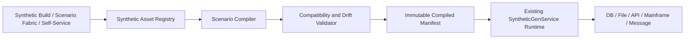

# ForgeTDM Synthetic Component Architecture Blueprint

Document owner: Product Engineering  
Status: Core implementation complete; advanced plugin certification remains roadmap work  
Scope: Synthetic Data Generation, Scenario Fabric, Self-Service, Mainframe generation, Mapping, and delivery integrations  
Prepared: 2026-07-28

## Implementation status

Implemented in the first production slice:

- V80 reusable asset registry with tenant ownership and visibility;
- mutable drafts and immutable published versions;
- Data Model, Field Contract, Generation Rule, Delivery Profile, and Generation
  Scenario asset types;
- backend validation for names, models, relationships, generators, receivers,
  and scenario references;
- exact dependency pinning, downstream impact, version comparison, and content
  hashes;
- immutable compiled scenario manifests with component and plan hashes;
- compilation into the existing `SyntheticGenService.GenPlan`;
- asynchronous scenario launch through the existing progress, cancellation,
  lineage, and delivery runtime;
- existing synthetic RBAC permissions applied separately to read, manage,
  compile, and run actions;
- one full-screen, searchable Synthetic Asset Library in the Synthetic Data UI;
- guided scenario assembly, draft editing, publishing, cloning, archiving,
  versions, impact, compile, launch, and "Open plan in Build";
- focused backend tests covering immutability, reference pinning, validation,
  compilation, launch delegation, and route permissions.

The existing one-off Build flow, saved jobs, generator catalogue, reference
lists, and run history remain available and unchanged.

## 1. Executive decision

ForgeTDM already contains the functional equivalents of the five common synthetic
data components:

1. Domain
2. Attribute
3. Generator
4. Receiver
5. Scenario

They currently live together inside `SyntheticGenService.GenPlan`. That makes a
single saved job easy to execute, but it also causes repeated configuration,
weak component reuse, coarse versioning, and tight coupling between data shape
and delivery.

The proposed change is a reusable, versioned **Synthetic Asset Graph**. It is a
backend architecture and runtime contract, not a collection of new screens.

The target execution flow is:

```text
Data Model
  -> Field Contracts
  -> Generator Bindings
  -> Delivery Profile
  -> Scenario Version
  -> Compiled GenPlan
  -> Existing Synthetic Runtime
```

The existing generation engine, partitioning, referential-integrity logic,
native loaders, progress, cancellation, governance, and saved-job execution
remain the runtime. The new asset graph compiles into that proven contract.

## 2. Why this adds user value

The architecture is justified only if it solves these user problems.

| User problem | Current behavior | Required outcome |
|---|---|---|
| The same customer table is configured in many jobs | Every job contains another copy | Configure the model once and reference a version |
| A column generator changes in one job but not others | Silent configuration drift | Publish a generator binding and show dependent scenarios |
| A database scenario must also produce JSON or mainframe output | Duplicate the entire plan | Reuse one model with multiple delivery profiles |
| Schema changes after jobs are saved | Failure appears at runtime | Detect drift and block incompatible compilation |
| Testers need a small variation of an approved scenario | Clone and edit technical details | Expose only approved scenario parameters |
| Auditors need to know exactly what ran | A plan hash exists, but components are opaque | Retain immutable component versions and compiled manifest |
| Engineers need cross-system consistency | Configuration depends on job-local FK rules | Reuse canonical identity and generator namespaces |
| New formats require changes in the generation service | Receiver switch is hard-coded | Add a receiver plugin without changing generation logic |

If a proposed component does not reduce repeat work, prevent a bad run, or add
a real delivery capability, it should not be implemented.

## 3. Product language

ForgeTDM should use language that is understandable without knowledge of another
tool.

| Reference concept | ForgeTDM product term | Meaning |
|---|---|---|
| Domain | Data Model | A reusable business or technical data structure |
| Attribute | Field Contract | A typed field and its constraints |
| Generator | Generation Rule | A reusable, validated value-production rule |
| Receiver | Delivery Profile | A reusable destination and format contract |
| Scenario | Generation Scenario | An immutable executable composition |

The API and database can use concise technical names such as
`synthetic_models`, `synthetic_fields`, and `synthetic_scenarios`.

This terminology avoids conflict with Scenario Fabric's broader **Test Domain**,
which represents a governed business testing scope across systems.

## 4. Current-state assessment

### 4.1 What exists

The current runtime already supports:

- multi-table plans;
- per-column generators and parameters;
- primary keys, foreign keys, composite keys, and cardinality;
- inferred database relationships and tool-defined relationships;
- database, CSV, JSON, and SQL outputs;
- multi-target database projection;
- single, local-partitioned, and distributed execution;
- streaming generation;
- deterministic seeds;
- constraint capture and preflight validation;
- saved jobs, approvals, lineage, cancellation, retry, and shell runners;
- generation progress by job, table, and partition;
- reference lists and learned value distributions;
- mainframe generation through the same row generator;
- Scenario Fabric compilation into approved Self-Service products.

### 4.2 Structural limitations

The following objects are currently embedded:

```text
GenPlan
  dataset
  tables[]
    columns[]
      generator
      parameters
      type
      PK/FK
  receiver
  target settings
  execution settings
```

Consequences:

- no independent lifecycle for a model or field contract;
- no impact analysis when a generator changes;
- no receiver extension point;
- saved-job versioning is plan-level only;
- scenario reuse depends on copying JSON;
- model and delivery concerns are edited together;
- one target format cannot be substituted safely at launch;
- import drift is discovered too late;
- component certification cannot be expressed.

## 5. Design principles

### 5.1 Compile, do not reinterpret at runtime

Published component versions compile into the existing `GenPlan`. Runtime
generation must never fetch the mutable "latest" version of an asset.

### 5.2 Drafts are mutable; published versions are immutable

Users edit a draft. Publishing creates an immutable version and fingerprint.
Existing scenarios keep their pinned versions.

### 5.3 Reuse is explicit

A scenario references assets by ID and version. It never depends on asset names
or hidden global defaults.

### 5.4 A usable workflow is more important than visible architecture

The main Build page remains a three-step workflow:

1. Choose or configure data.
2. Choose delivery and execution.
3. Review and launch.

Users open focused component editors only when they need reuse or advanced
configuration.

### 5.5 Validate at authoring, publishing, compilation, and runtime

Each layer catches a different class of error:

- authoring: field-level syntax and compatibility;
- publishing: completeness and component dependencies;
- compilation: cross-component compatibility and target drift;
- runtime: source, target, and environmental failures.

### 5.6 Sensitive values never become reusable metadata

Samples, secrets, credentials, production values, and literal PII must not be
stored in component metadata or audit events.

### 5.7 Existing saved jobs remain executable

Migration must not invalidate or silently rewrite existing `plan_json`.

## 6. Target architecture



### 6.1 Service boundaries

| Service | Responsibility |
|---|---|
| `SyntheticAssetService` | Draft, publish, version, search, clone, archive |
| `SyntheticModelService` | Models, fields, relationships, imports, drift |
| `GenerationRuleService` | Rule definitions, presets, compatibility, preview |
| `DeliveryProfileService` | Receiver plugins, configuration, readiness |
| `SyntheticScenarioService` | Scenario composition, parameters, versions |
| `SyntheticScenarioCompiler` | Resolve versions and produce `GenPlan` |
| `SyntheticCompatibilityService` | Validate model, rules, receiver, and target |
| `SyntheticImpactService` | Find dependent models and scenarios |
| `SyntheticGenService` | Execute the compiled plan |

The new services must not duplicate row generation or database loading.

## 7. Component 1: Data Model

### 7.1 Definition

A Data Model is a reusable graph of records and relationships. A record normally
maps to a database table, file record, JSON object, API resource, or mainframe
copybook record.

### 7.2 Required capabilities

- create manually;
- import database tables;
- import DDL;
- import CSV headers and inferred types;
- import JSON Schema, JSON samples, Avro, and XML Schema;
- import copybooks;
- import an approved Mapping Designer output;
- include multiple applications and database engines;
- define logical and physical names separately;
- define aliases and business descriptions;
- mark a root record;
- define PK, unique, FK, and tool-level relationships;
- define parent-child cardinality;
- define generation order and cycle-breaking policy;
- retain source metadata fingerprint;
- compare imported metadata with a published version;
- certify a version for reuse.

### 7.3 Model shape

```json
{
  "name": "Retail Customer Model",
  "records": [
    {
      "logicalName": "Customer",
      "physicalBinding": {
        "sourceId": 12,
        "schema": "bank",
        "object": "customers"
      },
      "rowPolicy": {
        "defaultCount": 1000,
        "minimum": 1,
        "maximum": 100000000
      }
    }
  ],
  "relationships": [
    {
      "parent": "Customer.customerId",
      "child": "Account.customerId",
      "minimumChildren": 1,
      "maximumChildren": 4,
      "source": "DB_CATALOG"
    }
  ]
}
```

### 7.4 Publishing rules

A model cannot be published when:

- a record has no fields;
- logical names are duplicated case-insensitively;
- a physical binding cannot be resolved;
- a required relationship references a missing field;
- a cycle has no explicit generation strategy;
- a PK generator cannot guarantee uniqueness at maximum volume;
- a field type is not representable by any selected delivery profile.

### 7.5 Drift behavior

The registry stores a normalized structural fingerprint. Drift checks classify:

- compatible: nullable field added;
- review required: length reduced or type widened ambiguously;
- breaking: field removed, type incompatible, PK/FK changed;
- target-only: physical target changed without logical model change.

Breaking drift blocks new scenario compilation. Existing compiled manifests
remain reproducible and visibly marked stale.

## 8. Component 2: Field Contract

### 8.1 Definition

A Field Contract defines the shape and validity of one value independently of
how that value is generated.

### 8.2 Required properties

- logical and physical name;
- business term and description;
- scalar or structured type;
- JDBC/SQL type and vendor type;
- length, precision, and scale;
- nullable and null percentage;
- PK, unique, FK, and generated-by-target flags;
- allowed values or reference-list binding;
- minimum, maximum, regex, and CHECK-derived constraints;
- classification and sensitivity;
- locale, timezone, encoding, and collation;
- semantic tags such as `CUSTOMER_ID`, `FIRST_NAME`, or `ISO_CURRENCY`;
- default generation-rule binding;
- output transformations by delivery profile;
- derived-field dependencies;
- quality assertions.

### 8.3 Reuse model

A Field Contract can be:

- local to one model;
- based on a reusable Field Template;
- overridden by a model without changing the template;
- bound to different physical fields in different applications.

Template inheritance is shallow and explicit. A model version stores the
resolved contract so template changes never mutate a published model.

### 8.4 Cross-field consistency

Derived values must use a dependency graph rather than relying on field order.

Example:

```text
firstName  -> US_FIRST_NAME
lastName   -> US_LAST_NAME
fullName   -> TEMPLATE("${lastName}, ${firstName}")
email      -> TEMPLATE("${firstName:lower}.${lastName:lower}@${domain}")
```

Compilation detects missing dependencies, cycles, and type mismatches.

## 9. Component 3: Generation Rule

### 9.1 Definition

A Generation Rule is a typed, reusable generator configuration. It references a
generator implementation plus validated parameters and optional dependencies.

### 9.2 Three layers

1. **Generator definition**: code or plugin supplied by ForgeTDM.
2. **Rule preset**: reusable configured instance, such as `US Adult Customer`.
3. **Field binding**: a pinned rule version bound to a Field Contract.

### 9.3 Generator SPI

```java
public interface SyntheticGeneratorPlugin {
    GeneratorDescriptor descriptor();
    GeneratorValidator validator();
    GeneratorInstance compile(GeneratorContext context, Map<String, Object> parameters);
}
```

`GeneratorDescriptor` declares:

- stable key and semantic version;
- categories and semantic tags;
- accepted output types;
- parameter JSON Schema;
- deterministic and stateful behavior;
- uniqueness capacity;
- locale support;
- dependency inputs;
- thread and partition safety;
- sensitive-data behavior;
- examples generated at runtime, not stored production samples.

### 9.4 Generator classes required for complete coverage

- random and patterned;
- sequential and permutation;
- weighted and statistical distribution;
- list and reference data;
- locale-aware identity and address;
- financial and payment;
- temporal;
- technical identifiers;
- derived and cross-field;
- parent lookup and cross-table;
- API/service lookup;
- query-backed and hybrid;
- negative and invalid-data;
- stateful;
- privacy-safe production distribution learner;
- script/plugin extension.

### 9.5 Validation contract

Before publishing a rule, ForgeTDM proves:

- parameters conform to schema;
- output is assignable to declared types;
- deterministic rules replay with the same seed;
- partition-safe rules produce the same logical sequence in single and
  partitioned execution;
- declared uniqueness capacity is sufficient;
- value samples satisfy length, precision, scale, regex, and range;
- no sample or metadata contains known real PII;
- derived dependencies exist and are acyclic.

### 9.6 Stateful generation

Stateful rules use a named state scope:

- `RUN`: resets for each run;
- `SCENARIO`: resumes from the scenario checkpoint;
- `TENANT`: centrally allocated ranges;
- `EXTERNAL`: backed by an approved sequence provider.

State updates must be leased and committed idempotently so retry does not
silently duplicate identifiers.

### 9.7 Rule lifecycle

- Draft
- Validated
- Published
- Deprecated
- Archived

Deprecation prevents new bindings but does not break pinned scenarios.

## 10. Component 4: Delivery Profile

### 10.1 Definition

A Delivery Profile converts generated logical records into a physical
destination or format. It contains no credentials; it references governed data
sources and secret aliases.

### 10.2 Receiver SPI

```java
public interface SyntheticReceiverPlugin {
    ReceiverDescriptor descriptor();
    ReceiverValidation validate(ReceiverContext context);
    ReceiverSession open(ReceiverContext context);
}
```

The session contract supports:

- begin;
- accept a logical row batch;
- flush;
- checkpoint;
- commit;
- rollback;
- cancel;
- close;
- progress and reject reporting.

### 10.3 Required first-class receiver families

#### Database

- JDBC portable load;
- PostgreSQL COPY;
- Oracle SQL*Loader/direct path;
- SQL Server bulk copy;
- DB2 LOAD;
- MySQL LOAD DATA;
- Snowflake staged COPY;
- BigQuery and Redshift staged loads;
- insert, update, upsert, replace, and truncate-only behaviors;
- transaction and commit controls;
- target projection and target-specific type coercion.

#### Structured files

- CSV and configurable delimiters;
- JSON array and NDJSON;
- XML;
- SQL scripts;
- Excel;
- Avro;
- Parquet;
- ORC.

#### Enterprise and mainframe

- fixed-width;
- copybook/EBCDIC;
- VSAM-compatible output;
- ISO 8583;
- SWIFT;
- BAI2;
- EDI and HL7 where schemas are supplied.

#### Services and streams

- REST;
- SOAP;
- Kafka;
- generic message queue;
- S3-compatible object storage;
- SFTP/FTP;
- webhook.

#### Test integration

- in-memory iterator;
- JUnit/TestNG fixture;
- Cucumber Examples;
- downloadable fixture pack;
- assertion-only receiver.

### 10.4 Delivery profile properties

- receiver type and plugin version;
- logical-to-physical projection;
- target data source and environment;
- formatting and encoding;
- batching and commit behavior;
- error and reject policy;
- preparation and cleanup;
- partition strategy;
- compression and encryption;
- file naming and package layout;
- retention;
- readiness requirements;
- permitted overrides.

### 10.5 Readiness

Publishing validates static configuration. Compilation validates the selected
model. Launch validates environmental readiness:

- data source accessible;
- required native client present;
- target schema and permissions valid;
- output location writable;
- secrets resolvable;
- capacity and quota sufficient.

Fallback from a native loader to JDBC is explicit in the compiled manifest and
evidence. It is never silent.

## 11. Component 5: Generation Scenario

### 11.1 Definition

A Generation Scenario is a versioned executable composition of:

- one Data Model version;
- field-to-rule bindings;
- one or more Delivery Profile versions;
- row-volume and cardinality policy;
- deterministic seed policy;
- execution and partition policy;
- allowed tester parameters;
- preflight assertions;
- post-generation verification;
- reservation, cleanup, and retention;
- approval policy.

### 11.2 Scenario parameters

A scenario author can expose safe parameters without exposing technical design:

```json
{
  "name": "customerCount",
  "label": "Customers",
  "type": "INTEGER",
  "minimum": 1,
  "maximum": 100000,
  "default": 1000,
  "bindsTo": "records.Customer.rowCount"
}
```

Permitted bindings include:

- record count;
- approved generator parameter;
- reference-list choice;
- locale;
- date/as-of value;
- receiver target environment;
- partition scale;
- reservation duration.

Credentials, SQL expressions, script bodies, and arbitrary target names cannot
be exposed as tester parameters.

### 11.3 Compilation

Compilation performs these steps:

1. Resolve every pinned component version.
2. Resolve allowed scenario parameter values.
3. Materialize inherited Field Contracts.
4. Compile Generation Rules.
5. Build the field dependency graph.
6. Validate uniqueness and cardinality at requested volume.
7. Order records by dependencies and generation waves.
8. Validate each Delivery Profile against the model.
9. Resolve target projections.
10. Capture target constraint and drift snapshots.
11. Produce a normalized `GenPlan`.
12. Hash the component manifest and compiled plan.
13. Persist both as an immutable execution manifest.

### 11.4 Scenario chains

ForgeTDM needs ordered scenario orchestration, but it should reuse the existing
Mapping and Self-Service execution model rather than inventing a second workflow
engine.

A chain supports:

- sequential and parallel steps;
- outputs from one step bound into a later step;
- condition based on a typed prior result;
- bounded loop over a declared collection;
- retry and compensation policy;
- before/after validation;
- one transaction only where a single receiver supports it;
- saga-style compensation across systems;
- shared deterministic seed namespace;
- one combined Ready-to-Test Pack.

Arbitrary code and unbounded loops are prohibited.

## 12. Persistence model

Migration numbering must be allocated at implementation time to avoid conflict
with concurrent migrations.

### 12.1 Core tables

```text
synthetic_assets
  id, tenant_id, asset_type, name, description, owner_user_id
  status, current_draft_revision, created_at, updated_at

synthetic_asset_versions
  id, asset_id, version_no, schema_version, content_json
  fingerprint, compatibility_level, published_by, published_at

synthetic_asset_dependencies
  owner_version_id, dependency_version_id, dependency_kind

synthetic_model_bindings
  model_version_id, logical_record, source_id, schema_name, object_name
  metadata_fingerprint

synthetic_scenario_manifests
  id, scenario_version_id, request_id, component_manifest_json
  compiled_plan_json, component_hash, plan_hash, compiled_by, compiled_at

synthetic_plugin_registry
  plugin_type, plugin_key, plugin_version, descriptor_json
  implementation_class, enabled, certified_status

synthetic_generator_state
  tenant_id, state_scope, state_key, version, value_json
  lease_owner, lease_expires_at, updated_at
```

### 12.2 Asset types

- `MODEL`
- `FIELD_TEMPLATE`
- `GENERATION_RULE`
- `DELIVERY_PROFILE`
- `SCENARIO`
- `SCENARIO_CHAIN`

### 12.3 Immutability

Database triggers or service-level guards reject update/delete of published
version content. An asset can be archived, but a version referenced by lineage
cannot be physically deleted.

### 12.4 Tenant and ownership

Every asset has:

- tenant;
- owner;
- visibility: private, team, tenant;
- team scope where applicable;
- explicit publish and execute permissions.

Names are unique only within tenant, type, and visibility scope.

## 13. API contract

### 13.1 Generic lifecycle

```text
GET    /api/synthetic/assets?type=&q=&status=&owner=
POST   /api/synthetic/assets
GET    /api/synthetic/assets/{id}
PUT    /api/synthetic/assets/{id}/draft
POST   /api/synthetic/assets/{id}/validate
POST   /api/synthetic/assets/{id}/publish
POST   /api/synthetic/assets/{id}/clone
POST   /api/synthetic/assets/{id}/deprecate
POST   /api/synthetic/assets/{id}/archive
GET    /api/synthetic/assets/{id}/versions
GET    /api/synthetic/assets/{id}/impact
GET    /api/synthetic/assets/{id}/compare?left=&right=
```

### 13.2 Model operations

```text
POST /api/synthetic/models/import/database
POST /api/synthetic/models/import/ddl
POST /api/synthetic/models/import/file
POST /api/synthetic/models/{id}/drift
POST /api/synthetic/models/{id}/validate-volume
```

### 13.3 Generator operations

```text
GET  /api/synthetic/generator-plugins
POST /api/synthetic/generation-rules/{id}/preview
POST /api/synthetic/generation-rules/{id}/verify
GET  /api/synthetic/generation-rules/{id}/compatibility
```

### 13.4 Receiver operations

```text
GET  /api/synthetic/receiver-plugins
POST /api/synthetic/delivery-profiles/{id}/validate
POST /api/synthetic/delivery-profiles/{id}/test
GET  /api/synthetic/delivery-profiles/{id}/readiness
```

### 13.5 Scenario operations

```text
POST /api/synthetic/scenarios/{id}/compile
POST /api/synthetic/scenarios/{id}/launch
POST /api/synthetic/scenarios/{id}/export-runner
GET  /api/synthetic/scenarios/{id}/manifest
POST /api/synthetic/scenario-chains/{id}/compile
POST /api/synthetic/scenario-chains/{id}/launch
```

The current `/api/synthetic/generate`, saved-job, and job-status endpoints remain
supported during migration.

## 14. Integrated user experience

### 14.1 No five-page obstacle course

The architecture must not force a user to visit Domain, Attribute, Generator,
Receiver, and Scenario pages in sequence.

The main Synthetic page remains:

```text
Synthetic Data Generation
  New request
  Build
    1. Data and rules
    2. Delivery and execution
    3. Review and launch
  Run history
  Saved scenarios
```

### 14.2 Data and rules workspace

The full-screen data workspace supports:

- choose an existing Data Model;
- import tables/files into a new model;
- create a local one-off model;
- open one record at a time;
- configure Field Contracts and Generation Rules;
- publish reusable changes or keep them scenario-local;
- see relationship and dependency diagrams;
- preview generated rows across related records;
- see affected scenarios before changing a published asset.

### 14.3 Delivery workspace

The user chooses:

- a saved Delivery Profile;
- a receiver type and creates a profile in context;
- multiple delivery profiles for the same scenario.

Technical settings stay behind an Advanced section. The primary view shows:

- destination;
- format;
- load behavior;
- readiness;
- estimated size;
- cleanup behavior.

### 14.4 Review and launch

Review shows:

- pinned component versions;
- requested row counts;
- relationship waves;
- uniqueness headroom;
- target projections;
- drift status;
- loader or fallback decision;
- expected files/rows;
- approval requirement;
- verification contract.

Users see a business-readable explanation and can expand the compiled technical
manifest.

### 14.5 Asset library

Reusable assets require a library, but it is secondary navigation, not the main
workflow. It can be reached from:

- `Use existing` dialogs;
- `Manage reusable assets` in the Synthetic header;
- impact links from scenarios;
- administrator navigation.

The library uses one searchable page with asset-type filters rather than five
separate top-level pages.

## 15. Persona review

### 15.1 Tester

**Job:** obtain valid data for a test without understanding schemas.

Value:

- selects an approved scenario;
- changes only safe parameters;
- receives consistent data in all required targets;
- sees expected outcome and verification;
- can rerun or reset.

Failure condition:

- the tester is exposed to generator internals, JDBC settings, or field maps.

Verdict: high value when delivered through Scenario Fabric and Self-Service.

### 15.2 Test Data Engineer

**Job:** build reusable, correct data designs without repeating work.

Value:

- imports and versions a model once;
- shares field templates and rules;
- previews impact before publishing;
- uses one model for DB, files, and messages;
- diagnoses compile-time errors before a long run.

Failure condition:

- publishing requires more work than cloning a saved job;
- local scenario overrides are impossible;
- component versioning creates dependency-management noise.

Verdict: highest-value persona and primary design target.

### 15.3 Application developer

**Job:** consume deterministic fixtures in local and pipeline tests.

Value:

- scenario ID and version are stable;
- REST and shell execution accept safe overrides;
- fixture manifests and checksums are downloadable;
- the same seed replays across receivers.

Failure condition:

- every run requires UI approval or manual download;
- output paths and credentials leak into manifests.

Verdict: strong value if runner compatibility remains simple.

### 15.4 Platform operator

**Job:** keep generation reliable at high volume.

Value:

- receiver readiness is independently testable;
- plugin health and certification are visible;
- stateful ranges and partitions are leased safely;
- fallback is explicit;
- one manifest explains each run.

Failure condition:

- arbitrary plugins can execute without isolation;
- scenario chains create uncontrolled distributed transactions.

Verdict: value depends on strict plugin and execution contracts.

### 15.5 Administrator and auditor

**Job:** control who can publish and prove what executed.

Value:

- maker-checker can apply to component publication;
- immutable versions retain lineage;
- sensitive metadata is excluded;
- deprecation and retention are enforceable;
- certification is evidence-based.

Failure condition:

- published versions can be edited or deleted;
- audit records contain generator samples or secrets.

Verdict: clear governance improvement over opaque plan JSON.

## 16. User-value scorecard

| Capability | User value | Complexity | Decision |
|---|---:|---:|---|
| Reusable versioned Data Models | 10 | 7 | Build |
| Reusable Field Templates | 7 | 6 | Build, keep optional |
| Typed Generation Rule presets | 9 | 6 | Build |
| Generator plugin SPI | 9 | 8 | Build |
| Delivery Profile reuse | 10 | 7 | Build |
| Receiver plugin SPI | 10 | 9 | Build |
| Immutable Scenario versions | 10 | 6 | Build |
| Compile-time compatibility | 10 | 8 | Build |
| Impact analysis | 9 | 6 | Build |
| Scenario chains | 8 | 9 | Build on existing orchestration |
| Five separate catalog screens | 2 | 7 | Reject |
| Mandatory reusable assets for simple jobs | 1 | 5 | Reject |
| Runtime resolution of latest version | 0 | 4 | Reject |
| Arbitrary user code in generators | 3 | 10 | Reject |
| Shared global mutable defaults | 1 | 7 | Reject |

### 16.1 Measurable value gates

The implementation must meet these targets in acceptance testing:

| Measure | Target |
|---|---:|
| Create a scenario from a published model and delivery profile | Under 3 minutes |
| Authoring time compared with cloning and editing a saved job | At least 50% lower |
| Repeated field and generator configuration across scenarios | At least 70% lower |
| Breaking model/target incompatibilities found before launch | At least 90% |
| Legacy saved jobs that continue to execute without promotion | 100% |
| Single versus partitioned deterministic replay | 100% equivalent by declared key/value contract |
| Published scenarios with complete component lineage | 100% |
| Receiver fallback decisions retained in evidence | 100% |
| Tester launches requiring technical field or receiver editing | 0 for approved scenarios |

If the first three measures fail, the authoring workflow must be simplified
before adding more asset types. If the lineage, compatibility, or backward
compatibility measures fail, release is blocked.

## 17. Backward-compatible migration

### 17.1 Existing jobs

Existing `synthetic_saved_jobs.plan_json` remains executable.

On first edit, the UI offers:

- continue as a legacy embedded design;
- promote reusable components;
- clone into a new versioned scenario.

There is no forced migration.

### 17.2 Promotion

Promotion:

1. Parses `GenPlan`.
2. Creates a draft Data Model.
3. Creates local Generation Rules for unique configurations.
4. Creates a Delivery Profile.
5. Creates a Scenario referencing those drafts.
6. Validates equivalence by compiling back to `GenPlan`.
7. Compares normalized plans.
8. Publishes only after user confirmation.

### 17.3 Equivalence rule

Promotion is accepted only when normalized legacy and compiled plans have the
same:

- records and fields;
- generators and parameters;
- relationships and cardinality;
- receiver behavior;
- target projections;
- execution and partition settings;
- seed behavior.

### 17.4 Runtime transition

`SyntheticGenService` receives either:

- a legacy `GenPlan`; or
- a compiled immutable manifest containing a `GenPlan`.

It does not need to know which authoring model produced the plan.

## 18. Security, RBAC, and governance

### 18.1 Permissions

```text
synthetic.asset.read
synthetic.asset.create
synthetic.asset.publish
synthetic.asset.deprecate
synthetic.asset.admin
synthetic.scenario.compile
synthetic.run
synthetic.cancel
synthetic.retry
synthetic.plugin.admin
```

Existing permissions remain aliases during migration.

### 18.2 Maker-checker

Configurable approval applies to:

- publishing an externally visible scenario;
- publishing a query/API-backed rule;
- using production-derived distributions;
- enabling a receiver plugin;
- targeting protected environments;
- increasing volume beyond policy.

The creator cannot approve the same high-risk publication.

### 18.3 Plugin security

- plugins are installed by administrators;
- plugin descriptors are signed or checksummed;
- no dynamic code upload through the UI;
- network destinations use allowlists;
- secrets come from the configured secret provider;
- file paths use controlled roots;
- script generators run in the existing sandbox;
- plugin execution has time, memory, and row limits;
- certification status is distinct from installation status.

### 18.4 Audit events

Structured events include:

- asset drafted, validated, published, deprecated, archived;
- dependency changed;
- drift detected;
- scenario compiled;
- compatibility failed;
- receiver readiness checked;
- plugin enabled or disabled;
- scenario launched;
- fallback selected;
- run completed, failed, cancelled, or retried.

Audit metadata contains IDs, versions, hashes, outcomes, and counts. It excludes
samples, secrets, query results, and raw payloads.

## 19. Observability and evidence

Each execution retains:

- scenario and component IDs and versions;
- component manifest hash;
- compiled plan hash;
- plugin versions;
- generator seed namespaces;
- receiver readiness snapshot;
- target schema fingerprint;
- loader decision;
- table and partition counts;
- generated, loaded, rejected, and retried rows;
- verification results;
- output checksums;
- reservation and cleanup evidence.

Metrics include:

- compile success and failure by reason;
- asset reuse count;
- scenarios affected by drift;
- receiver readiness;
- generator throughput;
- rows/sec by receiver and engine;
- native-loader fallback rate;
- rejected rows by field contract;
- time from request to ready-to-test.

## 20. Validation and test strategy

### 20.1 Unit tests

- asset version immutability;
- canonical fingerprints;
- dependency resolution;
- Field Contract inheritance;
- generator descriptor validation;
- generator determinism and uniqueness capacity;
- dependency-cycle detection;
- receiver descriptor validation;
- parameter binding;
- normalized `GenPlan` compilation;
- scenario-chain graph validation;
- metadata redaction.

### 20.2 Contract tests

Every generator plugin must pass:

- supported type matrix;
- parameter schema;
- deterministic replay;
- null and boundary behavior;
- partition equivalence;
- serialization;
- concurrency;
- cancellation;
- sensitive-data safety.

Every receiver plugin must pass:

- supported logical types;
- encoding and null behavior;
- commit and rollback;
- retry idempotency;
- cancel;
- reject reporting;
- checkpoint and resume;
- output checksum;
- target cleanup;
- readiness failure behavior.

### 20.3 Integration matrix

Required database targets:

- PostgreSQL
- Oracle
- SQL Server
- DB2 LUW
- MySQL

Resource-dependent targets can be marked HARD-PASS only with:

- contract tests passing;
- generated command or payload evidence;
- explicit missing infrastructure;
- no claim of physical certification.

### 20.4 Migration tests

- all current saved jobs still load and execute;
- promoted plans compile equivalently;
- current API payloads remain accepted;
- current run history and lineage remain visible;
- rollback leaves legacy jobs untouched.

### 20.5 End-to-end acceptance journeys

1. Import three related PostgreSQL tables, publish a model, bind rules, deliver
   to Oracle, and prove RI.
2. Reuse the same model to produce CSV, JSON, and mainframe output with matching
   canonical customer keys.
3. Change a field length and prove impact analysis identifies every affected
   scenario.
4. Attempt to compile against breaking target drift and prove launch is blocked.
5. Run single and partitioned modes with the same seed and prove equivalent data.
6. Publish a safe tester questionnaire and launch through Self-Service.
7. Execute a two-step scenario chain and prove output binding, retry, and
   compensation.
8. Retry a partially failed receiver and prove no duplicate rows.
9. Deprecate a Generation Rule and prove existing pinned scenarios still run.
10. Export a runner and reproduce the same manifest and output checksum.

## 21. Complete implementation sequence

This is sequencing for safe delivery, not a list of optional future ideas. The
architecture is complete only when all stages pass their exit criteria.

### Stage 1: Registry and compiler foundation

- generic asset and immutable version tables;
- tenant ownership and RBAC;
- dependency graph;
- Data Model, Field Contract, Generation Rule, Delivery Profile, and Scenario
  content schemas;
- compile to current `GenPlan`;
- component and plan hashing;
- legacy saved-job compatibility;
- promotion with equivalence validation.

Exit: a promoted legacy job compiles to an equivalent plan and runs unchanged.

### Stage 2: Model and rule reuse

- database/file/copybook model imports;
- reusable Field Templates;
- Generation Rule presets;
- model drift and impact analysis;
- generator descriptor SPI;
- current 81 generators registered as built-in plugins;
- state and uniqueness contracts;
- focused model/rule editors.

Exit: two scenarios reuse one published model and one rule, and impact analysis
is correct.

### Stage 3: Delivery architecture

- receiver SPI;
- current DB/CSV/JSON/SQL behavior moved behind built-in receiver plugins;
- mainframe receiver integration;
- target projection and readiness;
- structured file, enterprise file, service, stream, and test integration
  receiver families;
- plugin certification suite.

Exit: one scenario version compiles and delivers through at least three
different profiles without duplicating its model.

### Stage 4: Enterprise scenarios

- scenario parameters and safe questionnaires;
- multi-receiver scenarios;
- scenario chains using existing orchestration primitives;
- compiled manifests;
- Ready-to-Test Pack integration;
- Self-Service and Scenario Fabric binding;
- CI/CD runner compatibility.

Exit: a tester launches a governed cross-system scenario without seeing
technical component configuration.

### Stage 5: Hardening and certification

- full database and receiver matrix;
- volume, failover, retry, and cancellation tests;
- tenant and RBAC testing;
- plugin security tests;
- migration rehearsal;
- operational dashboards;
- documentation and certification evidence.

Exit: all acceptance journeys pass, all supported connectors have evidence, and
no legacy synthetic regression remains.

## 22. Definition of done

The implementation is not complete because a new Asset Library screen exists.
It is complete only when:

- all five components have persisted immutable versions;
- a scenario pins exact component versions;
- compilation produces the existing runtime plan deterministically;
- current saved jobs continue to run;
- a model and rules are reused by multiple scenarios;
- one scenario supports multiple delivery profiles;
- generator and receiver plugins pass contract suites;
- drift and impact are visible before launch;
- unsafe combinations fail before generation begins;
- Scenario Fabric and Self-Service use the same scenario contract;
- audit and lineage identify every component version;
- UI workflows are faster than cloning and editing a saved job;
- end-to-end acceptance journeys pass with retained evidence.

## 23. Recommendation after user review

Proceed with implementation, with these constraints:

1. Build the registry and compiler first. Do not begin with catalog screens.
2. Preserve `GenPlan` as the runtime boundary until equivalence is proven.
3. Keep simple one-off generation available.
4. Make reuse opt-in during authoring and automatic during approved scenario
   execution.
5. Use one Asset Library with filters, not five top-level pages.
6. Treat receiver extensibility and compile-time compatibility as first-class
   functionality, not later enhancements.
7. Measure whether the new architecture reduces scenario authoring time and
   runtime failures.

The expected product improvement is not "ForgeTDM now has five components."
The meaningful outcome is:

> A data engineer models and validates a business data shape once, reuses it
> safely across many scenarios and delivery formats, and gives testers a
> governed one-click request that remains reproducible as applications evolve.

## 24. Reference material

Primary vendor references used to understand the component pattern:

- GenRocket Solution Overview:
  https://www.genrocket.com/wp-content/uploads/2024/11/GenRocket-Solution-Overview-2312-01.pdf
- Understanding the GenRocket Ecosystem:
  https://www.genrocket.com/wp-content/uploads/2024/11/Understanding-the-GenRocket-Ecosystem-2211-01.pdf
- GenRocket receiver catalog:
  https://app.genrocket.com/browse/receivers
- GenRocket generator catalog:
  https://app.genrocket.com/browse/generators

These references inform the problem and terminology. The ForgeTDM design remains
independent: its core differentiators are compiled immutable manifests,
cross-system delivery, DataScope/masking integration, Scenario Fabric coverage,
governed Self-Service, and retained Ready-to-Test evidence.
