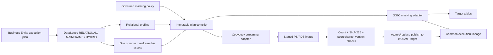

# Mainframe file masking in DataScope

## Decision

Mainframe file bytes remain in the source/target landing area or z/OS data set. ForgetDM does **not** store file payloads in relational tables. The database stores only governed control-plane metadata and immutable execution evidence:

- one DataScope definition with zero or more relational tables and zero or more mainframe file assets;
- one asset per logical file role, with source pattern, target template, copybook, DCB, encoding, selection contract, and ordered composite file-key fields;
- copybook-field-to-policy-rule mappings;
- frozen per-job mask plans;
- file/job status, counts, byte totals, versions/ETags, SHA-256 digests, and audit lineage.

This keeps large sequential data out of the application database while retaining replayable governance and delivery evidence.

## Reference architecture

## Cross-system masking contract

Database columns and copybook fields do not independently choose masking functions. A file field maps to an existing rule in the same governed masking policy. At submission time ForgetDM freezes the function, parameters, relational source table/column, and canonical semantic salt into the job.

For a source value `v`, secret `k`, run seed `s`, and semantic domain `d`, both adapters execute the same deterministic transform:

`masked = F(k, s, d, v, parameters, row-context)`

This provides identical results for a value represented in a table and in an EBCDIC copybook record. Non-deterministic rules, `SEQUENCE`, and `SCRIPT` are rejected for table/file mappings. Generic deterministic transforms require an explicit semantic salt; semantic functions such as email, phone, SSN, card, account, name, date of birth, and address use canonical domains shared by both adapters.

## Data model

| Object | Purpose | Payload stored? |
|---|---|---:|
| `dataset_definitions` | DataScope identity and RELATIONAL/MAINFRAME/HYBRID kind | No |
| `datascope_mainframe_assets` | Multiple file roles, patterns, target template, copybook/DCB, composite key paths | No |
| `datascope_mainframe_field_mappings` | Copybook field to governed relational policy rule | No |
| `mf_jobs` | Policy, DataScope, Business Entity, execution-plan, and run-group lineage | No |
| `mf_job_files` | Frozen mask plan, record/byte counts, versions, digests, stage/publish evidence | No |

`key_field_paths` is an ordered comma-separated list of copybook paths and is the file equivalent of a composite primary key. `entity_key_field_path` is separate: it identifies the cross-system Business Entity lookup key when that differs from the physical file key.

## Execution lifecycle

1. Resolve every enabled asset pattern before creating child jobs; reject empty manifests and target-name collisions.
2. Validate connection/copybook ownership and compile every field mapping against the selected governed policy.
3. Freeze the resolved manifest and mask plan so later copybook or policy edits cannot alter an active run.
4. Read binary FB/VB data one record at a time. Reject partial FB records, invalid/truncated RDWs, records exceeding LRECL, copybook drift, and encoding failures.
5. Mask into a local bounded-memory stage while collecting counts and input/output SHA-256 evidence.
6. Recheck the source version/ETag after the read and the target version immediately before publish.
7. Publish through a z/OS staging data set/member and rename or copy-with-replace. A precondition conflict fails the file; it never silently overwrites a newer target.
8. Persist terminal evidence and audit lineage. Retry skips already completed files and restarts failed files from their safe file boundary.

## Security and operations

- z/OSMF credentials resolve from the configured Vault KV field by default; inline passwords are disabled unless explicitly allowed for development.
- TLS certificate and hostname verification stay enabled by default. Trust-all is a scoped, explicit development override.
- Authorization applies to DataScope, policies, connections, copybooks, jobs, and Business Entity lineage.
- Cancellation is checked during streaming and before delivery, so canceled work cannot publish a partial image.
- Multiple source connections fan out into child jobs under one run-group ID; per-file target connections are retained.
- Metrics/evidence include file count, record count, input/output bytes, SHA-256, ETag/version, timestamps, policy, mapping count, DataScope, Business Entity, and execution plan.

## Adapter support and release gates

| Data set form | Product behavior | Production gate |
|---|---|---|
| PS, FB/VB | Streaming read, staged allocation, optimistic replace | Certify with site DCB, RACF, SMS classes, and representative volume |
| PDS/PDSE member | Member discovery, streaming read, staged member, replace | Certify member locking and site naming rules |
| Exact GDG generation input, for example `(0)` | Read using configured/fallback DCB | Certify catalog behavior on the target z/OS release |
| Relative GDG output, for example `(+1)` | Fails closed | Enable only after a site-approved generation allocation adapter is installed and tested |
| VSAM | Fails closed | Requires a site-approved IDCAMS unload/reload adapter plus quiesce/ENQ and rollback procedures |
| `ENTITY_KEYS` / `FILTER` record selection | Model validates configuration but launch fails closed | Enable after the Business Entity key-set contract and copybook predicate evaluator are certified |

Fail-closed entries are deliberate: the platform must not claim atomicity or record-selection semantics that the connected mainframe has not certified.

## Acceptance evidence

The automated parity acceptance test creates a real JDBC table and a real EBCDIC FB file with these ten governed values:

`customer_id`, `first_name`, `last_name`, `email`, `phone`, `ssn`, `card_number`, `account_number`, `birth_date`, `street`.

It masks the table and file with one secret, seed, policy semantics, and actual production adapters; decodes the delivered file; asserts all ten outputs equal the stored table row; verifies at least eight fields changed; and checks record count, byte counts, and input/output SHA-256 evidence.

The final production acceptance gate is a non-production LPAR certification run covering the exact z/OSMF level, RACF identity, TLS chain, SMS classes, DCB combinations, PDS/PDSE conventions, maximum expected file volume, deliberate ETag conflict, cancellation, retry, and recovery procedure.
