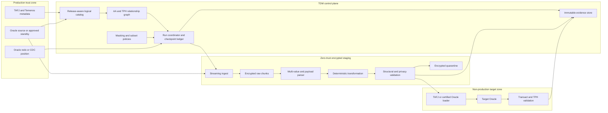

# Temenos Core TDM Solution Blueprint

Document owner: Enterprise Data Engineering  
Status: Implementation-ready solution blueprint  
Scope: Temenos Transact/T24, Arrangement Architecture (AA), Temenos Payments Hub (TPH), TAFJ, Oracle, and containerized execution  
Product assumption: A vendor-neutral, enterprise-grade test data management platform  

## 1. Executive intent

This blueprint defines how an enterprise TDM platform will discover, extract, subset, transform, validate, and provision Temenos data without treating the estate as ordinary Oracle tables.

The solution must understand all of the following layers:

1. Oracle is the physical persistence layer.
2. TAFJ is the application runtime and data-access layer.
3. Temenos Transact/T24 is the core banking application.
4. Arrangement Architecture models products and contracts as configurable, effective-dated aggregates.
5. TPH models payment instructions, parties, accounts, events, messages, and status transitions.
6. Multi-value and sub-value fields are logical structures encoded inside physical values.
7. Application integrity includes relationships and lifecycle rules that may not exist as Oracle foreign keys.

The target outcome is a repeatable process that produces safe, internally consistent, application-usable test data with evidence proving that:

- dynamic-array structure was not corrupted;
- associated multi-value fields remain positionally aligned;
- selected AA arrangements and TPH payments are complete enough for the intended tests;
- masked identifiers remain consistent across all required systems;
- free-text, XML, JSON, and large-object content contains no residual sensitive data;
- extraction and delivery can complete inside the required overnight window;
- no transformation code runs on production database nodes;
- every run is restartable, attributable, and auditable.

## 2. Scope

### 2.1 In scope

- Oracle metadata and data extraction from the Temenos schemas.
- Temenos dictionary and application metadata acquisition.
- TAFJ release-aware access and validation.
- Company or tenant boundaries used by the Temenos deployment.
- Local fields and client-specific application extensions.
- Multi-value, sub-value, and deeper text-level structures.
- Associated multi-value groups and positional dependencies.
- AA customer, party, account, arrangement, product, activity, property, schedule, balance, and history data.
- TPH payment, instruction, party, account, beneficiary, message, event, status, and settlement data.
- Free-text transaction narratives and remarks.
- XML and JSON payloads stored in relational or large-object columns.
- Initial full extraction followed by incremental capture.
- Deterministic cross-system masking.
- Isolated encrypted staging.
- Containerized parallel transformation and validation.
- Target provisioning through an approved application-aware or database load path.
- Reconciliation, privacy validation, and operational evidence.

### 2.2 Out of scope

- Modifying Temenos product code.
- Running masking logic directly on production Oracle nodes.
- Reverse engineering proprietary runtime behavior without approved metadata or SME validation.
- Claiming that Oracle constraints alone define Temenos business integrity.
- Loading an unsupported target directly and assuming that a successful SQL commit means the application is usable.
- Changing financial amounts, balances, or lifecycle states unless an approved test scenario explicitly requires a balanced transformation.

## 3. Design principles

1. **Logical before physical.** Oracle columns are mapped to Temenos logical records and paths before discovery or transformation.
2. **Byte-safe before text-safe.** Delimiter bytes, character set, and transport encoding are identified before parsing.
3. **Structure is immutable unless explicitly transformed.** A masking rule may change leaf values but must not silently add, remove, or reorder value positions.
4. **Associated fields move together.** Positional groups are validated as a unit.
5. **Business aggregates define subsets.** AA arrangements and TPH payments are selected as complete testable aggregates, not isolated rows.
6. **Application metadata outranks inference.** Temenos metadata is authoritative, followed by database constraints, approved tool-defined relationships, and finally evidence-backed inference.
7. **Production is read-only.** Extraction uses approved snapshot, standby, CDC, or non-blocking read mechanisms.
8. **Secrets are external.** Keys and salts are resolved at runtime from an enterprise secrets manager.
9. **Every stage is restartable.** Work is partitioned, checkpointed, and idempotent.
10. **Evidence is a deliverable.** A run is not complete until structural, privacy, relationship, and application checks pass.

## 4. Estate interpretation

### 4.1 Temenos Transact/T24

Transact is the system of record for core banking functions. The TDM process must preserve the links between customers, parties, accounts, arrangements, products, balances, schedules, activities, entries, and supporting records needed by the selected test.

### 4.2 Arrangement Architecture

AA is treated as an aggregate and lifecycle model rather than a set of independent tables.

The minimum logical AA graph is:

```text
Party/Customer
  -> Account or Arrangement
     -> Product and product version
     -> Arrangement properties
     -> Activities and events
     -> Schedules and due items
     -> Balances and financial entries
     -> Status and effective-dated history
     -> References to supporting records
```

The exact physical table names vary by release and implementation. They are discovered and bound during onboarding; they are not hard-coded into the platform.

### 4.3 Temenos Payments Hub

TPH is treated as a payment lifecycle aggregate:

```text
Payment order
  -> Debtor and creditor parties
  -> Source and destination accounts
  -> Payment instruction
  -> Routing and settlement data
  -> Messages and payloads
  -> Events and status history
  -> Charges, exceptions, returns, and reversals
```

Subsetting a payment without its required status history, parties, account references, or messages can produce a technically loaded but unusable test case.

### 4.4 TAFJ

TAFJ is part of the integrity boundary. It can enforce or expose application behavior not represented by Oracle constraints, including:

- record access and serialization;
- application hooks and validation;
- local-field behavior;
- version and enquiry semantics;
- application indexes or derived structures;
- caches and runtime services;
- release-specific data representation.

The preferred target load path is an approved TAFJ or Temenos service/batch interface. Direct Oracle loading is permitted only for certified clone scenarios with documented post-load rebuild and application validation.

### 4.5 Oracle

Oracle provides physical metadata, storage, snapshot consistency, and change capture. It does not by itself provide the complete Temenos logical model.

## 5. Reference architecture



## 6. Control-plane metadata model

The platform must persist the following versioned metadata before any production run.

### 6.1 Source release profile

| Attribute | Purpose |
| --- | --- |
| Application | Transact/T24, TPH, or shared service |
| Application release | Prevents applying an incompatible metadata profile |
| TAFJ/runtime release | Binds parser and load validation behavior |
| Oracle version | Selects extraction and CDC capability |
| Company/tenant | Prevents accidental cross-company extraction |
| Schema owner | Binds physical objects |
| Character set | Controls byte-to-character decoding |
| Time zone | Preserves effective dates and timestamps |
| Schema fingerprint | Detects drift before execution |
| Dictionary fingerprint | Detects logical metadata drift |

### 6.2 Logical record catalog

Each logical record definition contains:

- application and company;
- logical file or record name;
- physical object and storage strategy;
- record ID definition;
- field number and field name;
- data class and format;
- single-value or multi-value designation;
- value and sub-value depth;
- local-field indicator;
- associated-group identifier;
- controlling field, if applicable;
- mandatory and optional positions;
- reference target and relationship type;
- effective-date behavior;
- sensitive-data classification;
- permitted transformation;
- target loading rule;
- metadata source and confidence;
- release validity range.

### 6.3 Relationship precedence

When several definitions exist for the same logical link, the platform resolves them in this order:

1. Approved Temenos application metadata.
2. Approved TAFJ/dictionary relationship.
3. Verified Oracle primary/foreign key relationship.
4. Approved enterprise relationship entered by a data steward.
5. Inferred relationship supported by profiling evidence.

Conflicts are not silently merged. They are shown for review and one relationship is selected for execution.

## 7. Canonical logical data model

### 7.1 Logical path

Every atomic value is addressable by a stable logical path:

```text
application/company/logical-record/record-id/field/value-index/subvalue-index/text-index
```

Example:

```text
TRANSAct/COMPANY-A/CUSTOMER/10025/NAME/2/1/1
```

Indexes are one-based when presented to Temenos users and zero-based only inside internal implementation APIs if necessary. The API must state which convention is used.

### 7.2 Canonical leaf

```yaml
recordId: "10025"
logicalRecord: "CUSTOMER"
fieldName: "NAME"
fieldNumber: 1
valueIndex: 2
subValueIndex: 1
textIndex: 1
rawValue: "Alexander"
normalizedValue: "Alexander"
associatedGroup: "CUSTOMER.NAME.ADDRESS"
classification: "PERSON_NAME"
transformation: "DETERMINISTIC_PERSON_NAME"
```

### 7.3 Shape signature

Every structured physical value receives a shape signature before transformation. The signature contains:

- ordered delimiter byte sequence;
- delimiter hierarchy;
- number of fields;
- value count per field;
- sub-value count per value;
- text-level count per sub-value;
- empty-position bitmap;
- original byte length;
- character-set identifier;
- cryptographic digest of structure metadata, excluding sensitive leaf values.

After transformation, the signature is recalculated. A mismatch blocks the record from loading.

## 8. Dynamic-array parsing contract

### 8.1 Delimiter hierarchy

The parser must support the raw delimiter hierarchy used by the onboarded source, including at minimum:

| Logical mark | Decimal byte | Hex byte | Purpose |
| --- | ---: | ---: | --- |
| Field Mark (FM) | 254 | FE | Separates fields where present in the stored representation |
| Value Mark (VM) | 253 | FD | Separates multi-values |
| Sub-Value Mark (SVM) | 252 | FC | Separates sub-values |
| Text Mark (TM) | 251 | FB | Separates deeper text values where used |

The raw byte is authoritative. Displayed characters such as `^`, `]`, or Latin-1 glyphs may be export conventions or rendering artifacts and must not be assumed to be the stored delimiter.

### 8.2 Decode sequence

1. Read the source value without trimming or character substitution.
2. Record the Oracle column type and returned JDBC byte/character representation.
3. Detect the source encoding from the registered source profile.
4. Normalize known transport representations to internal delimiter tokens.
5. Split hierarchically without discarding trailing or consecutive empty positions.
6. Assign a logical path to every non-empty and empty position.
7. Attach dictionary metadata and associated-group metadata.
8. Calculate the shape signature.
9. Transform only selected leaves.
10. Reassemble using the exact original delimiter bytes and empty-position layout.
11. Compare pre- and post-transform shape signatures.
12. Write only if the structural comparison passes.

### 8.3 Round-trip invariants

For every supported encoded value:

```text
serialize(parse(raw)) == raw
shape(transform(raw)) == shape(raw)
paths(transform(raw)) == paths(raw)
delimiterBytes(transform(raw)) == delimiterBytes(raw)
```

These comparisons are byte-level where the source interface permits byte access.

### 8.4 Empty and malformed values

- Consecutive delimiters represent empty positions and are retained.
- Leading and trailing empty values are retained.
- `NULL`, empty string, and an encoded list containing empty positions are distinct states.
- Unsupported delimiter depth is quarantined, not flattened.
- Mixed or invalid encodings are quarantined with the source key and a non-sensitive diagnostic.
- Oversized records are streamed or chunked without cutting between encoded elements.

## 9. Associated multi-value groups

Several fields may form a positional group. Position `n` in one field describes the same logical occurrence as position `n` in another field.

Example:

```text
PHONE.TYPE      = MOBILE <VM> HOME
PHONE.NUMBER    = 5551111 <VM> 5552222
PHONE.COUNTRY   = QA      <VM> QA
```

The group contract records:

- group name;
- controlling field;
- member fields;
- allowed cardinality;
- optional members;
- whether empty placeholders are significant;
- value and sub-value association depth;
- rule for repairing pre-existing source inconsistency.

The engine must never independently sort, compact, or deduplicate one member. If one phone number is transformed, its type and country remain at the same position.

### 9.1 Cardinality policy

| Condition | Default action |
| --- | --- |
| All required members have equal counts | Continue |
| Optional member has fewer values but explicit empty positions are allowed | Pad only according to approved metadata |
| Required members have unequal counts | Quarantine group |
| Source is already inconsistent but application accepts it | Preserve exact shape and flag evidence |
| Rule would add or delete one associated occurrence | Require explicit structural transformation approval |

## 10. Addressed transformation

The rule model must support all of these scopes:

- every leaf in a logical field;
- one value position, such as `NAME.2`;
- one sub-value position;
- values matching a predicate;
- values in one associated-group occurrence;
- a substring inside one leaf;
- one XML/JSON node contained inside a leaf.

Example rule:

```yaml
logicalRecord: CUSTOMER
field: NAME
selector:
  valueIndexes: [1, 2]
function: DETERMINISTIC_PERSON_NAME
scopeKey: CUSTOMER.NAME
preserve:
  delimiters: true
  emptyPositions: true
  valueCount: true
```

An unspecified selector does not mean "guess". It means apply to all leaves in the named field.

## 11. Discovery and classification

Discovery operates on logical leaves, not only on physical Oracle columns.

### 11.1 Discovery sequence

1. Classify from trusted Temenos field metadata.
2. Apply approved field-name and path rules.
3. Sample decoded leaves under strict access controls.
4. Detect identifiers, names, addresses, phones, accounts, IBANs, card data, dates of birth, credentials, and free-text PII.
5. Inspect free-text narratives for embedded sensitive values.
6. Parse XML and JSON before classifying nodes.
7. Group findings by logical record, field, and path.
8. Require review for low-confidence or conflicting classifications.

### 11.2 Evidence retained

- metadata source;
- sample size without retaining raw sensitive samples;
- detector and version;
- confidence;
- reviewer decision;
- selected transformation;
- exception justification;
- release and schema fingerprint.

## 12. Business subset design

### 12.1 Supported roots

A subset can begin from:

- customer or party;
- account;
- AA arrangement;
- payment order;
- business date and transaction window;
- approved list of business keys;
- scenario predicate.

### 12.2 Closure rules

The relationship graph labels every edge with one or more execution directions:

- **Required parent closure:** include referenced parents needed to avoid orphan records.
- **Dependent child closure:** include child records required by the test scenario.
- **Lifecycle closure:** include events, activities, statuses, and history needed to make the object valid.
- **Reference closure:** include product, currency, branch, category, and other reference data.
- **No traversal:** retain the relationship as metadata but do not walk it for this subset.

The user can select among competing database, Temenos, and enterprise-defined relationships before execution.

### 12.3 AA completeness contract

An AA arrangement is complete only when the configured contract for its product family passes. The contract can require:

- arrangement root and status;
- current product and product version;
- mandatory properties;
- active schedules and due items;
- required activity and event history;
- balances and financial entries for the requested as-of date;
- linked customer, party, and account;
- required reference data;
- linked documents or messages when the scenario needs them.

Completeness is release- and product-specific. It is expressed as metadata, not hard-coded code branches.

### 12.4 TPH completeness contract

A payment test object can require:

- payment order;
- debtor, creditor, and intermediary parties;
- source and destination accounts;
- identifiers and routing fields;
- instruction and message payload;
- status and event history;
- charges;
- exception, repair, rejection, return, or reversal records;
- settlement reference.

The target lifecycle state determines which components are mandatory.

### 12.5 Temporal consistency

The subset has an explicit as-of instant and business date. Effective-dated objects must resolve consistently to that point. Current rows from one date must not be combined silently with historical children from another.

## 13. Coordinated extraction

### 13.1 Initial full seed

1. Validate schema and dictionary fingerprints.
2. Obtain an approved consistent-read position.
3. Record Oracle SCN, business date, source time zone, and run ID.
4. Resolve root keys and closure at the same logical point where possible.
5. Extract in stable, restartable partitions.
6. Stream encrypted chunks to the isolated staging zone.
7. Record counts, checksums, minimum/maximum keys, and source positions.
8. Never run transformation code on the production database host.

An Oracle consistent-read mechanism can use an approved flashback, standby, snapshot, or equivalent architecture. The selected mechanism must be validated against undo retention, licensing, operational windows, and source topology.

### 13.2 Incremental capture

After the initial seed:

- capture inserts, updates, and deletes from an approved redo/log-based or block-change source;
- store the start and end position for every increment;
- group changes into logical Temenos records;
- re-read the complete logical value when an update fragment cannot safely reconstruct a dynamic array;
- preserve commit ordering for dependent changes;
- advance the durable checkpoint only after encrypted staging and validation succeed;
- support point-in-time reconstruction from the full seed plus ordered increments.

### 13.3 Source impact controls

- read-only credentials;
- no DDL or DML permission;
- bounded fetch size and parallelism;
- rate limiting;
- cancellation;
- database resource-manager integration where available;
- no long-lived table locks;
- source-lag and CDC-lag alarms;
- automatic pause during restricted processing windows.

## 14. Isolated encrypted staging

Unmasked data is allowed only inside the protected staging boundary.

Required controls:

- TLS for source-to-staging and service-to-service traffic;
- envelope encryption using AES-256-GCM or an approved equivalent;
- one short-lived data-encryption key per run or partition;
- key-encryption keys held by an external enterprise key manager;
- no key material in logs, manifests, database rows, or container images;
- least-privilege workload identity;
- network policy denying direct user access;
- encrypted quarantine;
- configurable short retention and cryptographic erasure;
- immutable access audit;
- memory and temporary-file controls;
- no sensitive values in metrics or exception text.

## 15. Transformation architecture

### 15.1 Rule evaluation order

1. Resolve logical record and field metadata.
2. Decode multi-value structure.
3. Resolve associated-group context.
4. Select leaf paths.
5. Parse nested XML, JSON, or free text when applicable.
6. Apply deterministic or non-deterministic transformation.
7. Repack nested payload.
8. Reassemble the dynamic array.
9. Validate structure and domain constraints.

### 15.2 Deterministic cross-system values

Shared identifiers use:

```text
token = Transform(secretVersion, scopeKey, normalizedSourceValue, formatProfile)
```

Where:

- `secretVersion` is resolved from the key manager;
- `scopeKey` is a governed semantic identity such as `CUSTOMER.GLOBAL_ID`;
- `normalizedSourceValue` follows one centrally versioned normalization contract;
- `formatProfile` defines length, alphabet, checksum, and preserved segments.

The same source identity and scope key produce the same target token in every participating application. Different scope keys prevent inappropriate linking of unrelated data domains.

### 15.3 Free-text narratives

Fields such as payment remarks and statement narratives are processed with:

- deterministic patterns for IBAN, account, card, phone, email, and customer identifiers;
- approved name and address recognizers;
- context exclusions for fixed system phrases and codes;
- longest-match and overlap resolution;
- deterministic replacement of identified values;
- post-transform rescanning;
- leakage thresholds that block delivery.

The original sentence structure remains intact unless the field policy explicitly permits replacement of the whole narrative.

### 15.4 XML and JSON payloads

1. Detect and validate payload format.
2. Parse with secure settings that disable unsafe external resolution.
3. Match governed node paths and attributes.
4. Transform selected atomic values.
5. Serialize with a declared canonicalization policy.
6. Validate against an approved schema where available.
7. Confirm that untouched nodes remain semantically unchanged.
8. Quarantine malformed payloads rather than using regex as a fallback parser.

### 15.5 Financial integrity

Financial amounts, balances, exchange rates, schedules, and accounting entries are not generically randomized.

Allowed strategies are:

- preserve financial values while masking identities;
- select naturally suitable production-like test records;
- apply a scenario-specific balanced transformation to all dependent values;
- generate a complete synthetic financial lifecycle.

Every scenario-specific financial transformation must include explicit invariants and reconciliation equations.

## 16. Containerized execution

The data plane runs as stateless workers in the approved container platform.

### 16.1 Work partitioning

- partition by stable hash of the business root or logical record ID;
- keep all members of one aggregate in the same consistency unit where practical;
- isolate oversized records;
- cap concurrency by source, target, and policy;
- use back pressure instead of unbounded in-memory queues;
- persist checkpoints outside worker containers.

### 16.2 Worker lifecycle

1. Obtain workload identity.
2. Lease one partition.
3. Resolve policy and secret versions.
4. Stream encrypted input.
5. Decode, transform, and validate.
6. Write encrypted output and evidence.
7. Atomically mark the partition complete.
8. Release secrets and temporary storage.

A retried worker must produce the same deterministic output and must not duplicate loaded records.

### 16.3 Observability

At minimum expose:

- source and target throughput;
- records, bytes, and logical leaves processed;
- current logical record and partition without sensitive keys;
- parse and structural failure counts;
- associated-group mismatch count;
- free-text leakage count;
- Oracle snapshot or CDC lag;
- staging age;
- target reject count;
- worker retries and dead-letter count;
- estimated completion time;
- per-stage and end-to-end elapsed time.

## 17. Target provisioning

### 17.1 Load-path hierarchy

Use the first path certified for the target environment:

1. Approved Temenos/TAFJ service or batch interface.
2. Approved application import utility.
3. Certified Oracle bulk load into an isolated clone, followed by required rebuild and application validation.
4. JDBC batch loading only for supported small-volume or engineering scenarios.

### 17.2 Load ordering

The planner derives ordering from the logical relationship graph:

1. reference and product metadata;
2. customer and party roots;
3. accounts and arrangements;
4. properties, schedules, and lifecycle children;
5. payments and transaction records;
6. messages, history, indexes, and derived structures.

Cycles are handled through a certified deferred-link or staged-load strategy. Constraints are not disabled globally without an approved recovery plan.

### 17.3 Target preparation

Supported preparation modes are explicit:

- empty isolated target;
- replace a governed subset;
- merge by certified business key;
- restore a target snapshot;
- create a new ephemeral environment.

The platform refuses an ambiguous destructive action.

### 17.4 Post-load application validation

A successful SQL commit is only a transport result. Completion requires:

- target row/count reconciliation;
- structural validation of marked fields;
- Temenos/TAFJ record read;
- selected enquiry or service read;
- AA arrangement open/read checks;
- TPH payment read and lifecycle check;
- required index, cache, or derived-data validation;
- privacy rescan;
- smoke test for the intended scenario.

## 18. Validation gates

### 18.1 Structural gates

- exact delimiter-byte sequence preserved for leaf-only transformations;
- field, value, sub-value, and text-level counts preserved;
- empty positions preserved;
- associated-group positions aligned;
- all transformed values comply with length, type, alphabet, and checksum constraints;
- XML and JSON remain parseable;
- large objects are complete and checksummed.

### 18.2 Relationship gates

- no unexpected orphan records;
- all required parent closures satisfied;
- scenario-required dependent closures satisfied;
- selected AA and TPH completeness contracts pass;
- cross-system identity values are deterministic and collision-checked;
- temporal relationships are valid at the requested as-of instant.

### 18.3 Privacy gates

- all approved sensitive paths transformed;
- source values do not appear in target or non-sensitive logs;
- free-text and payload rescans pass;
- exceptions have approved owners and expiry;
- secret and policy versions are recorded without exposing secret material.

### 18.4 Operational gates

- extraction remained inside source resource limits;
- every partition has terminal evidence;
- retries did not create duplicate output;
- target rejects are zero or within an explicitly approved threshold;
- staging retention and deletion are confirmed;
- elapsed time meets the required window.

## 19. Acceptance criteria

| ID | Acceptance criterion | Pass evidence |
| --- | --- | --- |
| TEM-001 | 100% of in-scope physical objects map to a reviewed logical record or documented exclusion | Versioned catalog and exclusion report |
| TEM-002 | Parser round-trips at least 1,000,000 representative encoded values with zero byte differences | Automated test report and checksums |
| TEM-003 | Leaf masking changes no delimiter, count, order, or empty position | Before/after shape-signature report |
| TEM-004 | Every configured associated group retains positional alignment | Group cardinality report |
| TEM-005 | Addressed rules transform only selected value/sub-value paths | Path-level before/after evidence using sanitized values |
| TEM-006 | Free-text rescan finds no unapproved PII above the agreed threshold | Detector report |
| TEM-007 | XML/JSON payloads parse before and after masking and pass configured schema checks | Payload validation report |
| TEM-008 | AA test aggregates satisfy their product-family completeness contracts | Aggregate validation report |
| TEM-009 | TPH payment objects satisfy their requested lifecycle-state contract | Payment validation report |
| TEM-010 | Parent, child, and reference closure contains no unexpected orphan | Referential reconciliation |
| TEM-011 | Shared identifiers map identically across all participating systems | Cross-system token matrix |
| TEM-012 | Initial and incremental extraction points are recorded and replayable | Snapshot/CDC manifest |
| TEM-013 | A stopped run resumes from the last durable checkpoint without duplication | Failure/restart exercise |
| TEM-014 | No transformation executes on a production database host | Deployment and database audit evidence |
| TEM-015 | Unmasked staging data is encrypted, access-controlled, and deleted on schedule | Key, access, and retention evidence |
| TEM-016 | Target records are readable through the approved TAFJ/Temenos validation path | Application smoke-test report |
| TEM-017 | Representative production volume completes within the agreed 4-6 hour window | Timed performance report |
| TEM-018 | Every delivered record is traceable to run, source position, policy, and target result | Lineage manifest |

No criterion is marked passed from design review alone.

## 20. Failure handling

### 20.1 Record failure

A record is quarantined with:

- run and partition ID;
- logical record type;
- non-sensitive source key digest;
- failure stage;
- rule, parser, and metadata version;
- structural diagnostic;
- retry eligibility.

Raw values remain encrypted and are accessible only to an authorized investigation role.

### 20.2 Partition failure

- rollback uncommitted target work;
- preserve the last durable checkpoint;
- retry only classified transient failures;
- use bounded exponential delay;
- stop after the configured attempt limit;
- prevent dependent partitions from being reported complete;
- expose the failure and remediation action.

### 20.3 Schema or dictionary drift

Execution stops before data movement when the current fingerprint differs from the approved profile, unless the difference has been reviewed and declared non-breaking.

## 21. Governance and roles

| Role | Responsibility |
| --- | --- |
| Temenos application SME | Confirms logical records, associated fields, AA/TPH completeness, and supported load path |
| Oracle DBA | Approves snapshot/CDC method, resource limits, and target loading |
| Data architect | Owns relationship graph and business aggregate definitions |
| Privacy steward | Approves classification, transformation, exceptions, and leakage thresholds |
| TDM engineer | Builds and versions subset, transformation, and validation definitions |
| Platform operator | Executes and monitors approved runs |
| Test lead | Defines scenario intent and accepts application usability |
| Independent approver | Approves high-risk production extraction and release |

Separation of duties must prevent a requester from approving their own high-risk exception.

## 22. Phased implementation

### Phase 0: Evidence and access readiness

Deliver:

- source inventory;
- release and runtime matrix;
- approved read path;
- security and network design;
- sample records covering each storage pattern;
- source-volume and overnight-window baseline.

Exit gate: all critical unknowns in Section 25 have named owners and due dates.

### Phase 1: Metadata and byte-safe parser

Deliver:

- release-aware logical catalog;
- character-set profile;
- dynamic-array parser/reassembler;
- shape signatures;
- associated-group catalog;
- corpus of valid and malformed samples.

Exit gate: TEM-001 through TEM-005 pass on the agreed corpus.

### Phase 2: Discovery and policy

Deliver:

- leaf-path discovery;
- free-text and payload discovery;
- reviewed policy library;
- deterministic identity scope registry;
- privacy evidence.

Exit gate: discovery coverage is accepted and no critical field is unclassified.

### Phase 3: Subset and coordinated extraction

Deliver:

- AA and TPH aggregate contracts;
- relationship graph;
- snapshot and CDC manifests;
- encrypted streaming staging;
- restartable partitioning.

Exit gate: selected aggregates extract consistently with no unexpected orphans.

### Phase 4: Transformation and target delivery

Deliver:

- deterministic masking;
- free-text and payload masking;
- certified load path;
- post-load Temenos validation;
- operational runbook.

Exit gate: TEM-006 through TEM-016 pass.

### Phase 5: Scale and production certification

Deliver:

- production-volume rehearsal;
- failure and recovery exercise;
- security assessment;
- RTO/RPO evidence;
- 4-6 hour performance evidence;
- signed service acceptance.

Exit gate: TEM-017 and TEM-018 pass and all critical findings are closed.

## 23. Proof-of-concept plan

The PoC must demonstrate a real processing path, not screenshots.

### Pre-PoC preparation

- provide an isolated source copy or approved staging extract;
- provide representative single-, multi-, sub-value, free-text, XML, JSON, CLOB, and malformed samples;
- identify one AA arrangement and one TPH payment scenario;
- approve masking rules and expected invariants;
- capture baseline counts and structure signatures.

### Day 1: Discover and model

- acquire Oracle and Temenos metadata;
- register release and encoding;
- show logical fields and associated groups;
- select the business roots and relationship closure.

### Day 2: Parse and mask

- parse VM and SVM values;
- mask selected logical paths;
- preserve delimiters, counts, positions, and empty occurrences;
- mask sensitive substrings in one narrative;
- mask selected XML/JSON nodes.

### Day 3: Provision and validate

- load the isolated target;
- read records through the approved application path;
- prove AA or TPH aggregate completeness;
- run privacy and structural validation.

### Day 4: Recovery and increment

- interrupt a run and resume it;
- apply an incremental change set;
- prove no duplicates and correct checkpoint movement.

### Day 5: Scale and evidence

- run representative parallel volume;
- measure source impact and throughput;
- export the lineage, validation, failure, and reconciliation pack.

## 24. Worked example

### 24.1 Scenario

A tester needs customer `10025` with:

- one active deposit arrangement;
- two associated names;
- two phone occurrences;
- one posted outbound payment;
- a narrative containing an IBAN and customer name;
- consistent customer identity in a downstream system.

### 24.2 Source logical values

```text
CUSTOMER.NAME       = John <VM> Alexander
PHONE.TYPE          = MOBILE <VM> HOME
PHONE.NUMBER        = 5551111 <VM> 5552222
PAYMENT.NARRATIVE   = Transfer to IBAN QA06BANK0000000123456778 for John Alexander
```

### 24.3 Transformation

```text
CUSTOMER.NAME       = Mohammed <VM> Ahmed
PHONE.TYPE          = MOBILE <VM> HOME
PHONE.NUMBER        = 5558001 <VM> 5558002
PAYMENT.NARRATIVE   = Transfer to IBAN QA06BANK0000000987654321 for Mohammed Ahmed
```

The `<VM>` notation represents the original raw VM byte, not the literal text shown above.

### 24.4 Required proof

- both name positions remain present and ordered;
- both phone positions remain aligned with their types;
- the name in the narrative matches the governed identity transformation;
- the masked IBAN satisfies the configured format and checksum rule;
- the customer, arrangement, account, and payment graph is complete;
- the downstream customer key matches the same deterministic identity token;
- the target records are readable through the approved application path.

## 25. Mandatory onboarding decisions

The following are discovered with the Temenos and Oracle teams. They must not be guessed:

1. Exact Transact/T24 and TPH releases and patch levels.
2. TAFJ release, runtime topology, and supported import/read services.
3. Whether TPH is embedded, standalone, or integrated through messages.
4. Oracle versions, RAC/standby topology, and source schema owners.
5. Actual physical representation of dynamic arrays in each in-scope object.
6. Source and JDBC character-set behavior for delimiter bytes.
7. Authoritative Temenos dictionary and local-field metadata export.
8. Company/tenant separation rules.
9. AA product families and required aggregate members.
10. TPH lifecycle states and mandatory components.
11. Approved snapshot and CDC mechanisms.
12. Approved target load path and required index/cache rebuild.
13. Close-of-business and restricted-processing windows.
14. Maximum source load, parallelism, and network bandwidth.
15. Secrets manager, key rotation, and cryptographic standards.
16. Staging retention, quarantine retention, and evidence retention.
17. Privacy classifiers, transformations, and exception workflow.
18. Representative volume and skew, including oversized records and LOBs.

## 26. Required implementation artifacts

The delivery is incomplete without all of these versioned artifacts:

- source release profile;
- physical schema fingerprint;
- Temenos dictionary fingerprint;
- logical field catalog;
- associated multi-value group catalog;
- relationship graph;
- AA completeness contracts;
- TPH completeness contracts;
- encoding and delimiter profile;
- subset blueprint;
- transformation policy;
- deterministic identity scope registry;
- free-text and payload rule pack;
- extraction and CDC configuration;
- target load certification;
- validation suite;
- performance baseline;
- operations and recovery runbook;
- immutable run evidence package.

## 27. Definition of done

The Temenos scope is production-ready only when:

- all mandatory onboarding decisions are resolved;
- every implementation artifact is versioned and approved;
- all applicable acceptance criteria pass;
- the target is usable through the approved Temenos application path;
- privacy rescans pass;
- restart, incremental capture, and recovery are proven;
- representative volume meets the overnight window;
- operations, security, Oracle, Temenos, privacy, and test owners sign the acceptance record.

Until then, a successful parser test or Oracle load is useful engineering evidence, but it is not enterprise certification.

## 28. Reference material

- Temenos Transact API documentation: https://developer.temenos.com/transact-apis
- Temenos Payments Hub overview: https://www.temenos.com/wp-content/uploads/2026/01/Temenos-Payments-Hub.pdf
- Temenos cloud-native payments architecture: https://archive.temenos.com/products/payments/technology-cloud-native-cloud-agnostic/
- Dynamic-array background from the jBASE vendor documentation: https://static.zumasys.com/jbase/r99/knowledgebase/manuals/3.0/30manpages/man/obj2_JDYNARRAY.OBJECT.htm

## 29. RFP traceability

| RFP expectation | Blueprint response | Primary proof |
| --- | --- | --- |
| Temenos Transact/T24, AA, TAFJ, containers, and Oracle must be handled as one application estate | Sections 4 through 6 define the layered estate and release-aware control plane | Approved source profile, logical catalog, and architecture review |
| Coordinated, non-blocking overnight extraction | Section 13 defines consistent-read, CDC, resource, and checkpoint controls | TEM-012, TEM-013, TEM-017 |
| Isolated zero-trust staging | Section 14 defines encryption, workload identity, network boundaries, retention, and audit | TEM-014 and TEM-015 |
| Parallel container execution | Section 16 defines stateless workers, stable partitions, back pressure, and durable checkpoints | Performance and restart evidence |
| Native VM/SVM parsing | Sections 7 and 8 define logical paths, delimiter hierarchy, byte-safe parsing, and round-trip invariants | TEM-002 and TEM-003 |
| Exact structure preservation | Sections 8 and 9 preserve delimiter bytes, counts, empty positions, and associated-field alignment | TEM-003 and TEM-004 |
| Selective value/sub-value masking | Section 10 defines addressed selectors | TEM-005 |
| Context-aware free-text masking | Sections 11 and 15.3 define leaf discovery, pattern handling, deterministic replacement, and rescanning | TEM-006 |
| XML and JSON internal-node masking | Section 15.4 defines secure parse, governed node selection, repack, and schema validation | TEM-007 |
| Cross-system deterministic scrambling | Section 15.2 defines centrally versioned normalization, semantic scope keys, and external secrets | TEM-011 |
| Application-consistent AA and TPH delivery | Sections 12 and 17 define aggregate closure, load ordering, and application validation | TEM-008, TEM-009, TEM-010, TEM-016 |
| Operational evidence and lineage | Sections 18, 19, 20, and 26 define validation, failure evidence, and required artifacts | TEM-018 |
