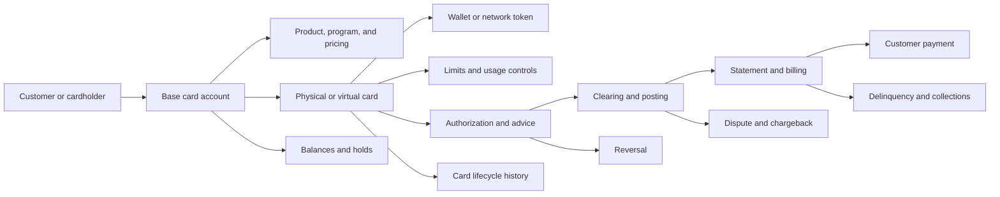
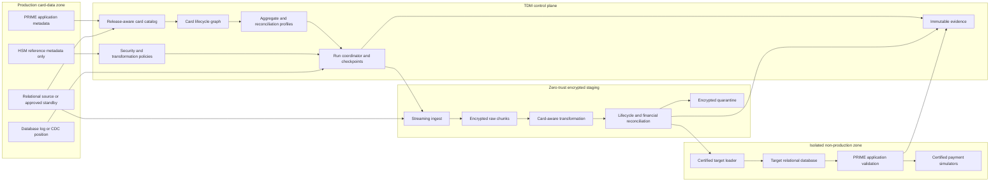

# TSYS PRIME Card Management TDM Solution Blueprint

Document owner: Enterprise Data Engineering  
Status: Implementation-ready solution blueprint  
Scope: TSYS PRIME credit and prepaid issuing, card lifecycle processing, relational persistence, and connected card services  
Product assumption: A vendor-neutral, enterprise-grade test data management platform  

## 1. Executive intent

This blueprint defines how an enterprise TDM platform will discover, extract, subset, transform, validate, and provision TSYS PRIME data while preserving the business integrity of cardholder, account, card, transaction, billing, token, dispute, and prepaid-balance lifecycles.

The solution must not treat PRIME as a collection of unrelated relational tables. Its governed test-data unit is a **Card Portfolio Aggregate** whose membership depends on the test scenario.

The target outcome is a repeatable process that produces safe, usable test data with evidence proving that:

- customer, base account, card, token, and transaction relationships remain valid;
- credit and prepaid financial states remain internally consistent;
- authorization, clearing, reversal, refund, dispute, statement, and payment chains remain traceable;
- PAN values are transformed according to an approved format and routing policy;
- generated PAN values are unique in the configured scope and satisfy the required Luhn check;
- production sensitive authentication data and cryptographic material are not copied into non-production;
- customer and account identifiers remain deterministic across connected systems;
- extraction and delivery are restartable and complete inside the required processing window;
- no transformation code runs on a production database node;
- every delivered environment passes structural, privacy, lifecycle, and application validation.

## 2. TDM implementation scope

### 2.1 In scope

- PRIME relational metadata and application metadata acquisition.
- Issuer, institution, portfolio, program, and product boundaries.
- Credit-card account and billing lifecycles.
- Prepaid account, purse, reload, and balance lifecycles.
- Customer, cardholder, account, card, supplementary-card, and token relationships.
- Physical, virtual, contactless, and tokenized card representations.
- Card status, activation, renewal, reissue, replacement, block, and closure history.
- Authorization, advice, reversal, clearing, posting, refund, dispute, and chargeback chains.
- Statements, payments, fees, interest, limits, balances, delinquency, and collections.
- Card controls, merchant/category controls, currencies, countries, channels, and velocity rules.
- PAN and other cardholder-data transformation.
- Customer identity synchronization with connected systems.
- Initial full extraction followed by incremental capture.
- Isolated encrypted staging and containerized processing.
- Deployment on the approved Red Hat OpenShift and HCI platform.
- Application-aware target provisioning and post-load validation.
- Masked-master, virtual-clone, bookmark, rewind, and refresh operations.
- Operational, privacy, reconciliation, and lineage evidence.

### 2.2 Out of scope

- Production payment authorization or scheme routing from a test environment.
- Exporting production HSM keys, PIN encryption keys, card-verification keys, token keys, or issuer master keys.
- Copying production PIN blocks, card verification values, full track data, or equivalent chip data into a normal non-production environment.
- Independently changing balances, limits, interest, fees, or transaction amounts without a scenario-specific reconciliation contract.
- Treating a successful database load as proof that PRIME can use the data.
- Hard-coding table names or lifecycle rules before the installed PRIME release and client configuration are inventoried.

## 3. Design principles

1. **Card lifecycle before table list.** Data selection begins with a testable card, account, or transaction scenario.
2. **Application metadata before inference.** PRIME product and lifecycle metadata is authoritative, followed by verified database constraints and approved enterprise relationships.
3. **Security class controls treatment.** Cardholder data, sensitive authentication data, cryptographic material, financial state, and reference data follow different rules.
4. **No production payment egress.** A target cannot communicate with payment schemes, token providers, card production, customer messaging, or external settlement endpoints until explicitly certified.
5. **Financial values move as reconciled sets.** Limits, balances, holds, statements, payments, fees, and transaction amounts are not randomized independently.
6. **Tokens are not PANs.** PAN, card ID, account ID, and network or wallet tokens have separate semantic scopes.
7. **Determinism is semantic.** Shared customer or account keys use governed cross-system scope keys, not accidental equality of column names.
8. **Extraction is read-only.** Snapshot, standby, CDC, or other approved non-blocking mechanisms are used.
9. **Every stage is restartable.** Work is partitioned, checkpointed, and idempotent.
10. **Evidence is part of delivery.** A dataset is not released until lifecycle, reconciliation, privacy, and application checks pass.

## 4. PRIME estate interpretation

### 4.1 Issuing platform

PRIME is treated as an issuer-processing platform that can participate in:

- customer and cardholder onboarding;
- account creation;
- card issuance and personalization;
- authorization and switching;
- clearing and transaction posting;
- billing and statements;
- collections;
- disputes and chargebacks;
- rewards and instalments;
- fraud and risk controls;
- tokenization and wallets;
- card production and correspondence.

Not every installation enables every module. The installed modules, release, integrations, and custom extensions are onboarding inputs.

### 4.2 Relational persistence

The relational database provides physical tables, columns, keys, indexes, partitions, history, and transaction data. It does not necessarily expose every business rule as a foreign key or check constraint.

The TDM model must combine:

- database catalog metadata;
- PRIME application and product metadata;
- institution-specific configuration;
- verified relationship definitions;
- lifecycle and reconciliation contracts;
- approved test scenario requirements.

### 4.3 External dependency boundary

PRIME commonly participates in a larger payment ecosystem. The TDM boundary inventories and controls connections to:

- payment schemes and switches;
- HSMs;
- card production and personalization;
- token service providers and wallet platforms;
- fraud and risk systems;
- customer communication services;
- statement generation;
- collection agencies;
- credit bureaus;
- rewards and loyalty systems;
- general ledger and core banking;
- data warehouse, reporting, and regulatory feeds.

These integrations are disabled, redirected to certified simulators, or isolated for non-production.

## 5. Logical card portfolio model

### 5.1 Core relationship graph



### 5.2 Identifier semantics

| Identifier | Meaning | Default TDM treatment |
| --- | --- | --- |
| Customer ID | Person or organization identity | Deterministic cross-system token |
| Base account number | Credit or prepaid account identity | Deterministic account-scope token |
| Internal account ID | Technical database identity | Preserve or remap consistently |
| Card ID | One issued card under an account | Deterministic card-scope token |
| PAN | Payment card number | Approved FPE or generated test PAN |
| Token reference | Wallet or token-service identity | Regenerate or deterministic token-domain mapping |
| Authorization ID | Authorization event identity | Preserve or remap across its event chain |
| Retrieval/reference number | Network or transaction correlation | Format-preserving chain-consistent mapping |
| Clearing ID | Presentment or posting identity | Preserve/remap with authorization link |
| Statement ID | Billing-cycle artifact identity | Preserve/remap with account and cycle |
| Dispute/chargeback ID | Case identity | Preserve/remap with transaction chain |
| Product/program ID | Card behavior configuration | Usually preserve as approved reference data |

Equal-looking source values do not automatically share a masking scope. The semantic identity registry defines which values must stay equal.

## 6. Card Portfolio Aggregate

### 6.1 Aggregate definition

A Card Portfolio Aggregate is a versioned business closure around one root:

- customer/cardholder;
- base account;
- card;
- transaction;
- statement;
- dispute;
- prepaid purse or wallet.

The aggregate records:

- root type and business key;
- included lifecycle components;
- relationship graph and source of each relationship;
- effective date and transaction window;
- financial reconciliation rules;
- sensitive-data treatment;
- permitted target environment;
- application validation suite.

### 6.2 Credit profile

A credit-card scenario can require:

- customer and cardholder;
- base account and ownership;
- product, pricing, interest, and fee references;
- primary and supplementary cards;
- card and account status;
- credit and cash limits;
- current balance, pending authorization holds, and available credit;
- selected authorization and clearing history;
- billing cycle and statement;
- payment allocation;
- delinquency and collection state;
- disputes, chargebacks, or instalments.

### 6.3 Prepaid profile

A prepaid scenario can require:

- customer or anonymous/program holder;
- prepaid account, purse, or wallet;
- program and product;
- physical, virtual, or companion cards;
- currency configuration;
- reload, unload, transfer, purchase, fee, and reversal events;
- ledger and available balances;
- limits and velocity controls;
- card activation, status, and expiry;
- token and wallet references.

### 6.4 Scenario-specific closure

| Test scenario | Minimum lifecycle closure |
| --- | --- |
| Card activation | Customer, account, card, product, status history, activation controls |
| Authorization approval | Card, account, product, status, limits, balances, controls, risk references |
| Authorization decline | Approval closure plus the intended decline condition and expected response |
| Clearing/posting | Authorization/advice, clearing record, transaction links, posting state, balances |
| Reversal | Original authorization or posting plus reversal and resulting balance state |
| Statement | Account, billing cycle, posted transactions, fees, interest, balances |
| Payment | Statement/account, payment, allocation, resulting balance and delinquency state |
| Dispute | Card/account, original transaction, case, reason, status, chargeback events |
| Card renewal | Original card, replacement card, account, token lifecycle, status history |
| Prepaid reload | Program, purse, card, reload source, ledger entries, resulting balances |

## 7. Reference architecture



## 8. Control-plane metadata

### 8.1 Source profile

| Attribute | Purpose |
| --- | --- |
| PRIME release and patch | Binds lifecycle and load behavior |
| Enabled modules | Limits the applicable model |
| Institution/issuer | Enforces organizational boundary |
| Portfolio/program | Controls product and data scope |
| Database engine/version | Selects snapshot, CDC, and loading strategy |
| Schema/catalog owner | Binds physical objects |
| Character set and collation | Preserves identifiers and text |
| Time zone and business date | Controls transaction and billing chronology |
| Schema fingerprint | Detects drift |
| Application-metadata fingerprint | Detects configuration drift |
| Partitioning strategy | Plans scalable extraction |

### 8.2 Logical field catalog

Each field definition contains:

- logical entity and attribute;
- physical table and column;
- business and technical key role;
- datatype, length, precision, and scale;
- security class;
- PAN/account/token scope;
- format and checksum profile;
- relationship targets;
- lifecycle role;
- effective-date behavior;
- financial reconciliation group;
- transformation rule;
- target loading rule;
- metadata source and confidence;
- release validity range.

### 8.3 Relationship precedence

When several candidate relationships connect the same records:

1. Approved PRIME application metadata.
2. Verified database primary/foreign key.
3. Approved enterprise relationship.
4. Evidence-backed inferred relationship.

Conflicts require an explicit selection. A run never walks every candidate relationship automatically.

## 9. Security classification and treatment

### 9.1 Treatment matrix

| Data class | Examples | Required treatment |
| --- | --- | --- |
| Cardholder data | PAN, cardholder name, expiry, service code | Protect and transform according to approved policy |
| Sensitive authentication data | Full track, CVV/CVC/CID, PIN/PIN block | Do not copy to standard non-production; generate only through an approved test process |
| Cryptographic material | HSM keys, PVK/CVK, issuer master keys, token keys | Never extract |
| Internal verifier/reference | PVV/CVV-derived verifier or HSM reference | Classify precisely; regenerate in test key domain or exclude |
| Customer PII | Name, address, phone, email, government ID | Deterministic realistic substitution |
| Financial state | Limits, balances, fees, interest, holds | Preserve or transform only as a reconciled scenario set |
| Transaction identity | Authorization, clearing, dispute references | Chain-consistent remapping |
| Reference configuration | Currency, country, MCC, response code, product | Usually preserve from an approved safe reference set |
| Operational/audit data | Users, logs, notes, correspondence | Mask embedded identities and credentials |

### 9.2 RFP interpretation

The RFP lists cardholder name, limits, and PVV/CVV hashes as high-risk targets. Their safe treatments differ:

- cardholder name is identity data and is substituted;
- limits are behavioral financial data and are preserved or reconciled, not blindly masked;
- verifier or authentication fields are regenerated within an approved non-production security domain or excluded;
- source cryptographic material is never copied.

## 10. PAN transformation

### 10.1 PAN profiles

The solution supports two governed modes.

#### Routing-compatible isolated profile

- preserve an approved 6- or 8-digit IIN/BIN when required by the test;
- transform the account-identifying digits using an approved format-preserving method;
- recalculate the final Luhn check digit;
- allow use only in an isolated environment with blocked external payment routing.

#### Safe synthetic test-IIN profile

- replace the production IIN/BIN with an approved non-production range;
- generate unique account digits;
- calculate a valid Luhn check digit;
- bind product and routing tests to the test reference configuration.

The second mode is preferred when a production IIN is not genuinely necessary.

### 10.2 PAN generation contract

For a configured length `n`:

```text
PAN = approved-prefix + transformed-account-digits + luhn-check-digit
```

The implementation must:

- support the card lengths required by the onboarded portfolios;
- treat 16 digits as a profile, not a universal assumption;
- preserve only the configured prefix length;
- use a security-approved FPE/tokenization design, not homemade digit substitution;
- be deterministic when cross-table consistency is required;
- maintain a collision registry or mathematically guaranteed permutation domain;
- reject generated PANs already assigned within the configured uniqueness scope;
- record the algorithm and key version without recording key material;
- never log or display a full PAN without explicit authorized need.

### 10.3 Uniqueness scopes

PAN uniqueness is enforced within the configured issuer domain, such as:

```text
institution + portfolio + PAN
```

The scope is based on the actual source constraint and issuer architecture. It is not guessed.

### 10.4 PAN evidence

For every run, retain:

- source and target PAN digests using separate evidence keys;
- prefix policy;
- length distribution;
- Luhn pass count;
- uniqueness count;
- collision and retry count;
- cross-table occurrence count;
- unauthorized display count.

Raw full PANs do not appear in the evidence pack.

## 11. Token and card lifecycle treatment

### 11.1 Card lifecycle

The card-state contract defines allowed transitions, for example:

```text
CREATED -> PERSONALIZED -> ISSUED -> ACTIVE
ACTIVE -> BLOCKED -> ACTIVE
ACTIVE -> EXPIRED -> RENEWED
ACTIVE -> REPLACED
ACTIVE -> CLOSED
```

Actual status codes and transitions come from the installed configuration.

### 11.2 Token lifecycle

Tokenized card scenarios can require:

- card-to-token relationship;
- token requester/provider;
- provisioning state;
- wallet/device reference;
- activation or suspension;
- card renewal/reissue propagation;
- token replacement or deletion;
- authorization token reference.

Production network tokens are regenerated or mapped to test-domain tokens. The target cannot call a production token provider.

### 11.3 Card production

Real card-personalization output is disabled. If physical-card testing is required, the target routes only to an approved test bureau or simulator using test keys and test stock.

## 12. Financial and lifecycle reconciliation

### 12.1 Credit account equations

The implementation registers release-specific equations rather than assuming one universal formula.

A representative available-credit rule is:

```text
available credit =
    approved credit limit
  - posted balance
  - qualifying authorization holds
  + eligible payments or credits
  - configured fees or reserved amounts
```

Each component source and sign convention must be bound to the installed schema.

### 12.2 Prepaid balance equations

A representative prepaid rule is:

```text
ending ledger balance =
    opening balance
  + successful reloads
  + credits and reversals
  - posted purchases
  - withdrawals
  - transfers out
  - fees
```

Available balance can differ from ledger balance because of holds or pending items.

### 12.3 Authorization and clearing chain

The chain validator understands:

- request and response;
- stand-in or offline behavior where applicable;
- advice;
- partial approval;
- incremental authorization;
- reversal;
- presentment/clearing;
- adjustment;
- refund;
- dispute/chargeback.

The selected test scenario determines which links are mandatory and which may legitimately be absent.

### 12.4 Billing and payments

For statement scenarios, validate:

- cycle and statement dates;
- opening and closing balances;
- posted transactions;
- fees and interest;
- minimum payment;
- due date;
- payment allocation;
- delinquency bucket;
- resulting account state.

### 12.5 Scenario transformation

If a tester requires a boundary condition such as "one unit below the credit limit", the transformation planner changes the smallest governed set needed to satisfy the condition and recalculates dependent balances and expected authorization behavior.

## 13. Discovery and classification

Discovery operates across the full schema and logical card paths.

### 13.1 Discovery sequence

1. Classify trusted application metadata.
2. Match verified physical columns to logical card attributes.
3. Inspect encrypted samples under controlled access.
4. Detect PAN and PAN fragments.
5. Detect customer PII, account IDs, tokens, and transaction references.
6. Identify sensitive authentication and cryptographic fields.
7. Inspect notes, correspondence, audit text, XML, JSON, and message payloads.
8. Review low-confidence or conflicting findings.
9. Approve treatment and permitted target zones.

### 13.2 Special detection

The detector must identify:

- full PAN;
- masked/truncated PAN;
- PAN embedded in text;
- PAN embedded in message payloads;
- track-like data;
- CVV/CVC/CID-like fields;
- PIN/PIN-block fields;
- token and wallet identifiers;
- cardholder names and contact data;
- identifiers copied into audit and history tables.

Column names alone are not sufficient evidence.

## 14. Subset planning

### 14.1 Root selection

A user can select:

- customer/cardholder;
- base account;
- card;
- product and status criteria;
- authorization or transaction;
- statement cycle;
- dispute;
- prepaid balance or reload scenario;
- approved business-key list;
- scenario predicate.

### 14.2 Traversal directions

Every relationship can specify:

- required parent closure;
- required dependent closure;
- transaction-window closure;
- lifecycle-history closure;
- reference-data closure;
- no traversal.

### 14.3 Volume controls

Controls are applied without breaking aggregates:

- root count;
- per-account transaction window;
- maximum statements;
- maximum authorizations;
- per-card history depth;
- dispute count;
- business-date range;
- product and portfolio filters.

The engine does not cut children independently after selecting a root if doing so would violate the scenario contract.

## 15. Coordinated extraction and CDC

### 15.1 Initial full seed

1. Validate schema and application-metadata fingerprints.
2. Establish an approved consistent-read position.
3. Record database position, business date, and source time zone.
4. Resolve aggregate roots and closure consistently.
5. Extract in stable, restartable partitions.
6. Stream encrypted chunks to isolated staging.
7. Record counts, checksums, key ranges, and source positions.
8. Advance checkpoints only after durable staging.

The exact consistent-read mechanism depends on the relational engine and operational topology.

### 15.2 Incremental capture

After the full seed:

- capture inserts, updates, and deletes from an approved log/CDC source;
- preserve commit order for dependent transaction chains;
- group changes by aggregate root;
- re-read a complete logical object when fragments cannot reconcile safely;
- persist start and end positions;
- support point-in-time reconstruction;
- delay target publication until financial and lifecycle reconciliation passes.

### 15.3 Source controls

- read-only credentials;
- no DDL or DML;
- bounded fetch and parallelism;
- rate limits and cancellation;
- partition pruning;
- no long-lived table locks;
- source and CDC lag monitoring;
- automatic pause during restricted processing.

## 16. Isolated staging and payment egress

### 16.1 Staging controls

- TLS for all data movement;
- approved envelope encryption for staged chunks;
- short-lived data-encryption keys;
- external enterprise key management;
- workload identity and least privilege;
- deny-by-default network policies;
- encrypted quarantine;
- configured retention and cryptographic erasure;
- immutable access audit;
- no PAN, customer identity, or authentication value in logs.

### 16.2 Egress deny policy

Before a target is released, verify that it cannot reach:

- production payment schemes;
- production switches;
- production HSM partitions;
- production token providers;
- real card production;
- customer SMS, email, or push gateways;
- collection agencies;
- credit bureaus;
- external settlement or reconciliation endpoints.

Approved simulators and test HSM domains are allow-listed explicitly.

## 17. Transformation architecture

### 17.1 Rule order

1. Resolve logical entity and security class.
2. Resolve semantic identity scope.
3. Resolve aggregate and lifecycle context.
4. Select transformation policy.
5. Transform customer and account identities.
6. Transform or generate PAN and token values.
7. Remove/regenerate prohibited authentication fields.
8. Transform free text and payloads.
9. Reconcile financial and lifecycle state.
10. Validate structure, format, uniqueness, and relationships.

### 17.2 Cross-system determinism

Shared values use:

```text
token = Transform(secretVersion, semanticScope, normalizedSourceValue, formatProfile)
```

Examples of semantic scopes:

- `CUSTOMER.GLOBAL_ID`
- `CARD.BASE_ACCOUNT`
- `CARD.PAN`
- `PAYMENT.TRANSACTION_REFERENCE`

The same source customer maps consistently across participating systems only when those fields share the same approved semantic scope.

### 17.3 Free text and payloads

Notes, correspondence, message data, and audit fields are:

- parsed by their actual format;
- scanned for embedded PAN, account, customer, address, phone, email, and token values;
- transformed using longest-match and overlap rules;
- repacked without changing required message structure;
- rescanned before release.

Malformed structured payloads are quarantined rather than processed with an unsafe regex fallback.

## 18. Containerized processing

### 18.1 Work partitioning

- partition by stable hash of customer, base account, or selected aggregate root;
- keep one aggregate in a consistent work unit where practical;
- isolate oversized transaction histories;
- cap concurrency by source and target;
- use streaming and back pressure;
- persist checkpoints outside worker containers.

### 18.2 Worker lifecycle

1. Acquire workload identity.
2. Lease a partition.
3. Resolve policy and secret versions.
4. Stream encrypted input.
5. Transform and reconcile.
6. Write encrypted output and evidence.
7. Atomically mark the partition complete.
8. Clear temporary data and release credentials.

### 18.3 Scaling

Horizontal scaling uses measured:

- source read capacity;
- target write capacity;
- CPU and memory;
- queue depth;
- average aggregate size;
- reconciliation time;
- staging throughput.

CPU-only autoscaling is insufficient for database-bound pipelines.

### 18.4 OpenShift and HCI controls

The certified deployment profile includes:

- versioned Operator or Helm deployment artifacts;
- namespace and workload isolation;
- workload identity and secret injection;
- network policies with deny-by-default egress;
- pod security controls;
- resource requests, limits, disruption budgets, and anti-affinity;
- CSI-backed encrypted persistent volumes for the protected staging tier;
- approved volume snapshot and restore integration;
- horizontal scaling based on CPU, memory, queue depth, source capacity, and target capacity;
- node-pool controls for sensitive workloads;
- immutable deployment and configuration evidence.

## 19. Target provisioning

### 19.1 Load-path hierarchy

Use the first path certified for the installed environment:

1. Approved PRIME service, batch, or import interface.
2. Approved application loader.
3. Certified database-native bulk loader into an isolated clone, followed by required rebuild and application validation.
4. JDBC batching only for supported engineering or small-volume scenarios.

### 19.2 Load ordering

1. Institution, portfolio, product, and safe reference data.
2. Customer/cardholder.
3. Base account and ownership.
4. Card and supplementary-card records.
5. Token/test-wallet records.
6. Status, limits, controls, and balances.
7. Authorization, clearing, and posting chains.
8. Statements, payments, fees, and collections.
9. Disputes, chargebacks, messages, and history.
10. Approved indexes, summaries, and derived structures.

Cycles use a certified staged-link strategy. Constraints are not disabled globally without an approved recovery plan.

### 19.3 Post-load application validation

Completion requires:

- row and aggregate reconciliation;
- PRIME application read of customer, account, and card;
- card and account status validation;
- product and control resolution;
- authorization against a certified simulator where included;
- posting, statement, prepaid-balance, or dispute smoke tests as applicable;
- token lifecycle validation using a test provider where included;
- privacy rescan;
- egress-control validation.

### 19.4 Masked-master and virtual environment lifecycle

After a masked master passes every release gate, authorized users can:

- create an isolated virtual or storage-efficient clone;
- reserve the clone for a test team and time window;
- bookmark a known application-consistent point;
- rewind to that bookmark without returning to production data;
- refresh from a newer approved masked master;
- delete the clone and verify storage/key cleanup.

Every clone inherits the masked master's egress policy, security classification, and evidence reference. A storage snapshot taken before masking is never exposed as a tester-accessible environment.

## 20. Validation gates

### 20.1 Structural gates

- key and relationship integrity;
- data type, length, precision, and scale;
- PAN length, prefix policy, Luhn, and uniqueness;
- token and card relationship integrity;
- valid status and effective-date sequences;
- parseable XML/JSON/message payloads;
- no truncated LOBs or transaction data.

### 20.2 Lifecycle gates

- card status compatible with account status;
- renewal/reissue/replacement chain valid;
- authorization/clearing/reversal chain satisfies scenario contract;
- statement/payment/collection chain valid;
- dispute references an eligible transaction;
- prepaid reload and transaction sequence reconciles;
- token state compatible with card state.

### 20.3 Financial gates

- credit limit and available-credit equation passes;
- posted and pending balances reconcile;
- statement opening/closing balance reconciles;
- payments and allocations reconcile;
- prepaid ledger and available balances reconcile;
- fees and interest follow the selected scenario.

### 20.4 Privacy and security gates

- all in-scope PAN occurrences transformed;
- no prohibited sensitive authentication data delivered;
- no source cryptographic material delivered;
- no residual customer PII above approved thresholds;
- no full PAN in logs or evidence;
- target egress is denied except to approved simulators;
- key and policy versions recorded without secret material.

## 21. Acceptance criteria

| ID | Acceptance criterion | Pass evidence |
| --- | --- | --- |
| PRI-001 | 100% of in-scope physical objects map to a reviewed logical card entity or documented exclusion | Versioned catalog and exclusion report |
| PRI-002 | Every selected aggregate contains all components required by its scenario profile | Aggregate completeness report |
| PRI-003 | Customer and base-account relationships contain no unexpected orphans | Referential reconciliation |
| PRI-004 | PAN output obeys configured length and prefix policy | Format distribution report |
| PRI-005 | 100% of generated PANs pass Luhn validation | Luhn evidence |
| PRI-006 | PAN uniqueness is 100% within the configured issuer scope | Unique constraint and collision report |
| PRI-007 | Every PAN occurrence for the same card maps consistently across in-scope tables and payloads | PAN occurrence matrix |
| PRI-008 | Shared customer and account identifiers match approved cross-system tokens | Cross-system identity matrix |
| PRI-009 | No production sensitive authentication data or cryptographic material reaches the target | Restricted-data scan and manifest |
| PRI-010 | Credit limits, balances, holds, statements, and payments reconcile for selected credit scenarios | Financial reconciliation report |
| PRI-011 | Prepaid reloads, transactions, fees, reversals, and balances reconcile | Prepaid reconciliation report |
| PRI-012 | Authorization, clearing, reversal, refund, and dispute chains satisfy scenario rules | Transaction-chain report |
| PRI-013 | Card, account, and token lifecycle states are valid | Lifecycle validation report |
| PRI-014 | Free-text and structured payload rescans find no unapproved sensitive data | Privacy rescan report |
| PRI-015 | Initial and incremental source positions are recorded and replayable | Snapshot/CDC manifest |
| PRI-016 | An interrupted run resumes without duplicate target records or inconsistent balances | Failure/restart exercise |
| PRI-017 | No transformation executes on production database nodes | Deployment and database audit |
| PRI-018 | Unmasked staging data is encrypted and deleted on schedule | Encryption, access, and retention evidence |
| PRI-019 | Target records are usable through the approved PRIME application path | Application smoke-test report |
| PRI-020 | Target cannot route to production payment, token, card-production, or customer-contact endpoints | Egress-control test |
| PRI-021 | Representative volume completes inside the agreed 4-6 hour processing window | Timed performance report |
| PRI-022 | The sustained masking tier demonstrates the RFP target of at least 500 GB/hour under the agreed benchmark conditions | Reproducible performance report |
| PRI-023 | Every output partition is traceable to source position, policy, algorithm/key version, and target result | Immutable lineage manifest |
| PRI-024 | The processing tier deploys and recovers on the approved OpenShift/HCI profile | Deployment, failover, PVC, and scaling evidence |
| PRI-025 | An authorized tester can clone, bookmark, rewind, refresh, and delete an approved masked environment without access to unmasked storage | Environment lifecycle evidence |

No criterion is marked passed from design review alone.

## 22. Failure handling

### 22.1 Record or aggregate failure

Quarantine:

- run and partition ID;
- logical entity;
- non-sensitive key digest;
- lifecycle component;
- failure stage;
- policy and metadata version;
- non-sensitive diagnostic;
- retry eligibility.

If one required member fails, the aggregate is not reported ready.

### 22.2 Partition failure

- roll back uncommitted target work;
- preserve the last durable checkpoint;
- retry only classified transient failures;
- use bounded retry and delay;
- prevent duplicate loads with idempotency keys;
- stop dependent publication;
- expose a remediation action.

### 22.3 Drift

Schema, application metadata, product configuration, or relationship drift blocks execution until reviewed. Financial equations are versioned with the metadata profile that validated them.

## 23. Governance and roles

| Role | Responsibility |
| --- | --- |
| PRIME application SME | Confirms entities, lifecycles, product configuration, and supported load path |
| Card operations SME | Confirms issuance, authorization, billing, dispute, collection, and prepaid behavior |
| Database administrator | Approves snapshot/CDC, source limits, and target loading |
| Payment security/HSM team | Approves PAN treatment, test key domain, verifier handling, and HSM connectivity |
| Data architect | Owns card aggregate and relationship definitions |
| Privacy/security steward | Approves classification, transformation, exceptions, and residual-data thresholds |
| TDM engineer | Builds and versions subset, transformation, reconciliation, and validation definitions |
| Platform operator | Executes and monitors approved runs |
| Test lead | Defines scenario intent and accepts usability |
| Independent approver | Approves high-risk extraction, exceptions, and release |

The requester cannot approve their own high-risk exception.

## 24. Phased implementation

### Phase 0: Evidence and access readiness

Deliver:

- release, module, institution, portfolio, and integration inventory;
- approved read path;
- security and network design;
- representative card, account, credit, prepaid, token, and transaction samples;
- source volume, partition, and processing-window baseline.

Exit gate: all mandatory decisions in Section 27 have owners.

### Phase 1: Metadata and lifecycle graph

Deliver:

- release-aware logical catalog;
- relationship graph;
- credit and prepaid aggregate profiles;
- identifier scope registry;
- financial reconciliation contracts.

Exit gate: PRI-001 through PRI-003 pass on the agreed schema scope.

### Phase 2: Discovery and transformation policy

Deliver:

- full card-data classification;
- PAN and token policies;
- restricted authentication/cryptographic treatment;
- customer identity rules;
- free-text and payload rules.

Exit gate: all critical fields have an approved treatment and target zone.

### Phase 3: Subset, extraction, and CDC

Deliver:

- scenario-driven closure;
- snapshot/CDC manifests;
- encrypted staging;
- restartable partitions;
- source-impact controls.

Exit gate: selected aggregates extract consistently without unexpected orphans.

### Phase 4: Transformation and target delivery

Deliver:

- approved PAN transformation;
- cross-system determinism;
- financial/lifecycle reconciliation;
- certified target load;
- application and simulator validation.

Exit gate: PRI-004 through PRI-020 pass.

### Phase 5: Scale and production certification

Deliver:

- representative-volume rehearsal;
- performance benchmark;
- failure/recovery exercise;
- security assessment;
- operational runbook;
- signed acceptance.

Exit gate: PRI-021 through PRI-025 pass and critical findings are closed.

## 25. Proof-of-concept plan

### Pre-PoC preparation

- provide an isolated source copy or approved extract;
- identify one credit and one prepaid product;
- identify representative PAN, card, account, authorization, clearing, billing, and balance records;
- provide safe test HSM/simulator arrangements where functional authorization is required;
- approve expected masking and reconciliation rules;
- capture baseline counts and equations.

### Day 1: Discover and model

- acquire database and application metadata;
- build the logical card graph;
- select one credit and one prepaid aggregate;
- show security classes and relationship evidence.

### Day 2: Transform card and customer data

- transform customer and account identities;
- transform a PAN while applying the approved IIN/BIN policy;
- prove Luhn validity, uniqueness, and cross-table consistency;
- demonstrate exclusion or test-domain regeneration of restricted fields.

### Day 3: Reconcile and provision

- reconcile credit or prepaid financial state;
- load an isolated target;
- read customer, account, card, and transaction data through the application;
- validate egress isolation.

### Day 4: Transaction and recovery test

- exercise an authorization/clearing or reload/reversal scenario against a simulator;
- interrupt and resume one run;
- prove no duplicate transaction or balance effect.

### Day 5: Scale and evidence

- run representative parallel volume;
- measure source impact and throughput;
- export reconciliation, privacy, security, lineage, and performance evidence.

## 26. Worked examples

### 26.1 Credit authorization boundary

A tester needs an active card whose available credit is one currency unit below a requested purchase.

The TDM planner:

1. Selects an active customer, account, and card.
2. Includes product, limit, balance, hold, and control records.
3. Includes only the configured transaction history window.
4. Masks customer and card identity.
5. Sets or derives a reconciled available-credit state.
6. Validates the expected decline or partial-approval behavior.
7. Provisions the target.
8. Runs the test through a certified authorization simulator.

### 26.2 Prepaid reload and reversal

A tester needs:

- an active prepaid card;
- a starting balance of 100;
- a successful reload of 50;
- a purchase of 40;
- a reversed fee of 5;
- an ending reconciled ledger balance of 115, subject to the installed sign and hold rules.

The aggregate includes the program, purse, card, currency, reload, purchase, fee, reversal, balances, and status history. The target is rejected if the configured equations do not reconcile.

### 26.3 PAN example

For a 16-digit configured routing-compatible profile:

```text
Source: approved-prefix + source-account-digits + source-check-digit
Target: same-approved-prefix + transformed-account-digits + recalculated-check-digit
```

Evidence displays only authorized masked representations and digests, never full source or target PANs.

## 27. Mandatory onboarding decisions

These decisions must be made with the PRIME, card operations, database, security, and test teams:

1. Exact PRIME release, patch level, modules, and custom extensions.
2. Database engine/version, topology, schemas, and partition strategy.
3. Institutions, issuers, portfolios, programs, and product boundaries.
4. Authoritative application metadata export.
5. Customer, base-account, card, PAN, token, and transaction key definitions.
6. Primary and supplementary card relationships.
7. Credit lifecycle states and reconciliation equations.
8. Prepaid purse, balance, reload, fee, and reversal equations.
9. Authorization, clearing, billing, dispute, and collection relationships.
10. Approved 6- or 8-digit IIN/BIN preservation rules.
11. Approved non-production IIN/BIN ranges.
12. PAN length and uniqueness scopes.
13. FPE/tokenization algorithm and key-management standard.
14. Treatment of PVV/CVV verifiers and HSM references.
15. Test HSM partition and test-key availability.
16. Token-provider and wallet simulation strategy.
17. Approved snapshot and CDC mechanisms.
18. Approved target load path and required rebuilds.
19. External endpoint inventory and non-production egress policy.
20. Close-of-business and restricted-processing windows.
21. Source load, parallelism, volume, and network limits.
22. Staging, quarantine, and evidence retention.
23. Required application smoke tests.
24. Benchmark dataset and hardware for the 500 GB/hour claim.

## 28. Required implementation artifacts

- source release and module profile;
- physical schema fingerprint;
- application-metadata fingerprint;
- logical card field catalog;
- relationship graph;
- credit Card Portfolio Aggregate profiles;
- prepaid Card Portfolio Aggregate profiles;
- identifier and semantic-scope registry;
- PAN format, prefix, uniqueness, and key profiles;
- restricted-data treatment policy;
- financial reconciliation contracts;
- lifecycle-state contracts;
- subset blueprints;
- free-text and payload policies;
- extraction and CDC configuration;
- target egress policy;
- target load certification;
- OpenShift/HCI deployment profile;
- masked-master and virtual environment lifecycle profile;
- application and simulator test suite;
- performance baseline;
- recovery runbook;
- immutable run evidence package.

## 29. Definition of done

The PRIME scope is production-ready only when:

- all mandatory onboarding decisions are resolved;
- every implementation artifact is versioned and approved;
- all applicable acceptance criteria pass;
- the selected credit and prepaid scenarios work through the approved application path;
- PAN, customer, financial, and transaction-chain validation passes;
- no prohibited authentication data or cryptographic material is delivered;
- production payment egress is blocked;
- restart, incremental capture, and recovery are proven;
- representative volume meets the processing window;
- operations, PRIME, card security, database, privacy, and test owners sign the acceptance record.

Until then, a successful SQL load or Luhn-valid PAN is engineering evidence, not enterprise TDM certification.

## 30. RFP traceability

| RFP expectation | Blueprint response | Primary proof |
| --- | --- | --- |
| PRIME credit and prepaid issuing/lifecycle support | Sections 4 through 6 define the application estate, logical graph, and scenario aggregates | PRI-001 through PRI-003 |
| Relational source handling | Sections 8, 13, 15, and 19 define metadata, extraction, CDC, and loading | Source catalog and CDC/load evidence |
| Coordinated non-blocking overnight extraction | Section 15 defines consistent read, CDC, controls, and checkpoints | PRI-015, PRI-016, PRI-021 |
| Zero-trust encrypted staging | Section 16 defines staging and payment-egress boundaries | PRI-017, PRI-018, PRI-020 |
| Containerized scalable transformation | Section 18 defines partitioning, workers, back pressure, and scaling signals | PRI-021 and PRI-022 |
| OpenShift/HCI deployment | Section 18.4 defines deployment, PVC, network, scaling, and recovery controls | PRI-024 |
| Cardholder name masking | Sections 9, 13, and 17 define identity classification and deterministic substitution | Privacy rescan and identity matrix |
| Customer ID and base-account cross-system consistency | Sections 5 and 17.2 define semantic identity scopes | PRI-008 |
| BIN/IIN preservation | Section 10 defines governed routing-compatible and safe test-IIN profiles | PRI-004 |
| FPE and Luhn-valid PAN | Section 10 defines transformation, uniqueness, collision, and evidence contracts | PRI-005 through PRI-007 |
| PVV/CVV-related protection | Section 9 separates restricted authentication and cryptographic treatment from ordinary masking | PRI-009 |
| Zero residual sensitive data | Sections 13 and 20 define discovery and post-transform privacy gates | PRI-009 and PRI-014 |
| Referential and lifecycle integrity | Sections 6, 11, 12, and 20 define closure and reconciliation | PRI-010 through PRI-013 |
| Immutable audit and lineage | Sections 20, 21, 22, and 28 define evidence and recovery | PRI-023 |
| Virtual clone, bookmark, rewind, and refresh | Section 19.4 defines the masked-master environment lifecycle | PRI-025 |
| Minimum 500 GB/hour benchmark | Sections 18, 21, 24, and 27 define scalable execution and controlled benchmark conditions | PRI-022 |

## 31. Reference material

- TSYS PRIME deployment and capability overview: https://www.tsysprime.com/Assets/PRIME/pdfs/br_tsys-prime-in-the-cloud.pdf
- TSYS PRIME tokenization lifecycle overview: https://www.tsysprime.com/assets/PRIME/downloads/is_prime-tokenisation.pdf
- Global Payments issuer-solutions overview: https://eu.globalpayments.com/issuer-solutions
- PCI Security Standards Council account-data scope: https://www.pcisecuritystandards.org/faqs/1335/
- PCI Security Standards Council sensitive-authentication-data guidance: https://www.pcisecuritystandards.org/faqs/1533/
